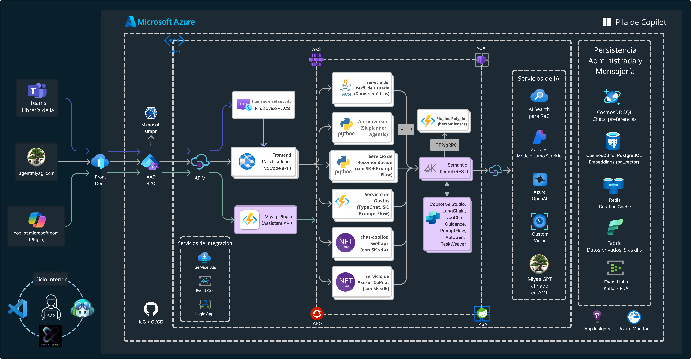
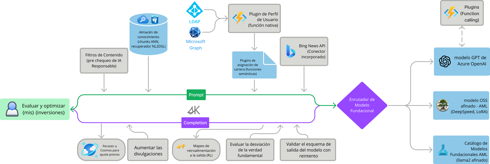

# Introducción a Miyagi

### Duración Estimada: 10 minutos

Miyagi está diseñado para mostrar la Pila Copilot de Microsoft para crear e implementar aplicaciones inteligentes avanzadas de nivel empresarial. Esta iniciativa proporciona una exploración exhaustiva de los casos de uso de machine learning generativo y tradicional, ofreciendo un enfoque práctico para desarrollar experiencias de productos mejoradas con IA. Este taller está dirigido a ingenieros de software ansiosos por sumergirse en patrones de diseño emergentes y técnicas que pueden mejorar sus aplicaciones a través de la hiperpersonalización y las mejoras de productividad.

## Objetivo

En este taller práctico, aprenderá a aprovechar la Pila Copilot de Microsoft para diseñar y crear aplicaciones empresariales impulsadas por IA que mejoren la productividad y brinden experiencias de usuario altamente personalizadas.

- **Interactuar con Herramientas y Metodologías**: Aprender técnicas de prompt engineering (por ejemplo, cadena de pensamiento, recuperación-aumentación), vectorización para memoria a largo plazo y fine-tuning de modelos de código abierto.
- **Introducir Conceptos Avanzados**: Explorar la orquestación tipo agente y los complementos para mejorar los modelos de lenguaje grande (LLMs).
- **Construir una Base para la Integración de IA**: Proporcionar una base sólida para integrar la IA en las aplicaciones modernas.

## Habilidades y Herramientas Clave

- **IA Generativa**: Comprensión de los fundamentos y las aplicaciones.
- **Azure OpenAI**: Implementación de soluciones de IA mediante los servicios OpenAI de Azure.
- **Patrones de Recuperación de Generación Aumentada (RAG)**: Mejora de los modelos de IA con RAG.
- **Semantic Kernel**: Uso de Semantic Kernel para tareas impulsadas por IA.
- **Pila Copilot de Microsoft**: Aprovechamiento de la pila Copilot de Microsoft para crear sistemas inteligentes.
- **Casos Prácticos de Uso**: Aplicación de conocimientos a escenarios del mundo real para visualizar y crear soluciones inteligentes.

## ¿A quién va dirigido?
Este taller está diseñado para:

- **Desarrolladores y Arquitectos** con conocimientos básicos de desarrollo de aplicaciones que desean incorporar IA en sus aplicaciones
- **Gerentes de Productos y Diseñadores** interesados ​​en aprovechar la IA para mejorar las experiencias de los usuarios
- Cualquier persona que sienta curiosidad por el potencial de la IA en el desarrollo de aplicaciones

## Arquitectura

### Arquitectura lógica de alto nivel

  

### Flujo de aprendizaje en contexto

  
