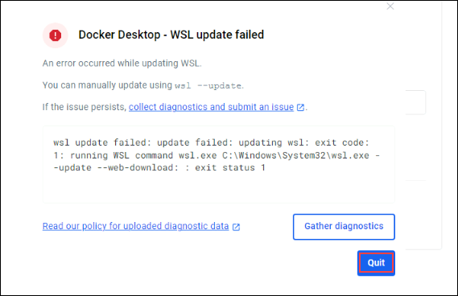

# Build Intelligent Apps with Microsoft's Copilot Stack & Azure OpenAI

### Overall Estimated Duration: 4 Hours

## Overview

In this lab, you will gain a strong understanding of Generative AI basics, Azure Open AI, Retrieval Augmented Generation (RAG) patterns, Semantic Kernel, and how to utilize these concepts to create your own Copilot for your business needs. You will also explore use cases that showcase Copilot product experiences. Using Microsoft's Copilot stack and practical use cases this lab will guide you in envisioning and creating intelligent systems that integrate foundation models resulting in improved productivity and hyper-personalized product experiences. 

## Objective

This lab is designed to equip participants with hands-on experience in containerizing and deploying a Recommendation service to Azure Container Apps and verifying it using the local Miyagi UI for seamless integration and scalability.

- **Verify and Retrieve the values of Azure Resources**: This hands-on exercise aims to verify and Retrieve the values to ensure the proper configuration and connectivity of the Azure resources.
- **Run Miyagi App Locally** : This hands-on exercise aims to configure the Miyagi App, implement the Recommendation service, deploy the frontend locally, optimize data retrieval with Azure AI Search, and explore the app and service for a personalized user experience.
- **Containerizing Recommendation service to Azure Container Apps** : This hands-on exercise aims to containerize and deploy the Recommendation service to Azure Container Apps, creating Docker images, pushing them to Azure Container Registry (ACR), and verifying the deployment for scalability and accessibility. 
- **Explore and Verify the Containerized Recommendation service in Azure Container App using Local Miyagi UI**: This hands-on exercise aims to explore and verify the containerized Recommendation service deployed in Azure Container Apps by integrating it with the local Miyagi UI, ensuring seamless functionality and validating service endpoints.
- **Expose Open AI Service through APIM**: This hands-on exercise aims to verify and create APIs in the API Management service to update the Docker image for the Recommendation service, ensuring the optimization and maintenance of containerized applications. 
- **Bringing your own data with Azure AI Search**: This hands-on exercise aims to integrate Large Language Models (LLMs) with languages like C#, Python, and Java by allowing the creation of easily chainable plugins. 
  
## Pre-requisites

Participants should have the following prerequisites

- Understanding of Generative AI basics
- Familiarity with Azure Open AI
- Experience with Semantic Kernel

## Architecture

Miyagi's architecture uses AI for hyper-personalized user interactions, transforming applications with Semantic Kernel skills and advanced prompt engineering. It features scalable microservices and an event-driven backbone, evolving with new AI models. The frontend offers personalized experiences similar to Microsoft Copilot.

It integrates Azure Functions, AKS, and Apache Kafka for seamless communication, with data managed by Cosmos DB and Azure Storage. Miyagi exemplifies advanced AI and Azure services for future-ready, intelligent applications.

## Architecture Diagram

   

## Explanation of Components

The architecture for this lab involves several key components:

- **Azure OpenAI**: Azure OpenAI integrates OpenAI's language models into Microsoft's Azure cloud, enabling scalable AI solutions for natural language processing and automation.
- **AI Search**: Is a cloud service that enables powerful and flexible search capabilities, including full-text search and AI-powered features.
- **Azure Functions**: Run code in response to events without managing servers. Scales automatically based on demand.
- **Apache Kafka**: Handles real-time data streaming and event processing.
- **Cosmos DB**: Globally distributed, multi-model database with low latency and high availability.
- **Azure Storage**: Scalable storage for blobs, files, queues, and tables.
- **Bing Search**: Lets you add Bing search features to your apps. It provides APIs for web, image, video, and news searches.

# Getting Started with the Lab

1. After the environment has been set up, your browser will load a virtual machine (JumpVM), use this virtual machine throughout the workshop to perform the lab. You can see the number on the bottom of the lab guide to switch to different exercises in the lab guide.

   
 
1. To get the lab environment details, you can select the **Environment** tab. Additionally, the credentials will also be emailed to your registered email address. You can also open the Lab Guide in a separate and full window by selecting the **Split Window** from the lower right corner. Also, you can start, stop, and restart virtual machines from the **Resources** tab.

    
   
   > You will see the SUFFIX value on the **Environment** tab; use it wherever you see SUFFIX or DeploymentID in lab steps.

## Lab Guide Zoom In/Zoom Out
 
To adjust the zoom level for the environment page, click the **A↕ : 100%** icon located next to the timer in the lab environment.

 
## Login to the Azure Portal

1. Minimize the **Docker Desktop** by click on **Minimize** button.

   

   >**Note:** If you encounter WSL Update failed error in the Docker Desktop application click on **Quit** and reopen the Docker Desktop application from the Desktop.
   
      
  
    >If you face any issue A WSL distro Docker Desktop relies on has exited unexpectedly. This usually happens as a result of an external entity terminating WSL, click on **Restart** Button.
  
     

1. In the JumpVM, click on the Azure portal shortcut of the Microsoft Edge browser, which is created on the desktop.

   

1. On the **Sign in to Microsoft Azure** tab, you will see the login screen. Enter the following email or username, and click on **Next**. 

   * **Email/Username**: **<inject key="AzureAdUserEmail"></inject>**

     
     
1. Now enter the following password and click on **Sign in**.
   
   * **Password**: **<inject key="AzureAdUserPassword"></inject>**

     
   
1. If you see the pop-up **Stay Signed in?**, select **No**.

   

1. If a **Welcome to Microsoft Azure** popup window appears, select **Cancel** to skip the tour.

    
   
1. Now that you will see the Azure Portal Dashboard, click on **Resource groups** from the Navigate panel to see the resource groups.

   

1. In the **Resource groups**, click on **miyagi-rg-<inject key="DeploymentID" enableCopy="false"/>** resource group.

   

1. In the **miyagi-rg-<inject key="DeploymentID" enableCopy="false"/>** resource groups, verify the resources present in it.

   

 > [!IMPORTANT] 
 > **For a smoother experience during the hands-on lab, it's important to thoroughly review both the instructions and the accompanying notes. This will help you navigate through the tasks with ease and confidence.**

This hands-on-lab will guide you to create intelligent systems with Microsoft's Copilot stack, leveraging Generative AI and RAG patterns for enhanced productivity and personalized experiences.

## Support Contact

The CloudLabs support team is available 24/7, 365 days a year, via email and live chat to ensure seamless assistance at any time. We offer dedicated support channels tailored specifically for both learners and instructors, ensuring that all your needs are promptly and efficiently addressed.

Learner Support Contacts:

- Email Support: cloudlabs-support@spektrasystems.com.
- Live Chat Support: https://cloudlabs.ai/labs-support

Now, click on Next from the lower right corner to move on to the next page.

## Happy Learning!!
