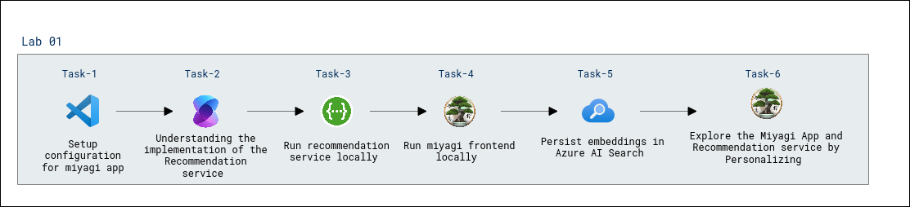
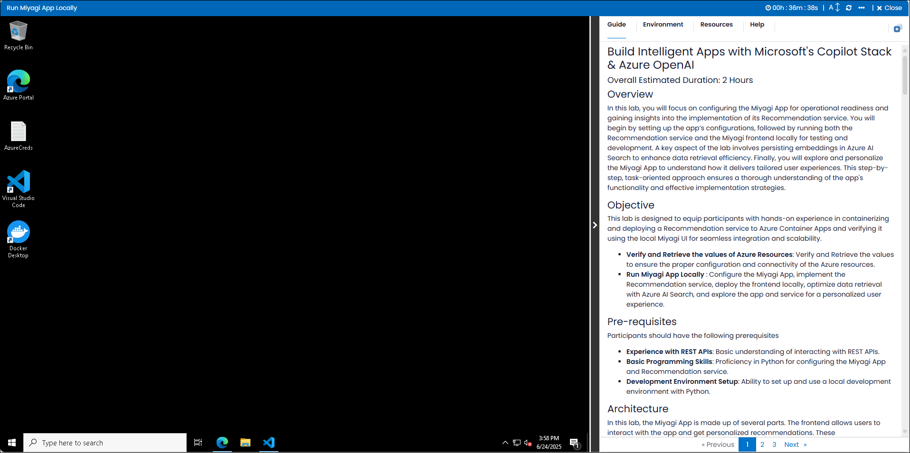
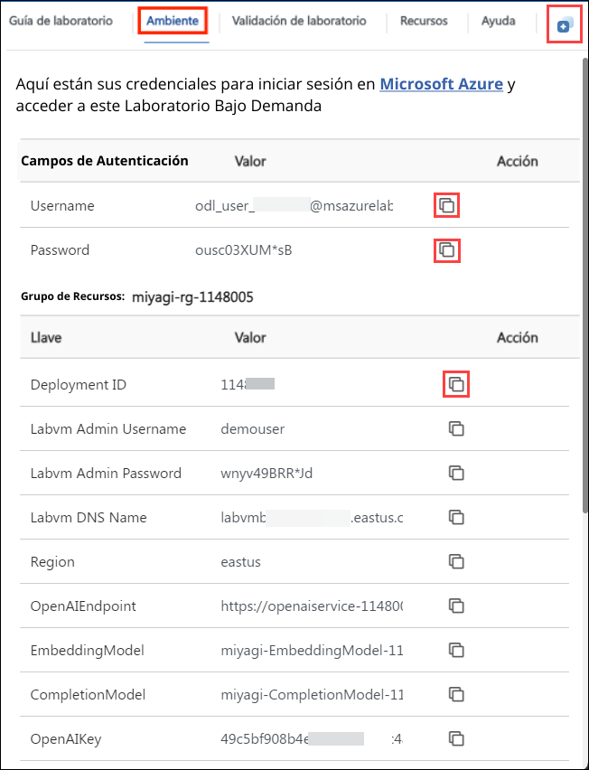
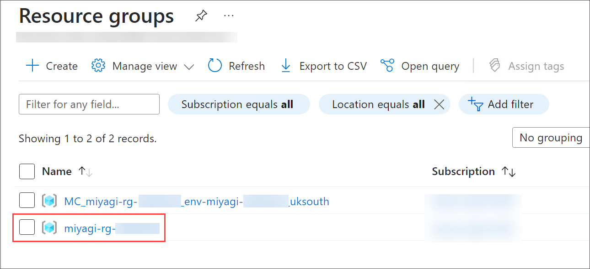

# Build Intelligent Apps with Microsoft's Copilot Stack & Azure OpenAI

### Overall Estimated Duration: 2 Hours

## Overview

In this lab, you will focus on configuring the Miyagi App for operational readiness and gaining insights into the implementation of its Recommendation service. You will begin by setting up the app’s configurations, followed by running both the Recommendation service and the Miyagi frontend locally for testing and development. A key aspect of the lab involves persisting embeddings in Azure AI Search to enhance data retrieval efficiency. Finally, you will explore and personalize the Miyagi App to understand how it delivers tailored user experiences. This step-by-step, task-oriented approach ensures a thorough understanding of the app's functionality and effective implementation strategies.

## Objective

This lab is designed to equip participants with hands-on experience in containerizing and deploying a Recommendation service to Azure Container Apps and verifying it using the local Miyagi UI for seamless integration and scalability.

- **Verify and Retrieve the values of Azure Resources**: Verify and retrieve the values to ensure the proper configuration and connectivity of the Azure resources.
- **Run Miyagi App Locally**: Configure the Miyagi App, implement the Recommendation service, deploy the frontend locally, optimize data retrieval with Azure AI Search, and explore the app and service for a personalized user experience.
  
## Pre-requisites

Participants should have the following prerequisites

- **Experience with REST APIs**: Basic understanding of interacting with REST APIs.
- **Basic Programming Skills**: Proficiency in Python for configuring the Miyagi App and Recommendation service.
- **Development Environment Setup**: Ability to set up and use a local development environment with Python.

## Architecture

In this lab, the Miyagi App is made up of several parts. The frontend allows users to interact with the app and get personalized recommendations. These recommendations are generated by the Recommendation service, which uses AI to analyze user data. To improve efficiency, the app stores user data as embeddings in Azure AI Search, making it easier to find relevant information. Everything runs locally on your machine for testing and development, ensuring all parts of the system work together smoothly.

## Architecture Diagram

   

## Explanation of Components

The architecture for this lab involves several key components:

- **Azure OpenAI**: Azure OpenAI integrates OpenAI's language models into Microsoft's Azure cloud, enabling scalable AI solutions for natural language processing and automation.
- **AI Search**: Is a cloud service that enables powerful and flexible search capabilities, including full-text search and AI-powered features.
- **Cosmos DB**: Globally distributed, multi-model database with low latency and high availability.
- **Azure Storage**: Scalable storage for blobs, files, queues, and tables.
- **Bing Search**: Lets you add Bing search features to your apps. It provides APIs for web, image, video, and news searches.

# Getting Started with the Lab

1. After the environment has been set up, your browser will load a virtual machine (JumpVM), use this virtual machine throughout the workshop to perform the lab. You can see the number on the bottom of the lab guide to switch to different exercises in the lab guide.

   
 
1. To get the lab environment details, you can select the **Environment** tab. Additionally, the credentials will also be emailed to your registered email address. You can also open the Lab Guide in a separate and full window by selecting the **Split Window** from the lower right corner. Also, you can start, stop, and restart virtual machines from the **Resources** tab.

    
   
   > You will see the SUFFIX value on the **Environment** tab; use it wherever you see SUFFIX or DeploymentID in lab steps.

## Lab Guide Zoom In/Zoom Out
 
To adjust the zoom level for the environment page, click the **A↕: 100%** icon located next to the timer in the lab environment.

 
## Login to the Azure Portal

1. Minimize the **Docker Desktop** by click on **Minimize** button.

   

   >**Note:** If you encounter the WSL Update failed error in the Docker Desktop application, click on **Quit** and reopen the Docker Desktop application from the Desktop.
   
      
  
    >If you face any issue, the WSL distro Docker Desktop relies on has exited unexpectedly. This usually happens as a result of an external entity terminating WSL. Click on the **Restart** Button.
  
     

1. In the JumpVM, click on the Azure portal shortcut of the Microsoft Edge browser, which is created on the desktop.

   

1. On the **Sign in to Microsoft Azure** tab, you will see the login screen. Enter the following email or username, and click on **Next**. 

   * **Email/Username**: **<inject key="AzureAdUserEmail"></inject>**

     
     
1. Now enter the following password and click on **Sign in**.
   
   * **Password**: **<inject key="AzureAdUserPassword"></inject>**

     
   
1. If you see the pop-up **Stay Signed in?**, select **No**.

   

1. If a **Welcome to Microsoft Azure** popup window appears, select **Cancel** to skip the tour.

    
   
1. Now that you will see the Azure Portal Dashboard, click on **Resource groups** from the Navigate panel to see the resource groups.

   

1. In the **Resource groups**, click on **miyagi-rg-<inject key="DeploymentID" enableCopy="false"/>** resource group.

   

1. In the **miyagi-rg-<inject key="DeploymentID" enableCopy="false"/>** resource groups, verify the resources present in it.

   

 > [!IMPORTANT] 
 > **For a smoother experience during the hands-on lab, it's important to thoroughly review both the instructions and the accompanying notes. This will help you navigate through the tasks with ease and confidence.**

## Support Contact

The CloudLabs support team is available 24/7, 365 days a year, via email and live chat to ensure seamless assistance at any time. We offer dedicated support channels tailored specifically for both learners and instructors, ensuring that all your needs are promptly and efficiently addressed.

Learner Support Contacts:

- Email Support: cloudlabs-support@spektrasystems.com.
- Live Chat Support: https://cloudlabs.ai/labs-support

Now, click on Next from the lower right corner to move on to the next page.

## Happy Learning!!
