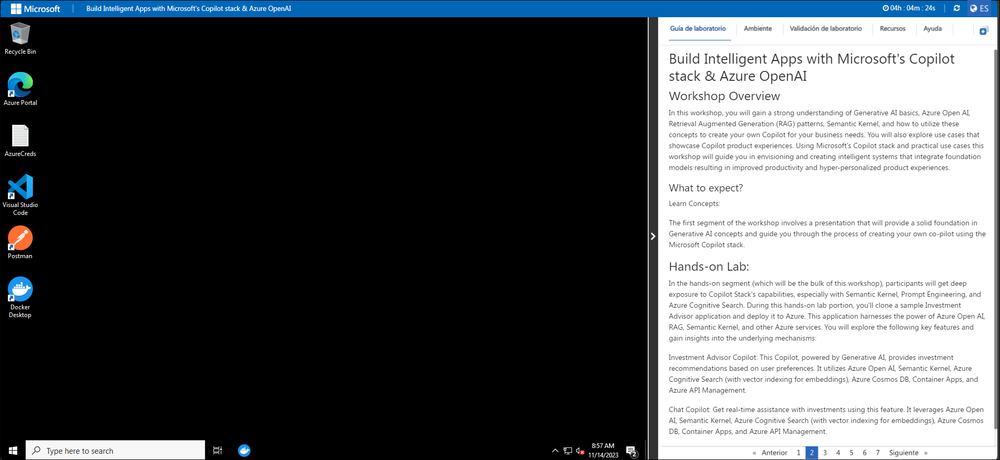

# Build Intelligent Apps with Microsoft's Copilot Stack & Azure OpenAI

### Overall Estimated Duration: 2 Hours 30 Minutes

## Overview

In this lab, you will containerize the Recommendation service and deploy it to Azure Container Apps. Containerization ensures a consistent and reproducible environment for your application. Azure Container Apps is a fully managed service that simplifies deploying and scaling containerized applications in the cloud. By the end of the lab, you will have the Recommendation service running in containers on Azure, ready for testing and integration.

## Objective

Learn how to containerize the Recommendation service and deploy it to Azure Container Apps for scalable and consistent cloud-based operations. By the end of this lab, you will be able to:

- **Verify and Retrieve the values of Azure Resources**: This hands-on exercise aims to verify and Retrieve the values to ensure the proper configuration and connectivity of the Azure resources.
- **Containerizing Recommendation service to Azure Container Apps** : This hands-on exercise aims to containerize and deploy the Recommendation service to Azure Container Apps, creating Docker images, pushing them to Azure Container Registry (ACR), and verifying the deployment for scalability and accessibility. 
- **Explore and Verify the Containerized Recommendation service in Azure Container App using Local Miyagi UI**: This hands-on exercise aims to explore and verify the containerized Recommendation service deployed in Azure Container Apps by integrating it with the local Miyagi UI, ensuring seamless functionality and validating service endpoints.
  
## Pre-requisites

Participants should have the following prerequisites

- **Basic Knowledge of Docker**: Familiarity with containerization concepts and Docker, including building and running Docker images.
- **Experience with Azure Container Apps**: Understanding of Azure Container Apps and the process of deploying containerized applications on Azure.
- **Familiarity with REST APIs**: Basic knowledge of REST API concepts for interacting with the Recommendation service and verifying functionality.
- **Basic Programming Skills**: Proficiency in Python or a similar programming language to work with the Recommendation service and containerization scripts.
- **Development Environment Setup**: Ability to set up a local development environment for running the Miyagi frontend and building Docker images.

## Architecture

The architecture involves the **Miyagi App Frontend**, which connects to the **Recommendation Service** to display personalized recommendations. The service is containerized and deployed on **Azure Container Apps**, with Docker images stored in a **Container Registry** for easy deployment. **Swagger** is used to test the service's API, ensuring proper functionality. The Miyagi UI connects to the deployed service on Azure, enabling verification and seamless interaction with the Recommendation service for personalized experiences.

## Architecture Diagram

   

## Explanation of Components

The architecture for this lab involves several key components:

- **Miyagi App Frontend**: The user interface that displays personalized recommendations by connecting to the Recommendation service. It interacts with the containerized service deployed in Azure.
- **Recommendation Service**: A backend service that generates personalized recommendations using AI models. It is containerized and accessed via the Miyagi frontend.
- **Azure Container Apps**: A managed service to deploy and scale containerized applications. It hosts the Recommendation service and is accessed from the Miyagi UI.
- **Swagger**: A tool to test and verify API endpoints of the Recommendation service, ensuring proper functionality after deployment.
- **Container Registry**: A storage location for Docker images of the Recommendation service, used to deploy the containerized service to Azure Container Apps.

# Getting Started with the Lab

1. After the environment has been set up, your browser will load a virtual machine (JumpVM), use this virtual machine throughout the workshop to perform the lab. You can see the number on the bottom of the lab guide to switch to different exercises in the lab guide.

   
 
1. To get the lab environment details, you can select the **Environment** tab. Additionally, the credentials will also be emailed to your registered email address. You can also open the Lab Guide in a separate and full window by selecting the **Split Window** from the lower right corner. Also, you can start, stop, and restart virtual machines from the **Resources** tab.

    
   
   > You will see the SUFFIX value on the **Environment** tab; use it wherever you see SUFFIX or DeploymentID in lab steps.

## Lab Guide Zoom In/Zoom Out
 
To adjust the zoom level for the environment page, click the **A↕ : 100%** icon located next to the timer in the lab environment.

 
## Login to the Azure Portal

1. Minimize the **Docker Desktop** by click on **Minimize** button.

   

   >**Note:** If you encounter WSL Update failed error in the Docker Desktop application click on **Quit** and reopen the Docker Desktop application from the Desktop.
   
      
  
    >If you face any issue A WSL distro Docker Desktop relies on has exited unexpectedly. This usually happens as a result of an external entity terminating WSL, click on **Restart** Button.
  
     

1. In the JumpVM, click on the Azure portal shortcut of the Microsoft Edge browser, which is created on the desktop.

   

1. On the **Sign in to Microsoft Azure** tab, you will see the login screen. Enter the following email or username, and click on **Next**. 

   * **Email/Username**: **<inject key="AzureAdUserEmail"></inject>**

     
     
1. Now enter the following password and click on **Sign in**.
   
   * **Password**: **<inject key="AzureAdUserPassword"></inject>**

     
   
1. If you see the pop-up **Stay Signed in?**, select **No**.

   

1. If a **Welcome to Microsoft Azure** popup window appears, select **Cancel** to skip the tour.

    
   
1. Now that you will see the Azure Portal Dashboard, click on **Resource groups** from the Navigate panel to see the resource groups.

   

1. In the **Resource groups**, click on **miyagi-rg-<inject key="DeploymentID" enableCopy="false"/>** resource group.

   

1. In the **miyagi-rg-<inject key="DeploymentID" enableCopy="false"/>** resource groups, verify the resources present in it.

   

 > [!IMPORTANT] 
 > **For a smoother experience during the hands-on lab, it's important to thoroughly review both the instructions and the accompanying notes. This will help you navigate through the tasks with ease and confidence.**

## Support Contact

The CloudLabs support team is available 24/7, 365 days a year, via email and live chat to ensure seamless assistance at any time. We offer dedicated support channels tailored specifically for both learners and instructors, ensuring that all your needs are promptly and efficiently addressed.

Learner Support Contacts:

- Email Support: cloudlabs-support@spektrasystems.com.
- Live Chat Support: https://cloudlabs.ai/labs-support

Now, click on Next from the lower right corner to move on to the next page.

## Happy Learning!!
