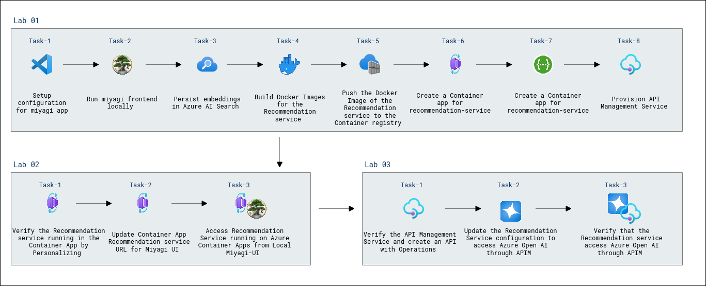
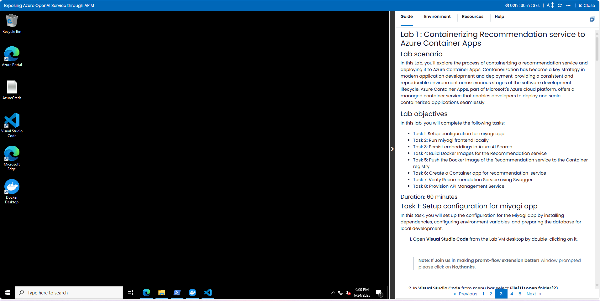

# Build Intelligent Apps with Microsoft's Copilot Stack & Azure OpenAI

### Overall Estimated Duration: 3 Hours 30 Minutes

## Overview

In this lab, you will containerize the Recommendation service and deploy it to **Azure Container Apps** for scalable operations. You will then integrate it with the **Miyagi App Frontend** and verify its functionality through the local UI. Finally, you'll expose the Recommendation service through **API Management (APIM)** to securely access **Azure OpenAI**, ensuring seamless and secure interaction for generating personalized recommendations. This lab covers containerization, API management, and integration of AI services in Azure.

## Objective

Understand how to containerize the Recommendation service, deploy it to Azure Container Apps, integrate it with the Miyagi frontend, and expose it through API Management for secure access to Azure OpenAI. By the end of this lab, you will be able to:

- **Verify and Retrieve the values of Azure Resources**: This hands-on exercise aims to verify and retrieve the values to ensure the proper configuration and connectivity of the Azure resources.
- **Containerizing Recommendation service to Azure Container Apps**: This hands-on exercise aims to containerize and deploy the Recommendation service to Azure Container Apps, creating Docker images, pushing them to Azure Container Registry (ACR), and verifying the deployment for scalability and accessibility. 
- **Explore and Verify the Containerized Recommendation service in Azure Container App using Local Miyagi UI**: This hands-on exercise aims to explore and verify the containerized Recommendation service deployed in Azure Container Apps by integrating it with the local Miyagi UI, ensuring seamless functionality and validating service endpoints.
- **Expose Open AI Service through APIM**: This hands-on exercise aims to verify and create APIs in the API Management service to update the Docker image for the Recommendation service, ensuring the optimization and maintenance of containerized applications.
  
## Pre-requisites

Participants should have the following prerequisites

- **Basic Knowledge of Docker**: Familiarity with containerization and building Docker images.
- **Experience with Azure Container Apps**: Understanding how to deploy and manage containerized applications in Azure.
- **Familiarity with REST APIs**: Knowledge of interacting with and configuring REST APIs for service integration.
- **Basic Programming Skills**: Proficiency in Python or similar languages to work with the Recommendation service and integrate it with frontend applications.
- **Understanding of API Management (APIM)**: Basic knowledge of using Azure API Management to expose and secure APIs.
- **Experience with Frontend Development**: Familiarity with setting up and using UI interfaces (like Miyagi UI) for testing services.

## Architecture

The architecture includes the **Recommendation Service** deployed as a container in **Azure Container Apps** for scalability. The **Miyagi App Frontend** connects to the service to display personalized recommendations. **Swagger** is used to test the API endpoints. **Azure API Management (APIM)** is used to securely expose the service and access **Azure OpenAI** for recommendations. Docker images of the service are stored in a **Container Registry** for deployment. This setup ensures a scalable, secure, and efficient solution for containerized AI services with managed API access.

## Architecture Diagram

   

## Explanation of Components

The architecture for this lab involves several key components:

- **Recommendation Service**: A backend service that generates personalized recommendations, deployed as a container in Azure Container Apps.
- **Miyagi App Frontend**: The UI that displays personalized recommendations by connecting to the Recommendation Service.
- **Azure Container Apps**: A managed service for deploying and scaling containerized applications like the Recommendation Service.
- **Swagger**: A tool to test and verify the API endpoints of the Recommendation Service.
- **Azure API Management (APIM)**: Exposes the Recommendation Service securely and integrates with Azure OpenAI for recommendations.
- **Container Registry**: Stores Docker images of the Recommendation Service for deployment.

# Getting Started with the Lab

1. After the environment has been set up, your browser will load a virtual machine (JumpVM), use this virtual machine throughout the workshop to perform the lab. You can see the number on the bottom of the lab guide to switch to different exercises in the lab guide.

   
 
1. To get the lab environment details, you can select the **Environment** tab. Additionally, the credentials will also be emailed to your registered email address. You can also open the Lab Guide in a separate and full window by selecting the **Split Window** from the lower right corner. Also, you can start, stop, and restart virtual machines from the **Resources** tab.

    
   
   > You will see the SUFFIX value on the **Environment** tab; use it wherever you see SUFFIX or DeploymentID in lab steps.

## Lab Guide Zoom In/Zoom Out
 
To adjust the zoom level for the environment page, click the **A↕: 100%** icon located next to the timer in the lab environment.


 
## Login to the Azure Portal

1. Minimize the **Docker Desktop** by click on **Minimize** button.

   

   >**Note:** If you encounter the WSL Update failed error in the Docker Desktop application, click on **Quit** and reopen the Docker Desktop application from the Desktop.
   
      
  
    >If you face any issue, the WSL distro Docker Desktop relies on has exited unexpectedly. This usually happens as a result of an external entity terminating WSL. Click on the **Restart** Button.
  
     

   >**Note:** If you still encounter the **WSL update failed** error, click **Quit**, then open **PowerShell** as an administrator and run the following command:
   >
   > ```powershell
   > wsl --update
   > ```

1. In the JumpVM, click on the Azure portal shortcut of the Microsoft Edge browser, which is created on the desktop.

   

1. On the **Sign in to Microsoft Azure** tab, you will see the login screen. Enter the following email or username, and click on **Next**. 

   * **Email/Username**: **<inject key="AzureAdUserEmail"></inject>**

     
     
1. Now enter the following password and click on **Sign in**.
   
   * **Password**: **<inject key="AzureAdUserPassword"></inject>**

     
   
1. If you see the pop-up **Stay Signed in?**, select **No**.

   

1. If a **Welcome to Microsoft Azure** popup window appears, select **Cancel** to skip the tour.

    
   
1. Now that you will see the Azure Portal Dashboard, click on **Resource groups** from the Navigate panel to see the resource groups.

   

1. In the **Resource groups**, click on **miyagi-rg-<inject key="DeploymentID" enableCopy="false"/>** resource group.

   

1. In the **miyagi-rg-<inject key="DeploymentID" enableCopy="false"/>** resource groups, verify the resources present in it.

   

 > [!IMPORTANT]<br>
 > **For a smoother experience during the hands-on lab, it's important to thoroughly review both the instructions and the accompanying notes. This will help you navigate through the tasks with ease and confidence.**

## Support Contact

The CloudLabs support team is available 24/7, 365 days a year, via email and live chat to ensure seamless assistance at any time. We offer dedicated support channels tailored specifically for both learners and instructors, ensuring that all your needs are promptly and efficiently addressed.

Learner Support Contacts:

- Email Support: cloudlabs-support@spektrasystems.com.
- Live Chat Support: https://cloudlabs.ai/labs-support

Now, click on Next from the lower right corner to move on to the next page.


## Happy Learning!!
