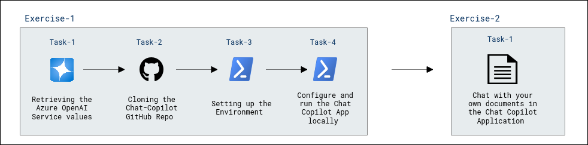
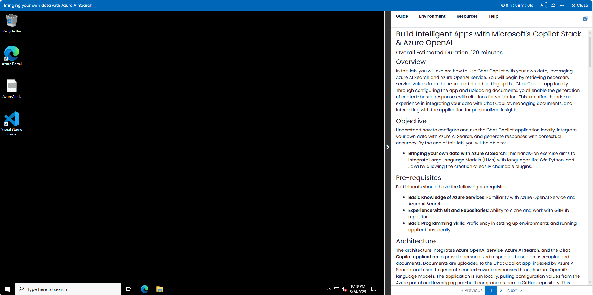
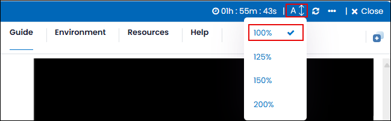

# Build Intelligent Apps with Microsoft's Copilot Stack & Azure OpenAI

### Overall Estimated Duration: 120 minutes

## Overview

In this lab, you will explore how to use Chat Copilot with your own data, leveraging Azure AI Search and Azure OpenAI Service. You will begin by retrieving necessary service values from the Azure portal and setting up the Chat Copilot app locally. Through configuring the app and uploading documents, you’ll enable the generation of context-based responses with citations for validation. This lab offers hands-on experience in integrating your data with Chat Copilot, managing documents, and interacting with the application for personalized insights.

## Objective

Understand how to configure and run the Chat Copilot application locally, integrate your own data with Azure AI Search, and generate responses with contextual accuracy. By the end of this lab, you will be able to:

- **Bringing your own data with Azure AI Search**: This hands-on exercise aims to integrate Large Language Models (LLMs) with languages like C#, Python, and Java by allowing the creation of easily chainable plugins. 
  
## Pre-requisites

Participants should have the following prerequisites

- **Basic Knowledge of Azure Services**: Familiarity with Azure OpenAI Service and Azure AI Search.
- **Experience with Git and Repositories**: Ability to clone and work with GitHub repositories.
- **Basic Programming Skills**: Proficiency in setting up environments and running applications locally.

## Architecture

The architecture integrates **Azure OpenAI Service**, **Azure AI Search**, and the **Chat Copilot application** to provide personalized responses based on user-uploaded documents. Documents are uploaded to the Chat Copilot app, indexed by Azure AI Search, and used to generate context-aware responses through Azure OpenAI's language models. The application is run locally, pulling configuration values from the Azure portal and leveraging pre-built components from a GitHub repository. This setup enables seamless interaction with your data, providing accurate responses enriched with citations for validation.

## Architecture Diagram

  

## Explanation of Components

The architecture for this lab involves several key components:

- **Azure OpenAI Service**: Provides access to powerful AI models for natural language understanding and response generation.
- **Azure AI Search**: Enables indexing and searching through uploaded documents to support contextual responses.
- **Chat Copilot App**: A sample application that integrates Azure OpenAI and AI Search to generate insights and citations based on your data.
- **GitHub Repository**: Contains the source code and dependencies for configuring and running the Chat Copilot app locally.

# Getting Started with the Lab

1. After the environment has been set up, your browser will load a virtual machine (JumpVM) and use this virtual machine throughout the workshop to perform the lab. You can see the number on the bottom of the lab guide to switch to different exercises in the lab guide.

   
 
1. To get the lab environment details, you can select the **Environment** tab. Additionally, the credentials will also be emailed to your registered email address. You can also open the Lab Guide in a separate and full window by selecting the **Split Window** from the lower right corner. Also, you can start, stop, and restart virtual machines from the **Resources** tab.

    
   
   > You will see the SUFFIX value on the **Environment** tab; use it wherever you see SUFFIX or DeploymentID in lab steps.

## Lab Guide Zoom In/Zoom Out
 
To adjust the zoom level for the environment page, click the **A↕: 100%** icon located next to the timer in the lab environment.

 
## Login to the Azure Portal

1. In the JumpVM, click on the Azure portal shortcut of the Microsoft Edge browser, which is created on the desktop.

   

1. On the **Sign in to Microsoft Azure** tab, you will see the login screen. Enter the following email or username, and click on **Next**. 

   * **Email/Username**: **<inject key="AzureAdUserEmail"></inject>**

     
     
1. Now enter the following password and click on **Sign in**.
   
   * **Password**: **<inject key="AzureAdUserPassword"></inject>**

     
   
1. If you see the pop-up **Stay Signed in?**, select **No**.

   

1. If a **Welcome to Microsoft Azure** popup window appears, select **Cancel** to skip the tour.

    
   
1. Now that you will see the Azure Portal Dashboard, click on **Resource groups** from the Navigate panel to see the resource groups.

   

1. In the **Resource groups**, click on **miyagi-rg-<inject key="DeploymentID" enableCopy="false"/>** resource group.

   

1. In the **miyagi-rg-<inject key="DeploymentID" enableCopy="false"/>** resource groups, verify the resources present in it.

   

 > [!IMPORTANT] 
 > **For a smoother experience during the hands-on lab, it's important to thoroughly review both the instructions and the accompanying notes. This will help you navigate through the tasks with ease and confidence.**

## Support Contact

The CloudLabs support team is available 24/7, 365 days a year, via email and live chat to ensure seamless assistance at any time. We offer dedicated support channels tailored specifically for both learners and instructors, ensuring that all your needs are promptly and efficiently addressed.

Learner Support Contacts:

- Email Support: cloudlabs-support@spektrasystems.com.
- Live Chat Support: https://cloudlabs.ai/labs-support

Now, click on Next from the lower right corner to move on to the next page.

## Happy Learning!!
