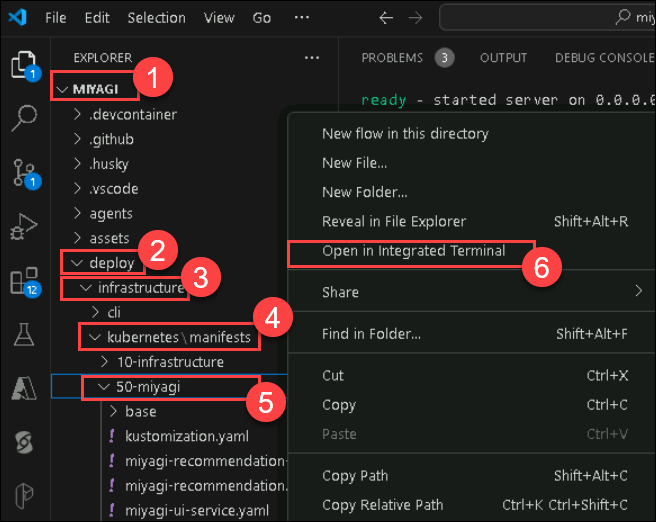
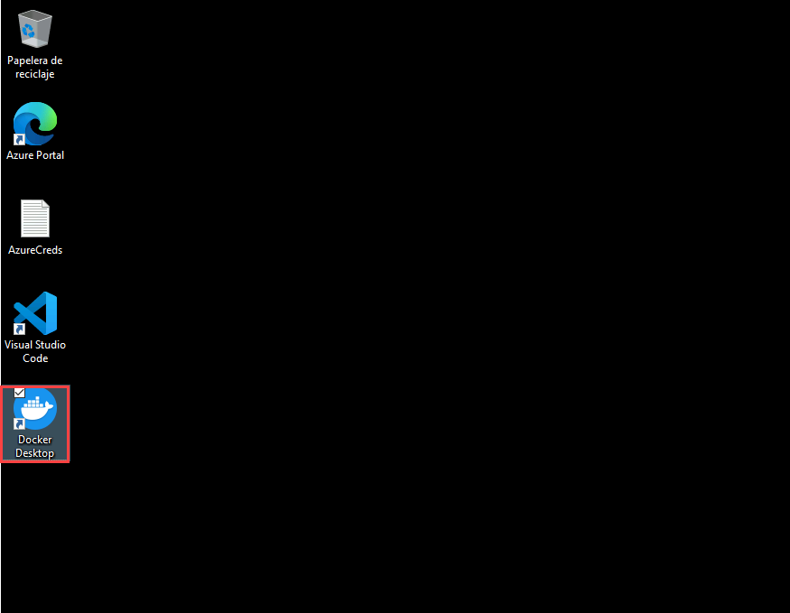
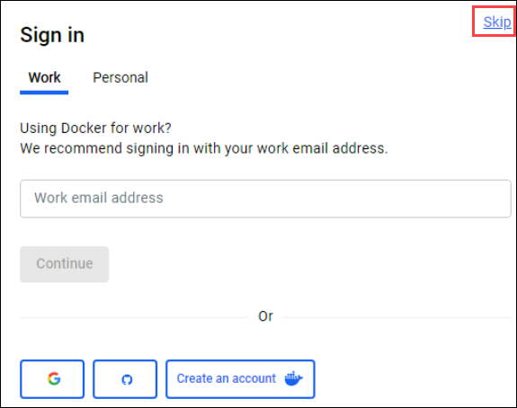
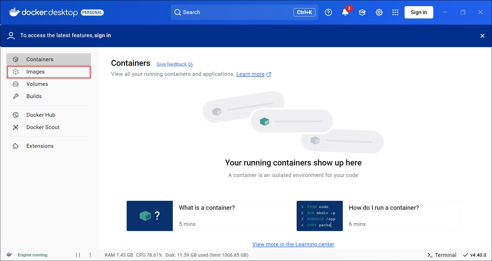
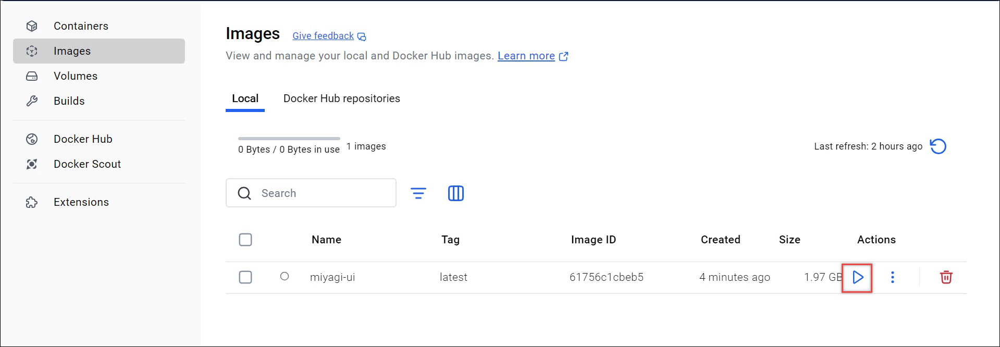
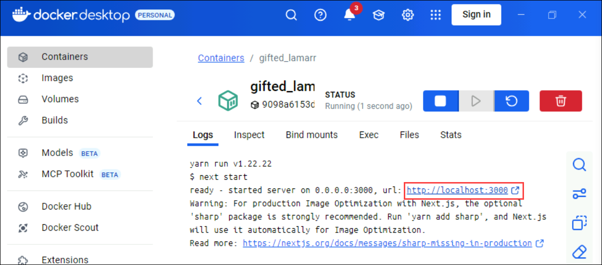
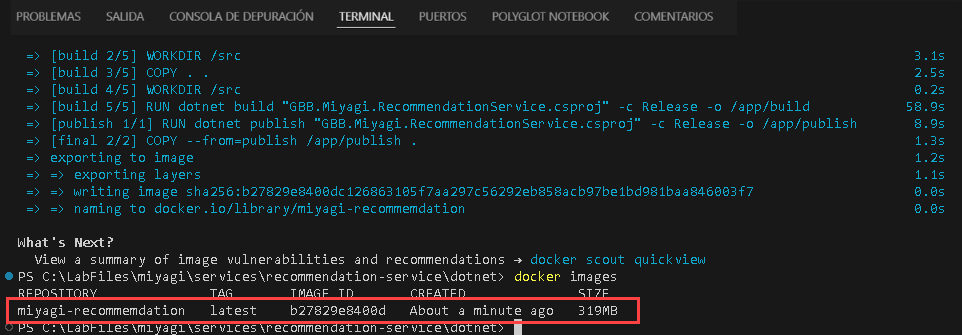
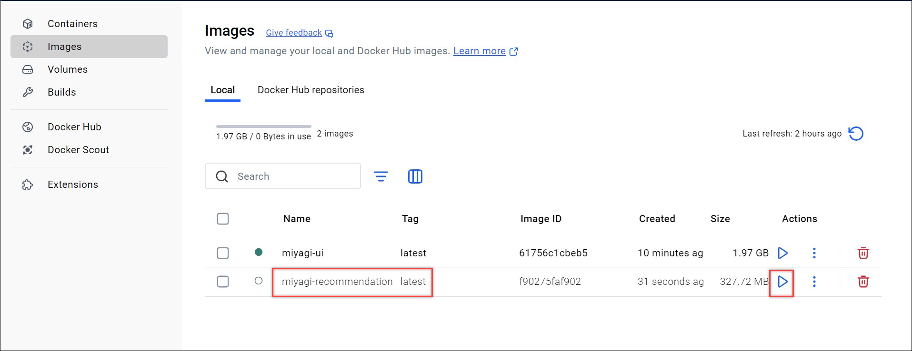
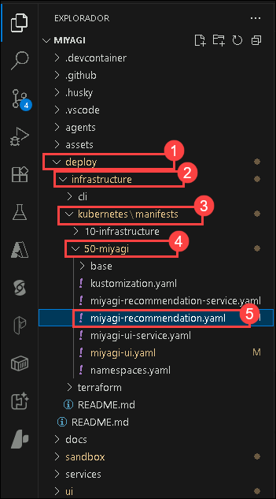
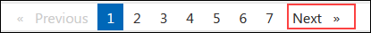

# Lab 3.1: Containerizing Miyagi UI and Recommendation service to Azure Kubernetes Service(AKS) 

### Estimated Duration: 60 minutes

In this lab, you will containerize and deploy the Miyagi UI and recommendation services to Azure Kubernetes Service (AKS). You will start by configuring Kubernetes and building Docker images for both services. The process involves pushing these images to Azure Container Registry (ACR) and then deploying them on an AKS cluster. This ensures that the services are seamlessly integrated and operational within a scalable, containerized environment applying Kubernetes configurations, updating service IP addresses, and verifying the deployment by accessing the services through their respective endpoints.

## Lab objectives

You will be able to complete the following tasks:

- Task 1: Deploy AKS Services
- Task 2: Build a Docker Image for the Miyagi UI
- Task 3: Build Docker Images for the Recommendation service
- Task 4: Push the Docker Image of Recommendation service to the Container registry
- Task 5: Deploy AKS Pods

### Lab 3.2: Explore and Verify the Containerized Miyagi UI and Recommendation service in AKS

- Task 1: Explore Recommendation service in AKS using Ingress Endpoint
- Task 2: Explore the Miyagi App in AKS using Ingress Endpoint

### Task 1: Deploy AKS Services

In this task, you will deploy the Miyagi recommendation and UI services to an Azure Kubernetes Service (AKS) cluster. This involves logging into the Azure portal, applying Kubernetes configurations, and updating configuration files with the services' external IP addresses.

1. Navigate back to the Visual Studio code window and navigate to **miyagi (1)/deploy (2)/infrastructure (3)/kubernetes/manifests (4)/50-miyagi (5)**, right-click on **50-miyagi** in the cascading menu, and select **Open in integrated Terminal (6)**.

    

1. Run the following command to log in to the Azure portal.

   ```
   az login
   ```

1. This will redirect to **Microsoft login page**, select your Azure account **<inject key="AzureAdUserEmail"></inject>**, and navigate back to the **Visual studio code**.

   

1. Run the following command to log in to the Azure portal.

   ```
   az aks get-credentials -n <inject key="aksname" enableCopy="true"/> -g <inject key="rgname" enableCopy="true"/>
   ```

   >**Important**: The command az aks get-credentials -n <inject key="aksname" enableCopy="true"/> -g <inject key="rgname" enableCopy="true"/> is used in Azure's command-line interface (CLI) to retrieve and merge the Kubernetes configuration files for a specified Azure Kubernetes Service (AKS) cluster into the local kubeconfig file.
   
1. Once the command finishes you should now have access to the cluster and can run the following commands to deploy the application services.

   ```
   kubectl apply -f ./miyagi-recommendation-service.yaml
   ```
   ```
   kubectl apply -f ./miyagi-ui-service.yaml
   ```
   
    >**Note**: Upon successful execution of the above commands. The Kubernetes will read the YAML file and apply its configurations to the cluster. It will create miyagi-recommendation- 
    service and miyagi-ui
 
1. Once the services have been deployed run the below command and keep track of the service's **external IPs**. It could take a few minutes for the **external IPs** to appear so wait a few minutes before running the command.

   ```
   kubectl get svc
   ```

   

1. Next navigate to **miyagi folder** and expand **services (1)/recommendation-service (2)/dotnet (3)** and open **appsettings.json (4)** file.

   
   
1. Copy the **miyagi-ui** External IP address from the console and paste it in the **CorsAllowedOrigins** section formatted as an **http://** endpoint and save the file by **Ctrl + S**.

   

1. Next navigate to **miyagi/ui/typescript (1)** and open the **.env (2)** file. 

   

1. Copy the **miyagi-recommendation-service** External IP address from the console and paste it in the **NEXT_PUBLIC_RECCOMMENDATION_SERVICE_URL** value and save the file by **Ctrl + S**.

   

### Task 2: Build a Docker Image for the Miyagi UI

In this task, you will build and run the Miyagi UI Docker container locally. Begin by opening the Docker Desktop and completing the initial setup. Next, use Visual Studio Code to build the Docker image for the Miyagi UI. Once the image is created, verify it and run the image in Docker. Configure the host port and access the application locally via the provided URL.

1. Navigate to the Docker Desktop application from the taskbar. If it is not open, you can open it by double-clicking on  the **Docker** Application from the Lab VM desktop.

   
   
    >**Note:** If you are prompted with Docker Desktop initial sign-in prompts follow the below steps:
    
    >If you are prompted with the **Docker Subscription Service Agreement** window, click **Accept**.

      

    > In the **Welcome to Docker Desktop** window, click on **Continue without signing in**.

     

    > In the **Sign in** window, click on **Skip**.

      
   
    >**Note**: Please ensure that the Docker engine is in a running state before proceeding to the next step.

1. Navigate back to **Visual studio code** window and navigate to **miyagi/ui/typescript** right - click in cascading menu, select **Open in Integrated Terminal**.

   ```
   docker build . -t miyagi-ui      
   ```

   > **Note**: Please wait as this command may require some time to complete.

   > **Note**: this command reads instructions from the Dockerfile, processes them to create a Docker image based on those instructions, and then tags the resulting image with the name miyagi-ui.
   
1. Run the following command to get the newly created image.

   ```
   docker images
   ```

   

1. Navigate back to **Docker desktop**, from the left pane select **Images**.

   

1. In the **Images** blade, notice **miyagi-ui** image is created, select **Run** icon .

   

1. In the **Run a new container** window select the dropdown arrow.

   

1. In the **Run a new container**, under **Ports** for **Host Port** enter **3000 (1)** and click on **Run (2)**.

    

1. Click on the URL link: **http://localhost:3000**

    
   
1. You should be able to see the application running locally
   
     

### Task 3: Build Docker Images for the Recommendation service

In this task, you will build and run the Miyagi recommendation service Docker container locally. Begin by opening the Docker Desktop and completing the initial setup. Next, use Visual Studio Code to build the Docker image for the Miyagi recommendation service. Once the image is created, verify it and run the image in Docker. Configure the host port and access the application locally via the provided URL.

1. Navigate back to **Visual studio code** window and navigate to **miyagi folder** and expand **services (1)/recommendation-service (2)/dotnet (3)** right - click on dotnet in cascading menu, select **Open in integrated Terminal (4)**.

   

1. Run the following command to build a **Docker image**.

   ```
   docker build . -t miyagi-recommendation      
   ```

   

   > **Note**: Please wait as this command may require some time to complete.

1. Run the following command to get the newly created **Docker image**.

   ```
   docker images
   ```
   
   
   
1. Navigate back to **Docker desktop**, from the left pane select **Images**.

   

1. In the **Images** blade, notice **miyagi-recommendation** image is created, select **Run** icon .

   

1. In the **Run a new container** window select the dropdown arrow.

   
   
1. In the **Run a new container**, under **Ports** for **Host Port** enter **5224 (1)** and click on **Run (2)**.

    

1. Click on **5224:8080** URL link.

   
   
1. You should be able to see the application running locally.
   
   

### Task 4: Push the Docker Image of Recommendation service to the Container registry

In this task, you will push the Docker image of the Miyagi recommendation service to the Azure Container Registry (ACR). This involves logging into the Azure portal, tagging the Docker image with the ACR name, and then pushing the image to the ACR. 

1. Navigate back to the **Visual studio code** window and navigate to **miyagi folder** and expand **services (1)/recommendation-service (2)/dotnet (3)** right - click on dotnet in cascading menu, select **Open in integrated Terminal (4)**.

    
   
1. Run the following command to log in to the **Azure portal**.

    ```
    az login
    ```

1. This will redirect to **Microsoft login page**, select your Azure account **<inject key="AzureAdUserEmail"></inject>**, and navigate back to the **Visual studio code**.

   

1. Run the following command to log in to an **Azure Container Registry (ACR)** using the Azure CLI.
   
   ```
   az acr login -n <inject key="AcrUsername" enableCopy="true"/> 
   ```

   >**Note**: The command **az acr login -n <inject key="AcrLoginServer" enableCopy="false"/>** logs you into an Azure Container Registry (ACR) instance. It authenticates your session with the specified Azure Container Registry, allowing you to push and pull container images to and from the registry.
    
1. Run the following command to add the tag.

   ```
   docker tag miyagi-recommendation:latest <inject key="AcrLoginServer" enableCopy="true"/>/miyagi-recommendation:latest
   ```

   >**Note**: The command **docker tag miyagi-recommendation:latest <inject key="AcrLoginServer" enableCopy="false"/>/miyagi-recommendation:latest** tags a local Docker image with a new name that includes the Azure Container Registry (ACR) name. By tagging the image this way, you prepare it to be pushed to the specified Azure Container Registry.

1. Run the following command to push the image to the container registry.

   ```
   docker push <inject key="AcrLoginServer" enableCopy="true"/>/miyagi-recommendation:latest
   ```

   

   >**Note**: The command **docker push <inject key="AcrLoginServer" enableCopy="false"/>/miyagi-recommendation:latest** uploads the specified Docker image, which has been tagged with the Azure Container Registry (ACR) name, to the ACR. This makes the image available in the ACR for deployment and use in various Azure services.
   
1. Navigate back to **Visual studio code** window and navigate to **miyagi/ui/typescript** right - click in cascading menu, select **Open in integrated Terminal**.

1. Run the following command to add the tag.

   ```
   docker tag miyagi-ui:latest <inject key="AcrLoginServer" enableCopy="true"/>/miyagi-ui:latest
   ```

1. Run the following command to push the image to the container registry.

   ```
   docker push <inject key="AcrLoginServer" enableCopy="true"/>/miyagi-ui:latest
   ```

### Task 5: Deploy AKS Pods

In this task, you will deploy the Miyagi UI and Recommendation services to Azure Kubernetes Service (AKS) pods. This involves modifying the Kubernetes manifest files to include the Azure Container Registry (ACR) name, applying the configurations, and verifying the deployment of the pods.

1. Navigate to **Miyagi/deploy (1)/infrastructure (2)/Kubernetes/manifests (3)/50-miyagi (4)**. Open the **miyagi-recommendation.yaml (5)** file.

   

1. In the **miyagi-recommendation.yaml** file, replace &lt;ACR-NAME&gt; with the name of your Azure container registry **<inject key="acrUsername" enableCopy="true"/>** and save the file with **Ctrl + S**.

   
   
   

1. Open the **miyagi-ui.yaml** file and replace the &lt;ACR-NAME&gt; with **<inject key="acrUsername" enableCopy="true"/>** Azure container registry name  and save the file by **Ctrl + S**.

   

   

1. Navigate to **miyagi folder (1)** and expand **deploy (2)/infrastructure (3)/kubernetes/manifests (4)/50-miyagi (5)** click on **50-miyagi** in the cascading menu, and select **Open in integrated Terminal (6)**.

    

1. Run the following commands to deploy the application pods.

   ```
   kubectl apply -f ./miyagi-recommendation.yaml
   ```

   ```
   kubectl apply -f ./miyagi-ui.yaml
   ```

1. The applications should now be deployed. To verify run the below command and you should see both pods in a running state.

   >**Note**: It could take a few minutes for the output to appear, so wait a few minutes before running the command.
   
   ```
   kubectl get pods
   ```
   
   

 
>**Congratulations** on completing the Task! Now, it's time to validate it. Here are the steps:
> - Hit the Validate button for the corresponding task. If you receive a success message, you have successfully validated the lab. 
> - If not, carefully read the error message and retry the step, following the instructions in the lab guide.
> - If you need any assistance, please contact us at cloudlabs-support@spektrasystems.com.

<validation step="e8c4db10-7879-482c-a538-de23b5f3eba3" />

# Lab 3.2: Explore and Verify the Containerized Miyagi UI and Recommendation service in AKS

In this lab, you'll explore the deployment and verification of the Miyagi UI and Recommendation services on Azure Kubernetes Service (AKS). Tasks involve testing APIs and accessing the UI via Ingress endpoints, ensuring proper functionality within the AKS environment.

### Task 1: Explore Recommendation service in AKS using Ingress Endpoint

1. To test the API run the below command to get the service IP addresses

   >**Note**: It could take a few minutes for the output to appear so wait a few minutes before running the command.

   ```
   kubectl get svc
   ```
   
   

1. Copy the External IP address of the **miyagi-recommendation-service** and enter it into the browser. You should now see the swagger endpoint.
   
    
   
### Task 2: Explore Miyagi App in AKS using Ingress Endpoint

1. To test the UI run the below command to get the service IP addresses

   ```
   kubectl get svc
   ```
   
   

1. Copy the External IP address of the **miyagi-ui** and enter it into the browser. You should now see the Miyagi frontend.

    

### Summary

In this Lab, you deployed Azure Kubernetes Service (AKS) for both the Miyagi UI and Miyagi Recommendation service. It began with constructing Docker images for these services, containing all necessary components like code and configuration files. After image creation, the next step involved pushing the Recommendation service's Docker image to a Container registry, a storage and deployment platform for Kubernetes clusters. Finally, AKS pods were deployed, representing running containers within the Kubernetes cluster, thereby making the Miyagi UI and Recommendation service operational

### You have successfully completed this lab. Now click on Next from the lower right corner to move to the next page.


