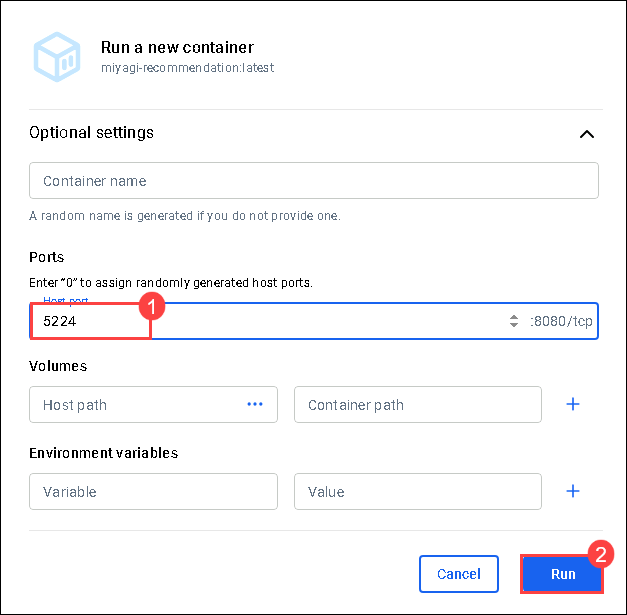

# Laboratorio 3.1 - Contenedorización de la interfaz de usuario de Miyagi y el servicio de Recomendación en Azure Kubernetes Service (AKS)

### Duración estimada: 60 minutos

En este laboratorio, contenedorizará e implementará la interfaz de usuario de Miyagi y los servicios de recomendación en Azure Kubernetes Service (AKS). Comenzará configurando Kubernetes y creando imágenes de Docker para ambos servicios. El proceso implica enviar estas imágenes a Azure Container Registry (ACR) y luego implementarlas en un clúster de AKS. Esto garantiza que los servicios se integren y funcionen sin problemas en un entorno escalable y contenedorizado, aplicando las configuraciones de Kubernetes, actualizando las direcciones IP de los servicios y verificando la implementación mediante el acceso a los servicios a través de sus respectivos puntos de conexión.

## Objetivos del laboratorio
Podrá completar las siguientes tareas:

- Tarea 1: Implementar servicios de AKS
- Tarea 2: Crear una imagen de Docker para la interfaz de usuario de Miyagi
- Tarea 3: Crear Imágenes de Docker para el servicio de Recomendación 
- Tarea 4: Enviar la Imagen Docker del servicio de Recomendación a Azure Container registry
- Tarea 5: Implementar Pods de AKS

### Laboratorio 3.2: Explorar y Verificar Miyagi UI contenedorizada y el Servicio de Recomendaciones en AKS

- Tarea 1: Explorar el servicio de recomendaciones en AKS con Ingress Endpoint
- Tarea 2: Explorar la aplicación Miyagi en AKS con Ingress Endpoint

### Tarea 1: Implementar servicios de AKS

En esta tarea, implementará los servicios de recomendación y UI de Miyagi en un clúster de Azure Kubernetes Service (AKS). Esto implica iniciar sesión en Azure Portal, aplicar las configuraciones de Kubernetes y actualizar los archivos de configuración con las direcciones IP externas de los servicios.

1. Vuelva a la ventana de Visual Studio Code y navegue a **miyagi/deploy/infrastructure/kubernetes/manifests/50-miyagi**, haga clic derecho en **50-miyagi** y en el menú contextual seleccione **Abrir en Terminal Integrada**.

    

2. Ejecute el siguiente comando para iniciar sesión en el Portal de Azure.

   > **Nota**: reemplace [ClusterName] con **<inject key="aksname" enableCopy="true"/>** y [ResourceGroupName] con **<inject key="rgname" enableCopy="true"/>**

   ```
   az aks get-credentials -n [ClusterName] -g [ResourceGroupName]
   ```

   >**Importante**: El comando az aks get-credentials -n <inject key="aksname" enableCopy="true"/> -g <inject key="rgname" enableCopy="true"/> se usa en la interfaz de línea de comandos (CLI) de Azure para recuperar y combinar los archivos de configuración de Kubernetes para un clúster de Azure Kubernetes Service (AKS) específico en el archivo kubeconfig local.

3. Una vez que el comando finalice, ahora debería tener acceso al clúster para poder ejecutar los siguientes comandos a fin de implementar los servicios de la aplicación.

   ```
   kubectl apply -f ./miyagi-recommendation-service.yaml
   ```
   ```
   kubectl apply -f ./miyagi-ui-service.yaml
   ```

4. Una vez que se hayan implementado los servicios, ejecute el siguiente comando y realice un seguimiento de las **direcciones IP externas** del servicio. Las **direcciones IP externas** pueden tardar unos minutos en aparecer, así que espere unos minutos antes de ejecutar el comando.

   ```
   kubectl get svc
   ```

   

5. A continuación, navegue a **miyagi/services/recommendation-service/dotnet** y abra el archivo **appsettings.json**.

   
   
6. Copie la Dirección IP Externa **miyagi-ui** de la consola y péguela en la sección **CorsAllowedOrigins** formateada como un punto de conexión **http** y guarde el archivo con **Ctrl + S**.  

   

7. Ahora navegue a **miyagi/ui/typescript** y abra el archivo **.env**. 

   

8. Copie la Dirección IP Externa **miyagi-recommendation-service** de la consola y péguela en el valor **NEXT_PUBLIC_RECCOMMENDATION_SERVICE_URL** y guarde el archivo con **Ctrl + S**.

   

### Tarea 2: Crear una imagen de Docker para la interfaz de usuario de Miyagi

En esta tarea, creará y ejecutará el contenedor Docker de Miyagi UI localmente. Comience abriendo Docker Desktop y completando la configuración inicial. A continuación, use Visual Studio Code para crear la imagen de Docker para Miyagi UI. Una vez creada la imagen, verifíquela y ejecútela en Docker. Configure el puerto host y acceda a la aplicación localmente mediante la URL proporcionada.

1. Acceda a la aplicación Docker Desktop desde la barra de tareas. Si no está abierta, puede abrirla haciendo doble clic en la aplicación **Docker** desde el escritorio de la máquina virtual del laboratorio.

   

    >**Nota:** Si se le solicita iniciar sesión en Docker Desktop, siga estos pasos:
    
    >Si aparece la ventana **Acuerdo de Servicio de Suscripción de Docker**, haga clic en **Aceptar**.

      

    > En la ventana **Welcome to Docker Desktop**, haga clic en **Continue without signing in**.

     

    > En la ventana **Sign in**, haga clic en **Skip**.

      
   
    >**Nota**: Asegúrese de que el motor Docker esté en funcionamiento antes de continuar con el siguiente paso.

5. Vuelva a la ventana de **Visual Studio Code** y navegue a **miyagi/ui/typescript** haga clic derecho y en el menú contextual seleccione **Abrir en la Terminal Integrada**.

   ```
   docker build . -t miyagi-ui      
   ```

   > **Nota**: Por favor espere, ya que este comando puede tardar algún tiempo en completarse.

   > **Nota**: Este comando lee las instrucciones del Dockerfile, las procesa para crear una imagen de Docker basada en esas instrucciones y luego etiqueta la imagen resultante con el nombre miyagi-ui.

6. Ejecute el siguiente comando para obtener la imagen recién creada.

   ```
   docker images
   ```

   

7. Vuelva a **Docker Desktop**, en el panel izquierdo seleccione **Images**.

   

8. En la hoja **Images**, observe que se ha creado la imagen **miyagi-ui**, seleccione el icono **Run**.

   

9. En la ventana **Run a new container** seleccione la flecha desplegable.

   .png)

10. En **Run a new container**, en **Ports** para **Host Port** ingrese **3000** y haga clic en **Run**.

    

11. Haga clic en el enlace URL **http://localhost:3000**.

    
   
12. Debería poder ver la aplicación ejecutándose localmente.
   
     

### Tarea 3: Crear Imágenes de Docker para el servicio de Recomendación 

En esta tarea, creará y ejecutará localmente el contenedor Docker del servicio de recomendaciones Miyagi. Comience abriendo Docker Desktop y completando la configuración inicial. A continuación, use Visual Studio Code para crear la imagen de Docker para el servicio de recomendaciones Miyagi. Una vez creada la imagen, verifíquela y ejecútela en Docker. Configure el puerto host y acceda a la aplicación localmente mediante la URL proporcionada.

1. Vuelva a la ventana de **Visual Studio Code** y navegue a **miyagi/services/recommendation-service/dotnet**, haga clic derecho en dotnet, en el menú contextual seleccione **Abrir en Terminal integrada**.

   

1. Ejecute el siguiente comando para crear una **imagen de Docker**

   ```
   docker build . -t miyagi-recommendation      
   ```

   

   > **Nota**: Por favor espere, ya que este comando puede tardar algún tiempo en completarse.

1. Ejecute el siguiente comando para obtener la imagen recién creada.

   ```
   docker images
   ```
   
   

1. Vuelva a **Docker Desktop**, en el panel izquierdo seleccione **Images**.

   

1. En la hoja **Images**, observe que se crea la imagen **miyagi-recommendation**, seleccione el icono **Run**.

   

1. En la ventana **Run a new container**, seleccione la flecha desplegable.

   .png)

1. En **Run a new container**, en **Ports** para **Host Port** ingrese **5224** y haga clic en **Run**.

    

1. Haga clic en el enlace URL **5224:8080**

   
   
1. Debería poder ver la aplicación ejecutándose localmente.
   
   

### Tarea 4: Enviar la Imagen Docker del servicio de Recomendación a Azure Container registry

En esta tarea, enviará la imagen de Docker del servicio de recomendaciones Miyagi a Azure Container Registry (ACR). Esto implica iniciar sesión en Azure Portal, etiquetar la imagen de Docker con el nombre de ACR y, a continuación, enviarla a ACR.

1. Vuelva a la ventana **Visual Studio Code** y navegue a **miyagi/services/recommendation-service/dotnet** haga clic derecho en dotnet y el menú contextual seleccione **Abrir en la Terminal Integrada**.

   


1. Ejecute el siguiente comando para iniciar sesión en el **Portal de Azure**.

    ```
    az login
    ```

1. Esto lo redirigirá a la **Página de Inicio de sesión de Microsoft Azure**, seleccione su cuenta de Azure **<inject key="AzureAdUserEmail"></inject>**, y regrese a **Visual Studio Code**.

   

1. Ejecute el siguiente comando para iniciar sesión en **Azure Container Registry (ACR)** usando la CLI de Azure.

   > **Nota**: Por favor reemplace **[ACRname]** con **<inject key="AcrUsername" enableCopy="true"/>**.
   
   ```
   az acr login -n [ACRname] 
   ```

   > Nota: El comando **az acr login -n <inject key="AcrLoginServer" enableCopy="false"/>** inicia sesión en una instancia de Azure Container Registry (ACR). Esto autentica la sesión con el Azure Container Registry especificado, lo que permite enviar y recibir imágenes de contenedor del registro.

1. Ejecute el siguiente comando para agregar la etiqueta.

   > **Nota**: Por favor reemplace **[ACRname]** con **<inject key="AcrLoginServer" enableCopy="true"/>**.

   ```
   docker tag miyagi-recommendation:latest [ACRname]/miyagi-recommendation:latest
   ```

   > **Nota**: El comando **docker tag miyagi-recommendation:latest <inject key="AcrLoginServer" enableCopy="false"/>/miyagi-recommendation:latest** etiqueta una imagen local de Docker con un nuevo nombre que incluye el nombre de Azure Container Registry (ACR). Al etiquetar la imagen de esta manera, se prepara para su envío al Azure Container Registry especificado.

1. Ejecute el siguiente comando para enviar la imagen al registro de contenedor.

   > **Nota**: Por favor reemplace **[ACRname]** con **<inject key="AcrLoginServer" enableCopy="true"/>**.

   ```
   docker push [ACRname]/miyagi-recommendation:latest
   ```

   

   > **Nota**: El comando **docker push <inject key="AcrLoginServer" enableCopy="false"/>/miyagi-recommendation:latest** carga la imagen de Docker especificada, etiquetada con el nombre de Azure Container Registry (ACR), en el ACR. Esto hace que la imagen esté disponible en el ACR para su implementación y uso en diversos servicios de Azure.

1. Vuelva a la ventana **Visual Studio Code** y navegue a **miyagi/ui/typescript** haga clic derecho, en el menú contextual seleccione **Abrir en la Terminal Integrada**.

1. Ejecute el siguiente comando para agregar la etiqueta.

   > **Nota**: Por favor reemplace **[ACRname]** con **<inject key="AcrLoginServer" enableCopy="true"/>**.

   ```
   docker tag miyagi-ui:latest [ACRname]/miyagi-ui:latest
   ```

1. Ejecute el siguiente comando para enviar la imagen al registro del contenedor.

   > **Nota**: Por favor reemplace **[ACRname]** con **<inject key="AcrLoginServer" enableCopy="true"/>**.

   ```
   docker push [ACRname]/miyagi-ui:latest
   ```

### Tarea 5: Implementar Pods de AKS

En esta tarea, implementará los servicios Miyagi UI y Recomendación en los pods de Azure Kubernetes Service (AKS). Esto implica modificar los archivos de manifiesto de Kubernetes para incluir el nombre de Azure Container Registry (ACR), aplicar las configuraciones y verificar la implementación de los pods.

1. Vuelva a la ventana Visual Studio Code y navegue a **miyagi/deploy/infrastructure/kubernetes/manifests/50-miyagi** haga clic derecho en **50-miyagi** y en el menú contextual seleccione **Abrir en Ventana Integral**.

    

2. Abra el archivo **miyagi-recommendation.yaml** y reemplace &lt;ACR-NAME&gt; con **<inject key="acrUsername" enableCopy="true"/>**, el nombre del Azure Container Registry creado anteriormente y guarde el archivo con **Ctrl + S**.

   

   

3. Abra el archivo **miyagi-ui.yaml** y reemplace &lt;ACR-NAME&gt; con **<inject key="acrUsername" enableCopy="true"/>**, el nombre del Azure Container Registry creado anteriormente y guarde el archivo con **Ctrl + S**.

   

   

4. Vaya a la **carpeta miyagi** y expanda **deploy (2)/infrastructure (3)/kubernetes/manifests (4)/50-miyagi (5)**, haga clic derecho en **50-miyagi** y en el menú seleccione **Abrir en la terminal integrada (6)**.

   

5. Ejecute los siguientes comandos para implementar los pods de aplicaciones.

   ```
    kubectl apply -f ./miyagi-recommendation.yaml
   ```
   ```
    kubectl apply -f ./miyagi-ui.yaml
   ```

6. Las aplicaciones ahora deberían estar implementadas. Para verificar, ejecute el siguiente comando y debería ver ambos pods en estado de ejecución.

   >**Nota**: El resultado puede tardar unos minutos en aparecer, así que espere unos minutos antes de ejecutar el comando. 
   
   ```
    kubectl get pods
   ```
   
   

 
>**¡Felicitaciones** por completar la tarea! Ahora es el momento de validarla. Aquí están los pasos:
> - Pulse el botón Validar para la tarea correspondiente. Si recibe un mensaje de éxito, ha validado correctamente el laboratorio.
> - De lo contrario, lea atentamente el mensaje de error y vuelva a intentar el paso, siguiendo las instrucciones de la guía de laboratorio. 
> - Si necesita ayuda, contáctenos en cloudlabs-support@spektrasystems.com.

<validation step="e8c4db10-7879-482c-a538-de23b5f3eba3" />

# Laboratorio 3.2: Explorar y Verificar la interfaz de usuario de Miyagi y el servicio de Recomendación contenedorizados en AKS

En este laboratorio, explorará la implementación y verificación de los servicios de interfaz de usuario y recomendación de Miyagi en Azure Kubernetes Service (AKS). Las tareas implican probar las API y acceder a la interfaz de usuario mediante puntos de conexión de Ingress, lo que garantiza su correcto funcionamiento en el entorno de AKS.

### Tarea 1: Explorar el servicio de recomendaciones en AKS con Ingress Endpoint

1. Para probar la API, ejecute el siguiente comando para obtener las direcciones IP del servicio:

   >**Nota** : El resultado puede tardar unos minutos en aparecer, así que espere unos minutos antes de ejecutar el comando.

   ```
   kubectl get svc
   ```
   
   


2. Copie la Dirección IP Externa de **miyagi-recommendation-service** e ingrésela en el navegador. Debería ver el punto de conexión swagger.
   
   
   
### Tarea 2: Explorar la aplicación Miyagi en AKS con Ingress Endpoint

1. Para probar la interfaz de usuario, ejecute el siguiente comando para obtener las direcciones IP del servicio:
   ```
   kubectl get svc
   ```
   
   

2. Copie la dirección IP Externa de **miyagi-ui** e ingrésela en el navegador. Ahora debería ver el frontend de Miyagi.

   

### Resumen

En esta práctica de laboratorio, implementó Azure Kubernetes Service (AKS) tanto para la interfaz de usuario de Miyagi como para el servicio de Recomendación de Miyagi. Comenzó con la construcción de imágenes de Docker para estos servicios, que contienen todos los componentes necesarios como el código y los archivos de configuración. Después de la creación de la imagen, el siguiente paso consistió en enviar la imagen Docker del servicio de Recomendación a Azure Container Registry, una plataforma de almacenamiento e implementación para clústeres de Kubernetes. Finalmente, se implementaron pods de AKS, que representan contenedores en ejecución dentro del clúster de Kubernetes, lo que hizo que la interfaz de usuario y el servicio de Recomendación de Miyagi estuvieran operativos.

### Ha completado con éxito este laboratorio. Ahora haga clic en Siguiente en la esquina inferior derecha para pasar a la página siguiente.