# Crie aplicações inteligentes com a pilha Copilot da Microsoft e Azure OpenAI

### Duração Total Estimada: 4 horas

## Visão geral

Neste laboratório, irá adquirir uma compreensão sólida dos fundamentos da IA generativa, do Azure OpenAI, dos padrões de Geração Aumentada por Recuperação (RAG), do Semantic Kernel e de como utilizar estes conceitos para criar o seu próprio Copilot para as necessidades do seu negócio. Irá também explorar casos de utilização que demonstram experiências de produtos Copilot. Utilizando a pilha Copilot da Microsoft e casos de utilização práticos, este laboratório irá guiá-lo na conceção e criação de sistemas inteligentes que integrem modelos de base, resultando num aumento da produtividade e em experiências de produto hiperpersonalizadas.

## Objectivo

- **Verificar e recuperar os valores dos recursos do Azure**: Este exercício prático visa verificar e recuperar os valores para garantir a configuração e a conectividade adequadas dos recursos do Azure.
- **Executar a aplicação Miyagi localmente**: Este exercício prático visa configurar a aplicação Miyagi, implementar o serviço de recomendação, implementar o front-end localmente, otimizar a recuperação de dados com o Azure AI Search e explorar a aplicação e o serviço para uma experiência de utilizador personalizada.
- **Containerizar a interface de utilizador Miyagi e o serviço de recomendação para o serviço Azure Kubernetes (AKS)**: Este exercício prático visa containerizar e implantar a interface de utilizador Miyagi e os serviços de recomendação para o AKS, configurando o Kubernetes, enviando imagens do Docker para o ACR e verificando a implantação através de endpoints de serviço.
- **Explorar e verificar a interface de utilizador Miyagi em contentor e o serviço de recomendação no AKS**: Este exercício prático visa a implementação e verificação da interface de utilizador Miyagi e dos serviços de recomendação no AKS, testando APIs e acedendo à interface através de endpoints Ingress para garantir a funcionalidade. Este exercício melhora a compreensão da gestão e encaminhamento de tráfego em ambientes Kubernetes.
- **Exponha a IA aberta através do APIM**: Este exercício prático tem como objetivo verificar e criar APIs no serviço de gestão de APIs para atualizar a imagem do Docker para o serviço de recomendação, garantindo a otimização e manutenção das aplicações em contentor.
- **Introdução ao seu próprio copiloto**: Este exercício prático tem como objetivo integrar modelos de linguagem de grande dimensão (LLMs) com linguagens como C#, Python e Java, permitindo a criação de plugins facilmente encadeáveis.

## Pré-requisitos

Os participantes devem ter:

- Compreensão dos fundamentos de IA generativa

- Familiaridade com o Azure OpenAI

- Experiência com o Semantic Kernel

### Arquitetura

A arquitetura do Miyagi utiliza IA para interações de utilizador hiperpersonalizadas, transformando aplicações com competências do Semantic Kernel e engenharia de prompts avançada. Apresenta microsserviços escaláveis e uma espinha dorsal orientada a eventos, evoluindo com novos modelos de IA. O frontend oferece experiências personalizadas semelhantes ao Microsoft Copilot.

Integra Azure Functions, AKS e Apache Kafka para uma comunicação fluida, com os dados geridos pelo Cosmos DB e pelo Azure Storage. O Miyagi exemplifica a utilização avançada de IA e de serviços Azure para aplicações inteligentes preparadas para o futuro.

## Diagrama de Arquitetura

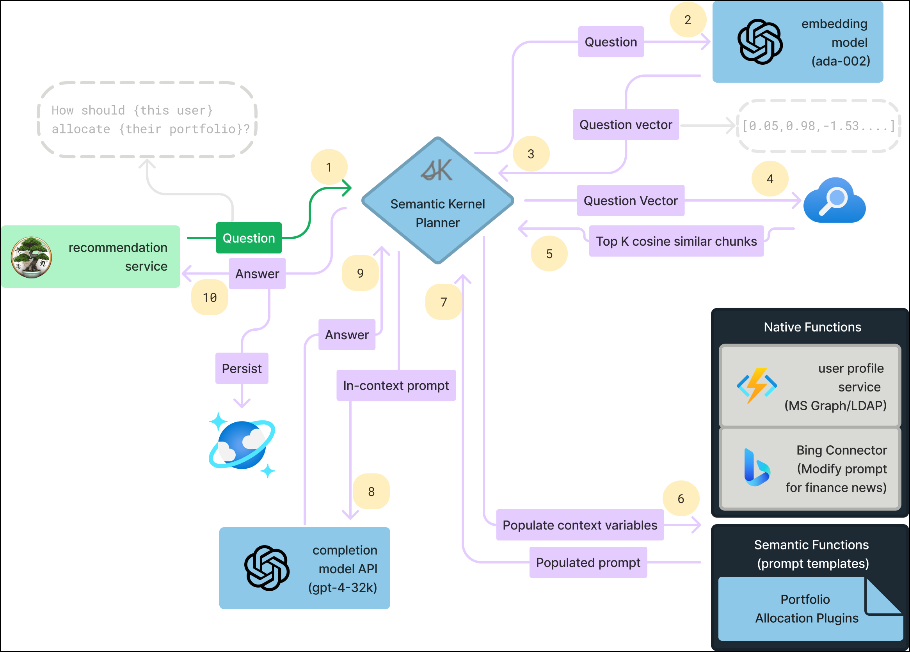

## Explicação dos Componentes

A arquitetura deste laboratório envolve os seguintes componentes principais:

- **Azure OpenAI**: O Azure OpenAI integra os modelos de linguagem do OpenAI na cloud Azure da Microsoft, permitindo soluções de IA escaláveis ​​para processamento e automatização de linguagem natural.
- **AI Search**: É um serviço de cloud que permite recursos de pesquisa poderosos e flexíveis, incluindo pesquisa de texto completo e recursos com tecnologia de IA.
- **Azure Functions**: Executa código em resposta a eventos sem gerir servidores. Escala automaticamente com base na procura.
- **AKS (Azure Kubernetes Service)**: Serviço Kubernetes gerido para orquestração e escalabilidade de contentores.
- **Apache Kafka**: Trata do streaming de dados e do processamento de eventos em tempo real.
- **Cosmos DB**: Base de dados multimodelo distribuída globalmente com baixa latência e alta disponibilidade.
- **Azure Storage**: Armazenamento escalável para blobs, ficheiros, filas e tabelas.

- **Pesquisa do Bing**: Permite adicionar as funcionalidades de pesquisa do Bing às suas aplicações. Fornece APIs para pesquisas na web, imagens, vídeos e notícias.

## Introdução ao Laboratório

Bem-vindo ao workshop "Crie Aplicações Inteligentes com o Copilot Stack da Microsoft e o Azure OpenAI"! Preparámos um ambiente integrado para que possa explorar e aprender sobre os serviços Azure. Vamos começar por tirar o máximo partido desta experiência:

## Aceder ao seu Ambiente de Laboratório

Após a configuração do ambiente, o seu browser irá carregar uma máquina virtual (JumpVM). Utilize esta máquina virtual durante todo o workshop para realizar o laboratório. Pode ver o número na parte inferior do guia para alternar entre os diferentes exercícios.

   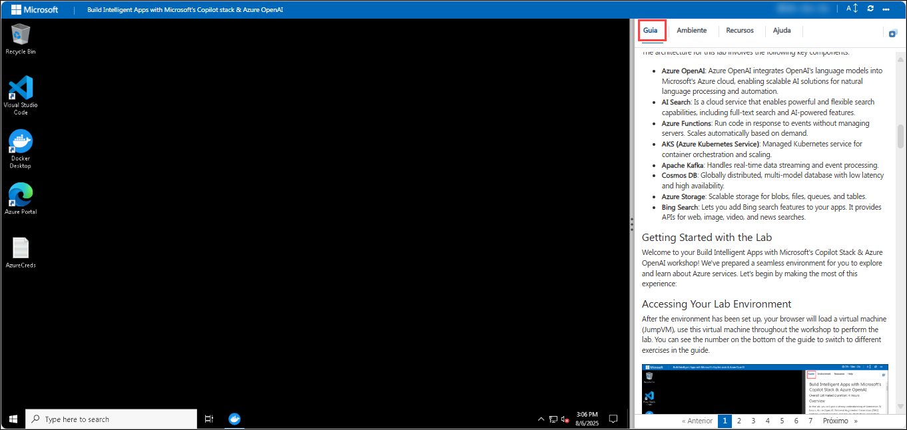

### Máquina Virtual e Guia de Laboratório

A sua máquina virtual é a sua força motriz durante todo o workshop. O guia de laboratório é o seu guião para o sucesso.

## Explorando os Recursos do Seu Laboratório

Para melhor compreender as características e credenciais do seu laboratório, navegue até ao separador **Ambiente**.

  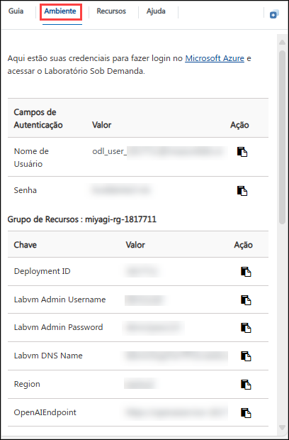

> Verá o valor SUFFIX no separador **Ambiente**; utilize-o sempre que vir SUFFIX ou DeploymentID nas etapas do laboratório.

## Utilizando o Recurso de Janela Dividida

Para sua conveniência, pode abrir o guia do laboratório numa janela separada, selecionando o botão **Janela dividida** no canto superior direito.

  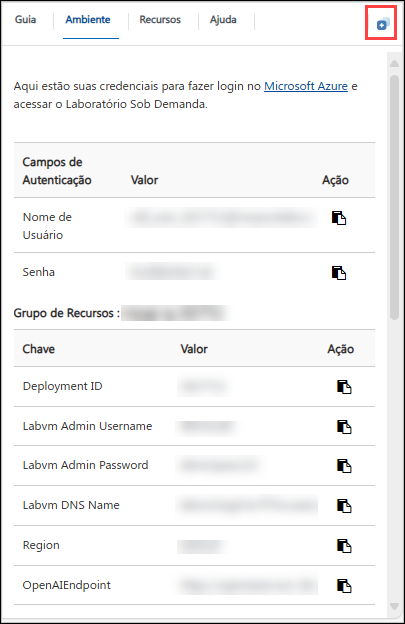

## Gerir a sua Máquina Virtual

Sinta-se à vontade para iniciar, parar ou reiniciar a sua máquina virtual conforme necessário no separador **Recursos**. A sua experiência está nas suas mãos!

  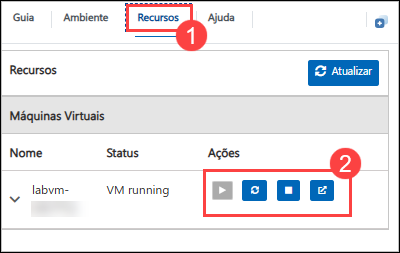

## Guia de Laboratório Ampliar/Reduzir

Para ajustar o nível de zoom da página do ambiente, clique no ícone **A↕ : 100%** localizado junto ao cronómetro no ambiente do laboratório.

  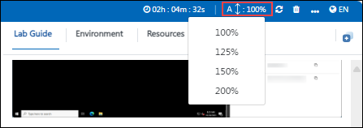

## Faça login no Portal Azure

1. Minimize o **Docker Desktop** clicando no botão **Minimizar**.

   

   > **Nota:**  Se encontrar o erro de falha na atualização do WSL na aplicação Docker Desktop, clique em **Sair** e volte a abrir a aplicação Docker Desktop na área de trabalho.

   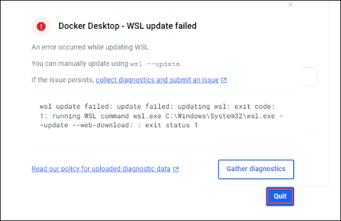

   > Se enfrentar algum problema, uma distribuição WSL da qual o Docker Desktop depende foi encerrada inesperadamente. Isto acontece normalmente como resultado de uma entidade externa terminar o WSL, clique no botão **Reiniciar**.

   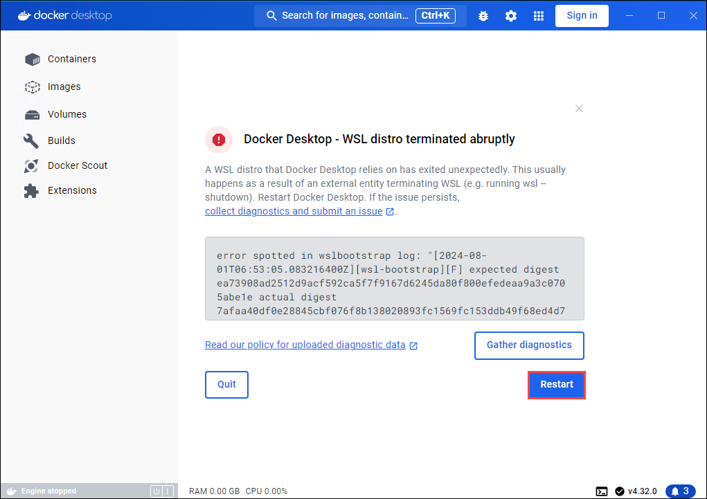

1. No JumpVM, clique no atalho do portal Azure do navegador Microsoft Edge, que é criado no ambiente de trabalho.

   

1. No separador **Entrar no Microsoft Azure**, verá o ecrã de login. Introduza o seguinte e-mail ou nome de utilizador e clique em **Seguinte**.

     - **E-mail/Nome de utilizador**: **<inject key="AzureAdUserEmail"></inject>**

       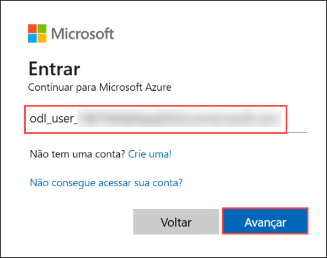

1. Agora digite a seguinte palavra-passe e clique em **Entrar**.

    - **Palavra-passe**: **<inject key="AzureAdUserPassword"></inject>**

      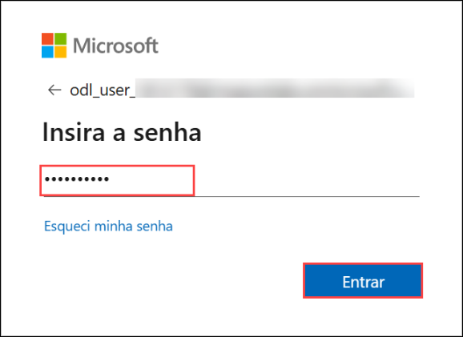

      > **Nota**: Se for solicitado o MFA, siga os passos destacados em - [Passos para prosseguir com a configuração do MFA se a opção Perguntar mais tarde não estiver visível](#passos-a-proceder-com-mfa-setup-if-ask-later-option-is-not-visible)

1. Se vir o pop-up **Permanecer ligado?**, selecione **Não**.

   

1. Se for apresentada uma janela pop-up **Bem-vindo ao Microsoft Azure**, selecione **Cancelar** para ignorar o tour.

   

1. Agora que verá o Painel do Portal Azure, clique em **Grupos de recursos** no painel Navegar para ver os grupos de recursos.

   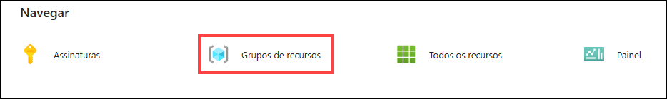

1. Em **Grupos de recursos**, clique em **miyagi-rg-<inject key="DeploymentID" enableCopy="false"/>** grupo de recursos.

   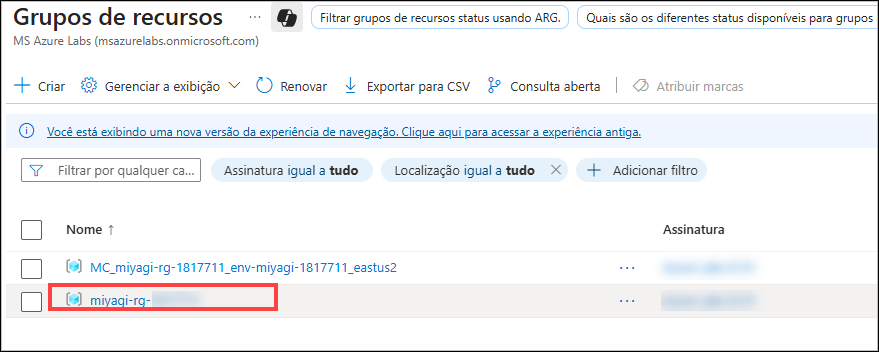

1. No grupo de recursos **miyagi-rg-<inject key="DeploymentID" enableCopy="false"/>**, verifique os recursos nele presentes.

   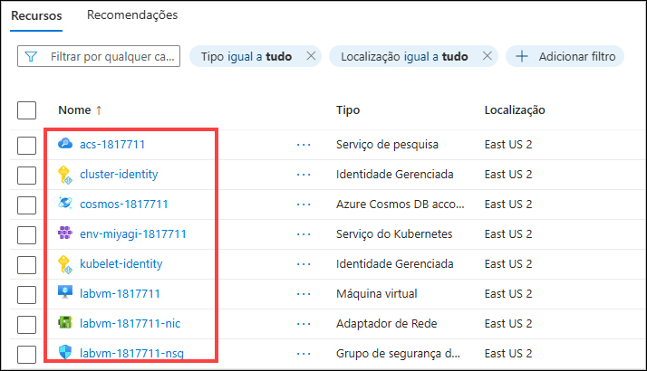

## Passos para prosseguir com a configuração do MFA se a opção "Perguntar Mais Tarde" não estiver visível

> **Nota:** Continue com os exercícios se o MFA já estiver activado ou indisponível.

1. No aviso **"Mais informações necessárias"**, selecione **Seguinte**.

1. Na página **"Mantenha a sua conta segura"**, selecione **Seguinte** duas vezes.

1. **Nota:** Se não tiver a aplicação Microsoft Authenticator instalada no seu dispositivo móvel:

   - Abra a **Google Play Store** (Android) ou a **App Store** (iOS).
   - Procure por **Microsoft Authenticator** e toque em **Instalar**.
   - Abra a aplicação **Microsoft Authenticator**, selecione **Adicionar conta** e, em seguida, escolha **Conta empresarial ou escolar**.

1. Um **código QR** será apresentado no ecrã do seu computador.

1. Na aplicação Authenticator, selecione **Escanear um código QR** e digitalize o código apresentado no ecrã.

1. Após a digitalização, clique em **Seguinte** para prosseguir.

1. No seu telemóvel, introduza o número apresentado no ecrã do computador na aplicação Authenticator e selecione **Seguinte**.

1. Se lhe for pedido para permanecer ligado, pode clicar em **Não**.

1. Se for apresentada uma janela pop-up **Bem-vindo ao Microsoft Azure**, clique em **Cancelar** para ignorar o tour.

1. Agora, clique em **Seguinte** no canto inferior direito para avançar para a página seguinte.

> [!IMPORTANTE] 
> **Para uma experiência mais tranquila durante o laboratório prático, é importante rever atentamente as instruções e as notas que o acompanham. Ajudará a navegar pelas tarefas com facilidade e confiança.**

Este laboratório prático irá guiá-lo na criação de sistemas inteligentes com a pilha Copilot da Microsoft, aproveitando a IA Generativa e os padrões RAG para maior produtividade e experiências personalizadas.

### Contato de suporte

A equipe de suporte da CloudLabs está disponível 24 horas por dia, 7 dias por semana, 365 dias por ano, por e-mail e chat ao vivo, para garantir assistência contínua a qualquer momento. Oferecemos canais de suporte dedicados, adaptados especificamente para alunos e instrutores, garantindo que todas as suas necessidades sejam atendidas com rapidez e eficiência.

Contatos de Suporte ao Aluno:
    
- Suporte por e-mail: cloudlabs-support@spektrasystems.com.

- Suporte por chat ao vivo: https://cloudlabs.ai/labs-support

Agora, clique em Avançar no canto inferior direito para avançar para a **próxima** página.

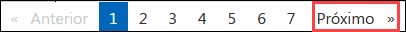

### Feliz aprendizado!!
