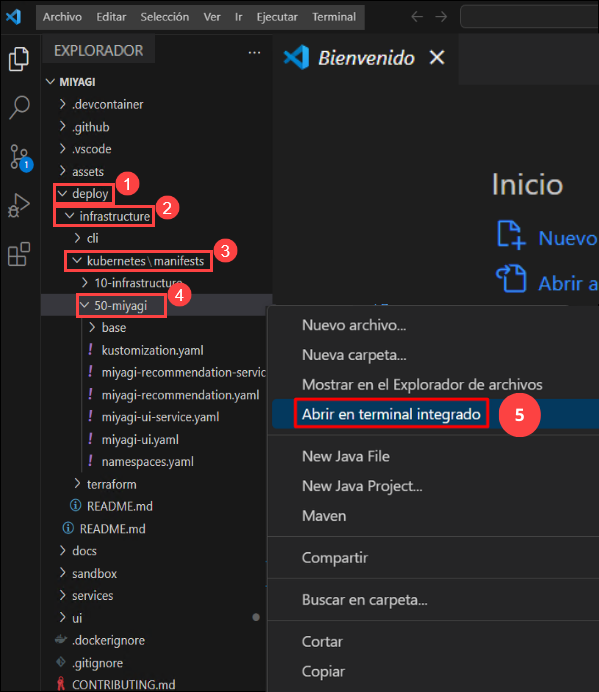
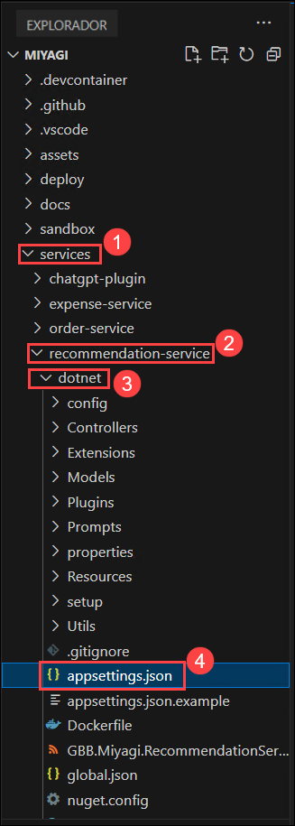
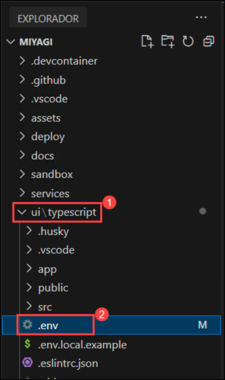
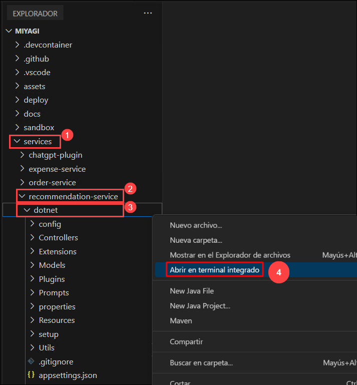
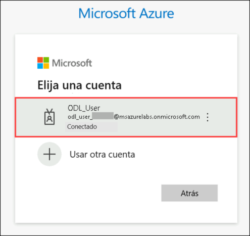
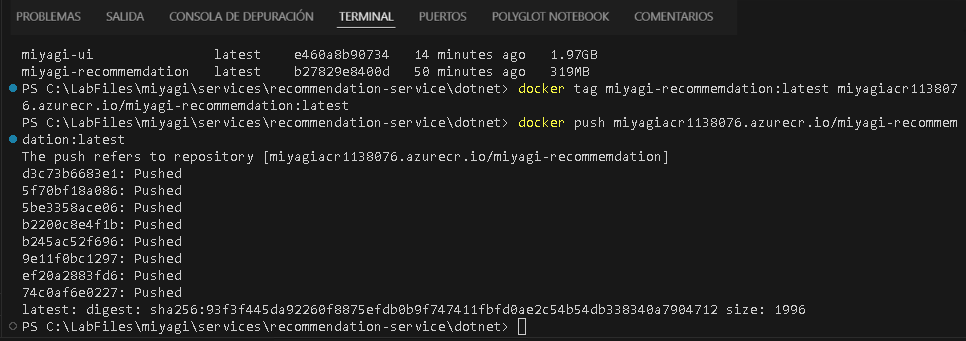

# Laboratório 3.1: Contentorização da UI Miyagi e do serviço de recomendação para o Azure Kubernetes Service (AKS)

### Duração: 80 minutos

Neste laboratório, irá contentorizar e implementar a UI Miyagi e os serviços de recomendação no Azure Kubernetes Service (AKS). Começará por configurar o Kubernetes e construir imagens Docker para ambos os serviços. O processo envolve o envio destas imagens para o Azure Container Registry (ACR) e depois a sua implementação num cluster AKS. Isto garante que os serviços estão perfeitamente integrados e operacionais num ambiente escalável e em contentores e aplicam configurações do Kubernetes, atualizando os endereços IP de serviço e verificando a implementação acedendo aos serviços através dos seus respetivos endpoints.

### Tarefa 1: Implementar serviços AKS

Nesta tarefa, irá implementar a recomendação Miyagi e os serviços UI num cluster do Azure Kubernetes Service (AKS). Isto envolve fazer login no portal do Azure, aplicar as definições do Kubernetes e atualizar os ficheiros de configuração com os endereços IP externos dos serviços.

1. Navegue de volta para a janela de código do Visual Studio e navegue até **miyagi/deploy/infrastructure/kubernetes/manifests/50-miyagi**, clique com o botão direito do rato em **50-miyagi** no menu em cascata e seleccione **Abrir no Terminal integrado**.

   

1. Execute o seguinte comando para iniciar sessão no portal Azure.

    > **Nota**: substitua [ClusterName] por **<inject key="aksname" enableCopy="true"/>** e [ResourceGroupName] por **<inject key="rgname" enableCopy="true"/>**

    ```
    az aks get-credentials -n [ClusterName] -g [ResourceGroupName]
    ```

    > **Importante** : O comando az aks get-credentials -n [ClusterName] -g [ResourceGroupName] é utilizado na interface de linha de comandos (CLI) do Azure para recuperar e fundir os ficheiros de configuração do Kubernetes para um serviço Cluster Azure Kubernetes especificado ( AKS) no ficheiro kubeconfig local.

1. Assim que o comando estiver concluído, deverá ter acesso ao cluster e poderá executar os seguintes comandos para implementar os serviços de aplicação.

    ```
    kubectl apply -f ./miyagi-recommendation-service.yaml
    ```
    ```
    kubectl apply -f ./miyagi-ui-service.yaml
    ```

    >**Nota**: Após a execução bem-sucedida dos comandos acima. O Kubernetes irá ler o ficheiro YAML e aplicar as suas definições ao cluster. Criará miyagi-recommendation-service e miyagi-ui

1. Depois de os serviços estarem implementados, execute o comando abaixo e acompanhe os **IPs externos** do serviço. Pode demorar alguns minutos até que os **IP's externos** apareçam, por isso aguarde alguns minutos antes de executar o comando.

    ```
    kubectl get svc
    ```

    

1. De seguida, navegue até **miyagi/services/recommendation-service/dotnet** e abra o ficheiro **appsettings.json**.

   

1. Copie o endereço IP externo **miyagi-ui** da consola e cole-o na secção **CorsAllowedOrigins** formatada como um endpoint **http://** e guarde o ficheiro por **Ctrl+S**.

   

1. De seguida, navegue até **miyagi/ui/typescript** e abra o ficheiro **. env**.

   

1. Copie o endereço IP externo **miyagi-recommendation-service** da consola e cole-o no valor **NEXT_PUBLIC_RECCOMMENDATION_SERVICE_URL** e guarde o ficheiro por **Ctrl + S**.

   

### Tarefa 2: Construir uma imagem Docker para a UI Miyagi
Nesta tarefa, irá criar e executar o contentor Miyagi UI Docker localmente. Comece por abrir o Docker Desktop e concluir a configuração inicial. De seguida, utilize o Visual Studio Code para criar a imagem Docker para a UI Miyagi. Depois de a imagem ser criada, verifique-a e execute-a no Docker. Configure a porta do host e aceda à aplicação localmente através do URL fornecido.

1. Abra a aplicação **Docker** na área de trabalho do Lab VM clicando duas vezes.

   

1. Na janela **Contrato de serviço de subscrição Docker**, clique em **Aceitar**.

   

1. Na janela **Bem-vindo ao Docker Desktop**, clique em **Continuar sem iniciar sessão**.

   

1. Na janela **Conte-nos o trabalho que realiza**, clique em **Saltar**.

1. Navegue de volta para a janela **Visual Studio Code** e navegue até **miyagi/ui/typescript** - clique com o botão direito do rato no menu em cascata e selecione **Abrir no terminal integrado**.

    ```
    docker build . -t miyagi-ui
    ```

    > **Nota**: Aguarde, pois este comando pode demorar algum tempo a ser concluído.

    > **Nota**: este comando lê as instruções do Dockerfile, processa-as para criar uma imagem Docker com base nessas instruções e, em seguida, marca a imagem resultante com o nome miyagi-ui.

1. Execute o seguinte comando para obter a imagem recém-criada.

    ```
    docker images
    ```

    

1. Navegue de volta para **Docker desktop**, no painel esquerdo selecione **Images**.

   

1. Na folha **Images**, repare que a imagem **miyagi-ui (1)** é criada, selecione o ícone **executar (2)** .

   

1. Na janela **Executar um novo contentor** selecione a seta pendente.

   

1. Em **Run a new container**, em **Ports** para **Host Port** insira **3000 (1)** e clique em **Run (2)**.

   

1. Clique no link **3000:3000** URL

   

1. Deverá conseguir ver a aplicação em execução localmente

   

### Tarefa 3: Criar imagens Docker para o serviço de recomendação

1. Navegue de volta para a janela **Visual Studio Code** e navegue até **miyagi/services/recommendation-service/dotnet** - clique com o botão direito do rato em dotnet no menu em cascata, seleccione **Abrir no terminal integrado**.

   

1. Execute o seguinte comando para construir uma **imagem Docker**

    ```
    docker build . -t miyagi-recommendation
    ```

    > **Nota**: Aguarde, pois este comando pode demorar algum tempo a ser concluído.

1. Execute o seguinte comando para obter a imagem recém-criada.

    ```
    docker images
    ```

    

1. Navegue de volta para **Docker desktop**, no painel esquerdo selecione **Images**.

   

1. Na folha **Images**, repare que a imagem **miyagi-recommendation (1)** está criada, selecione **run (2)** icon .

   

1. Na janela **Executar um novo contentor** selecione a seta pendente.

   

1. Em **Executar um novo contentor**, em **Portas** para **Host Port** introduza **5224 (1)** e clique em **Run (2)**.

   

1. Clique no link URL **5224:8080**.

   

1. Deverá conseguir ver a aplicação em execução localmente.

   

### Tarefa 4: enviar o serviço Docker Image of Recommendation para o Container Registry

Nesta tarefa, irá enviar imagens de recomendação miyagi para acr.

1. Navegue de volta para a janela **Visual Studio Code** e navegue até **miyagi/services/recommendation-service/dotnet** - clique com o botão direito do rato em dotnet no menu em cascata, seleccione **Abrir no terminal integrado**.

   

1. Execute o seguinte comando para iniciar sessão no **portal Azure**.

    ```
    az login
    ```

1. Isto irá redirecionar para **página de login da Microsoft**, selecione a sua conta do Azure **<inject key="AzureAdUserEmail"></inject>** e navegue de volta para **código do Visual Studio**.

   

1. Execute o comando seguinte para iniciar sessão num **Azure Container Registry (ACR)** utilizando a CLI do Azure.

    > **Nota**: Substitua **[ACRname]** **<inject key="AcrUsername" enableCopy="true"/>**.

    ```
    az acr login -n [ACRname]
    ```

    >**Nota**: O comando az acr login -n [ACRname] regista-o numa instância do Azure Contentor Registry (ACR). Autentica a sua sessão com o Registo de Contentores do Azure especificado, permitindo enviar e extrair imagens de contentores de e para o registo.

1. Execute o seguinte comando para adicionar a etiqueta.

    > **Nota**: Substitua **[ACRname]** por **<inject key="AcrLoginServer" enableCopy="true"/>**.

    ```
    docker tag miyagi-recommendation:latest [ACRname]/miyagi-recommendation:latest
    ```

    >**Nota**: o comando docker tag miyagi-recommendation:latest [ACRname]/miyagi-recommendation:latest marca uma imagem local do Docker com um novo nome que inclui o nome do Azure Container Registry (ACR). Ao marcar a imagem desta forma, prepara-a para ser enviada por push para o Registo de Contentores do Azure especificado.

1. Execute o seguinte comando para enviar a imagem para o registo do contentor.

    > **Nota**: Substitua **[ACRname]** por **<inject key="AcrLoginServer" enableCopy="true"/>**.

    ```
    docker push [ACRname]/miyagi-recommendation:latest
    ```

    

    >**Nota**: O comando docker push [ACRname]/miyagi-recommendation:latest carrega a imagem do Docker especificada, que foi marcada com o nome do Azure Container Registry (ACR), para o ACR. Isto disponibiliza a imagem no ACR para implementação e utilização em vários serviços Azure.

1. Navegue de volta para a janela **Visual Studio Code** e navegue até **miyagi/ui/typescript** - clique com o botão direito do rato no menu em cascata e selecione **Abrir no terminal integrado**.

1. Execute o seguinte comando para adicionar a etiqueta.

    > **Nota**: Substitua **[ACRname]** por **<inject key="AcrLoginServer" enableCopy="true"/>**.

    ```
    docker tag miyagi-ui:latest [ACRname]/miyagi-ui:latest
    ```

1. Execute o seguinte comando para enviar a imagem para o registo do contentor.

    > **Nota**: Substitua **[ACRname]** por **<inject key="AcrLoginServer" enableCopy="true"/>**.

    ```
    docker push [ACRname]/miyagi-ui:latest
    ```

### Tarefa 5: Implantar pods AKS

1. Navegue de volta para a janela de código do Visual Studio e navegue até **miyagi/deploy/infrastructure/kubernetes/manifests/50-miyagi** clique em **50-miyagi** no menu em cascata e seleccione **Abrir no Terminal integrado**.

   

1. Abra o ficheiro **miyagi-recommendation.yaml** e substitua o ficheiro &lt;ACR-NAME&gt; com **<inject key="acrUsername" enableCopy="true"/>** Nome do registo do contentor Azure e guarde o ficheiro por **Ctrl + S**.

   

   

1. Abra o ficheiro **miyagi-ui.yaml** e substitua o ficheiro &lt;ACR-NAME&gt; com **<inject key="acrUsername" enableCopy="true"/>** Nome do registo do contentor Azure e guarde o ficheiro por **Ctrl + S**.

   

   

1. Execute os seguintes comandos para implementar os pods de aplicações.

    ```
    kubectl apply -f ./miyagi-recommendation.yaml
    ```
    ```
    kubectl apply -f ./miyagi-ui.yaml
    ```

1. As aplicações devem agora ser implantadas. Para verificar, execute o comando abaixo e verá os dois pods em estado de execução.

    >**Nota**: Pode demorar alguns minutos até que a saída apareça, por isso aguarde alguns minutos antes de executar o comando.

    ```
    kubectl get pods
    ```

    


    >**Parabéns** pela conclusão da tarefa! Agora é altura de validá-lo. Aqui estão os passos:
    > - Clique no botão Validar para a tarefa correspondente. Se receber uma mensagem de sucesso, validou o laboratório com sucesso.
    > - Caso contrário, leia atentamente a mensagem de erro e tente novamente o passo, seguindo as instruções do guia do laboratório.
    > - Se precisar de ajuda, contacte-nos através do e-mail cloudlabs-support@spektrasystems.com.

 <validation step="f50c7e4e-0b5a-4ae2-bd9e-ff29a023f1d2" />

# Laboratório 3.2: Explorar e verificar a UI Miyagi em contentor e o serviço de recomendação no AKS

Neste laboratório, irá explorar a implementação e verificação da UI Miyagi e dos serviços de recomendação no Azure Kubernetes Service (AKS). As tarefas envolvem testar APIs e aceder à UI através de pontos finais do Ingress, garantindo a funcionalidade adequada no ambiente AKS.

### Tarefa 1: Explorar o serviço de recomendação no AKS utilizando o Ingress Endpoint

1. Para testar a API, execute o comando abaixo para obter os endereços IP do serviço

    >**Nota**: Pode demorar alguns minutos até que a saída apareça, por isso aguarde alguns minutos antes de executar o comando.

    ```
    kubectl get svc
    ```

    

1. Copie o endereço IP externo do **miyagi-recommendation-service** e introduza-o no browser. Agora deve ver o ponto final do swagger.

   

### Tarefa 2: Explore a aplicação Miyagi no AKS utilizando o Ingress Endpoint

1. Para testar a UI, execute o comando abaixo para obter os endereços IP do serviço
 
    ```
    kubectl get svc
    ```

    

1. Copie o endereço IP externo do **miyagi-ui** e introduza-o no browser. Agora deve ver a interface do Miyagi.

   

### Resumo

Neste laboratório, implementou o Azure Kubernetes Service (AKS) para a UI Miyagi e para o serviço de recomendação Miyagi. Tudo começou com a construção de imagens Docker para estes serviços, contendo todos os componentes necessários, como código e ficheiros de configuração. Após a criação da imagem, o passo seguinte envolveu o envio da imagem Docker do serviço de recomendação para um registo de contentor, uma plataforma de armazenamento e implementação para clusters Kubernetes. Por fim, foram implementados pods AKS, representando contentores em execução no cluster Kubernetes, tornando operacional a UI Miyagi e o serviço de recomendação

### Concluiu este laboratório com sucesso. Agora clique em Seguinte no canto inferior direito para passar para a página seguinte.
