# Laboratório 4 - Expor a IA aberta através do APIM

### Duração: 80 minutos

Neste laboratório, irá aprofundar a configuração e verificação de APIs no Azure API Management, com foco na integração do serviço Azure OpenAI. Isto envolve configurar APIs HTTP, garantir a configuração correta e obter um URL de gateway para acesso e integração externos perfeitos. Explorará também a criação de políticas, definições de funções e gestão de assinaturas para operar as APIs em segurança. Este laboratório destaca as melhores práticas de gestão de API, garantindo a autenticação, autorização e testes operacionais robustos no ecossistema Azure abrangente.

## Objetivos do laboratório

Você poderá completar as seguintes tarefas:

- Tarefa 1: verificar o serviço de gestão de API implementado e criar uma API.
- Tarefa 2: Criar políticas e funções de gestão de API.
- Tarefa 3: atualizar a imagem do Docker para o serviço de recomendação.
- Tarefa 4: Revisão do serviço de recomendação do AKS.
- Tarefa 5: configurar o log do Event Hub e validar a entrada.

### Tarefa 1: verificar o serviço de gestão de API implementado e criar uma API

Neste laboratório, irá configurar uma API HTTP no Azure API Management para interagir com o serviço Azure OpenAI. Garante que a API está configurada corretamente e fornece um URL de gateway para acesso externo e integração com outros serviços.

1. Navegue até ao portal do Azure, abra o **Grupo de Recursos** denominado **miyagi-rg-<inject key="DeploymentID" enableCopy="false"/>** e seleccione **miyagi-apim-<inject key="DeploymentID" enableCopy="false"/>** Serviço de gestão de API da lista de recursos.

   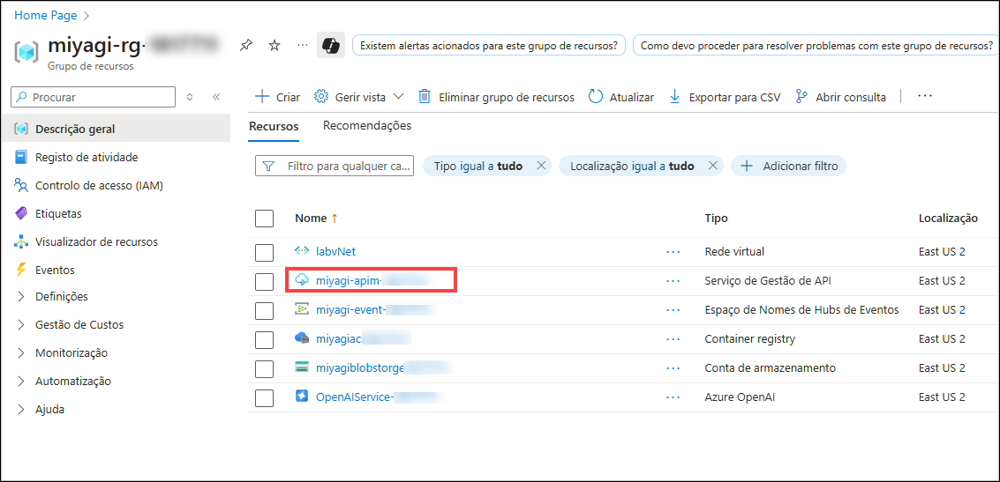

1. No serviço **miyagi-apim-<inject key="DeploymentID" enableCopy="false"/>** API Management, clique em **APIs** **(1)** em APIs no menu esquerdo e selecione **HTTP** **(2)** em **Definir uma nova API** para criar uma API HTTP.

   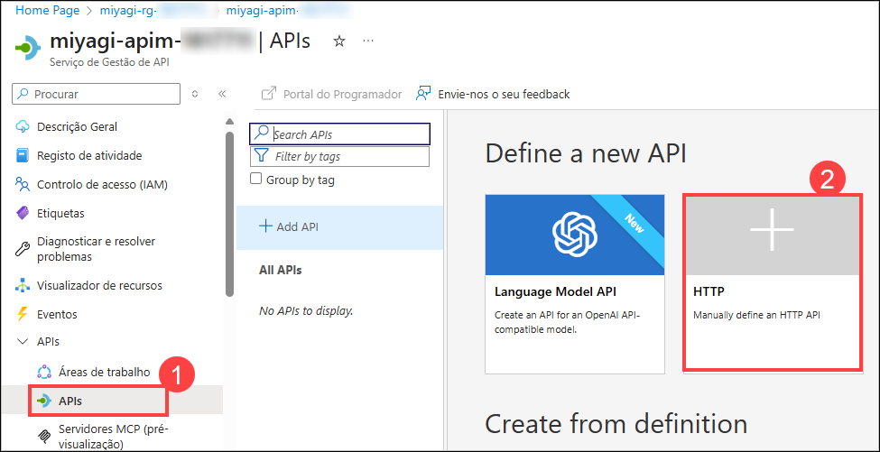

1. No painel **Criar uma API HTTP**, introduza os seguintes valores:

    | **Parâmetro** | **Valores** |
    | -------------------- | -------------------- |
    | Tipo de API **(1)** | **Básico** |
    | Nome de visualização **(2)** | **miyagi-api** |
    | Nome **(3)** | **miyagi-api** |
    | URL do serviço Web **(4)** | Introduza o Endpoint do Azure OpenAI Endpoint **<inject key="OpenAIEndpoint" enableCopy="true"/>** |
    | Sufixo de URL da API **(5)** | **aberto** |
    | Clique em **(6)** | **Criar** |

    

1. Depois de a API ser criada, clique em **Descrição Geral** **(1)** e copie o **URL da gateway** **(2)** do serviço API Management. Registe o **URL** necessário na tarefa seguinte.

   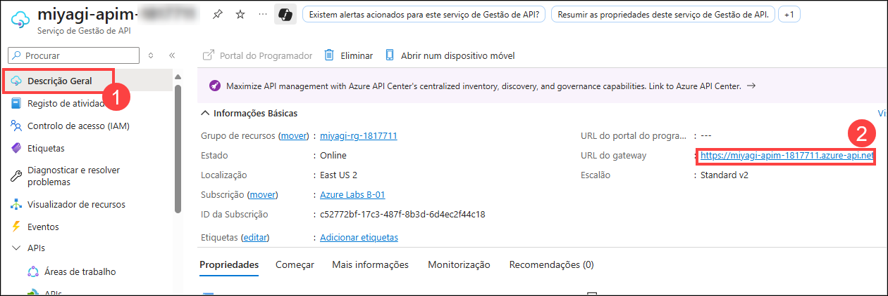

    > **Parabéns** pela conclusão da tarefa! Agora é altura de validá-lo. Aqui estão os passos:
    > - Clique no botão Validar para a tarefa correspondente.
    > - Se receber uma mensagem de sucesso, pode avançar para a tarefa seguinte. Caso contrário, leia atentamente a mensagem de erro e repita o passo, seguindo as instruções do guia do laboratório.
    > - Se precisar de ajuda, contacte-nos através do e-mail labs-support@spektrasystems.com. Estamos disponíveis 24 horas por dia, 7 dias por semana para o ajudar.

 <validation step="f0747771-c830-4f46-8e46-2531ad40214a" />

### Tarefa 2: Criar políticas e funções de gestão de API

Neste laboratório, irá configurar políticas de API, definir funções e assinaturas e integrar a API do serviço Azure OpenAI no Azure API Management. Garante a autenticação, autorização e testes operacionais adequados dos endpoints da API

1. No serviço **miyagi-apim-<inject key="DeploymentID" enableCopy="false"/>** API Management, no painel de navegação esquerdo na secção **APIs** selecione **APIs** **(1)**, clique nos **três pontos** **(2)**.

   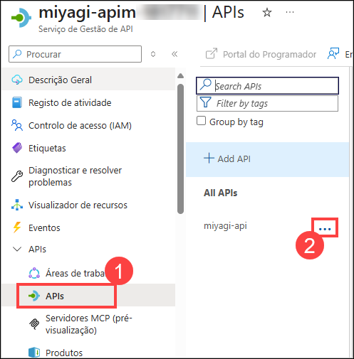

2. junto ao miyagi-api, seleccione **Import**.

   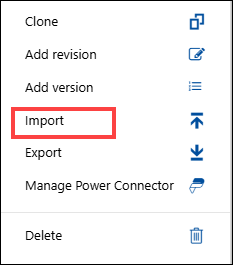

3. e clique em **OpenAPI**.

   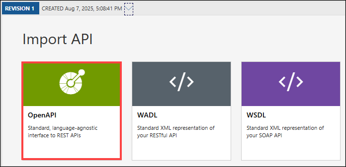

4. No pop-up de **Importar da especificação OpenAPI** cole o link abaixo na especificação OpenAPI **textbox** **(1)** e clique em **import** **(2)** .

    ```
    https://raw.githubusercontent.com/Azure/azure-rest-api-specs/main/specification/cognitiveservices/data-plane/AzureOpenAI/inference/stable/2023-05-15/inference.json
    ```

   

5. Agora deve ver uma série de APIs na API do serviço Azure OpenAI.

   

6. Na API **Azure OpenAI Service**, navegue até ao separador **configurações** **(1)** e atualize a chave de assinatura **Nome do cabeçalho** para **api-key** **(2)** e clique em **Guardar** **(3)**.

   

7. No serviço **miyagi-apim-<inject key="DeploymentID" enableCopy="false"/>** API Management, no painel de navegação esquerdo em **APIs** clique em **Produtos** **(1)** e selecione **+ Adicionar** **(2)**.

   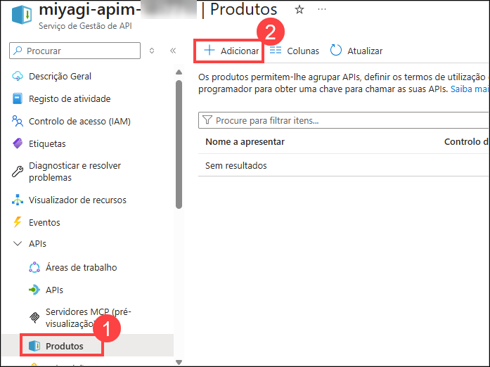

8. Na janela **Adicionar produto**, especifique **Nome de visualização** como **OpenAi** **(1)**, **Descrição** como **OpenAI** **(2)* *. No menu **APIs**, clique no sinal de mais** **(3)** seleccione **Azure OpenAI Service API** **(4)** prima Enter e clique em **Create** **(5)**.

   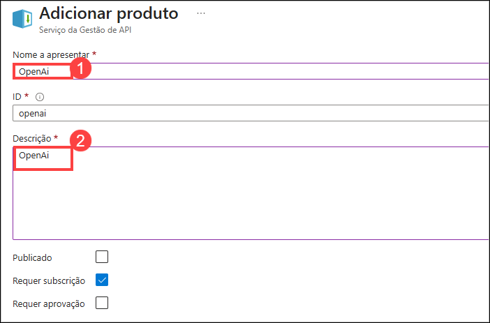

   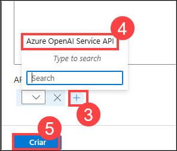

9. No serviço **miyagi-apim-<inject key="DeploymentID" enableCopy="false"/>** API Management, no painel de navegação esquerdo em **APIs** selecione **Subscrições** **(1)** e clique em **+ Adicionar assinatura** **(2)**.

   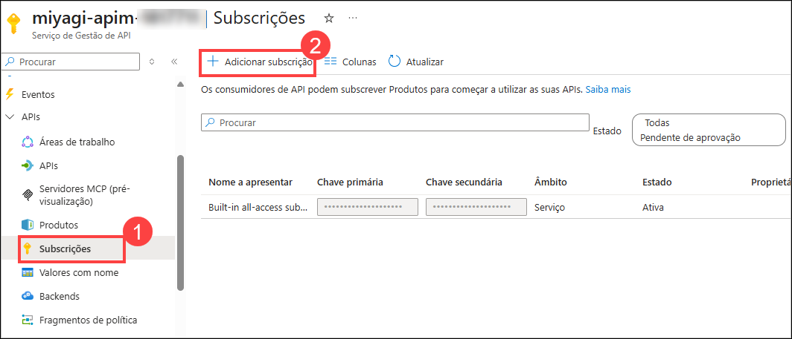

10. No Janela **Adicionar assinatura**, forneça **Nome** como **aoai-test** **(1)** e **Nome de visualização** como **AOAI Test** **(2)** e clique em **Criar** **(3)**.

   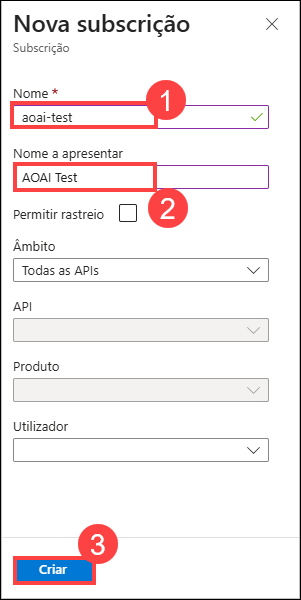

11. Depois de a subscrição ser **Teste AOAI** criada, clique nos **três pontos** **(1)** junto ao **Teste AOAI** e clique em **Mostrar\ocultar chaves** **(2)**. Copie a chave **assinatura primária** **(3)** e guarde-a para mais tarde.

   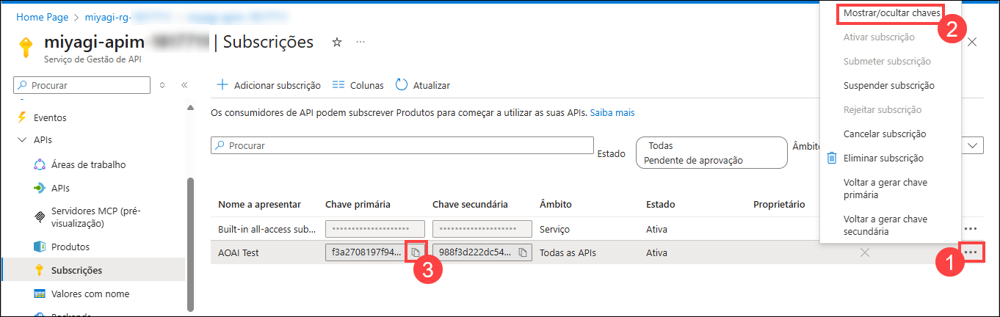

12. Navegue até **Azure OpenAI** no Portal Azure, selecione **OpenAIService-<inject key="DeploymentID" enableCopy="false"/>**.

13. No ficheiro **OpenAIService-<inject key="DeploymentID" enableCopy="false"/>**, seleccione **Controlo de acesso (IAM)** **(1)**, clique em **+ Adicionar** **(2)** e selecione **Adicionar atribuição de função** **(3)**.

   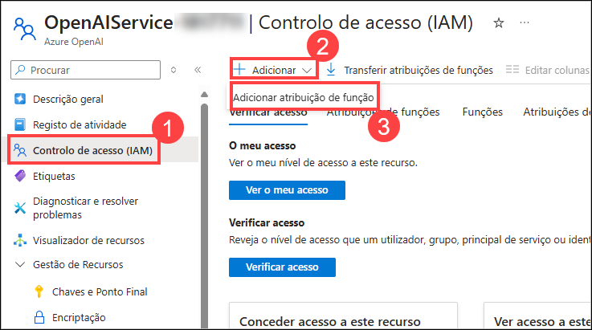

14. No separador **Adicionar atribuição de função** da barra de pesquisa, pesquise e selecione **Utilizador de serviços cognitivos (1) (2)** e clique em **Seguinte (3)**.

   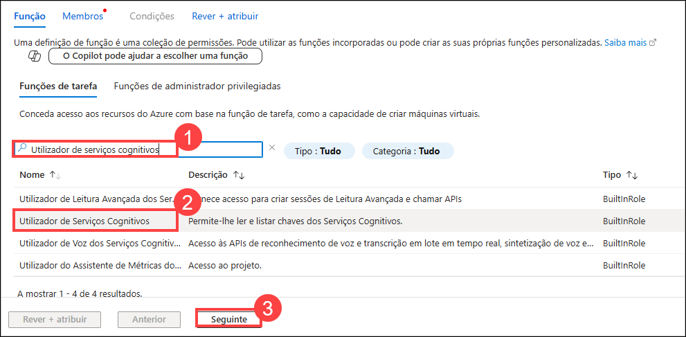

15. No separador **Membros**, selecione **Identidade gerida** **(1)**, clique em **+ Selecionar membros** **(2)**.

   

16. No pop-up selecionar identidade gerida, para **Assinatura (1)** aceite o valor por defeito e **Identidade gerida** selecione **Serviço de gestão de API** **(2)**, escolha **miyagi -apim-<inject key="DeploymentID" enableCopy="false"/>** **(3)** e clique em **Selecionar** **(4)**.

   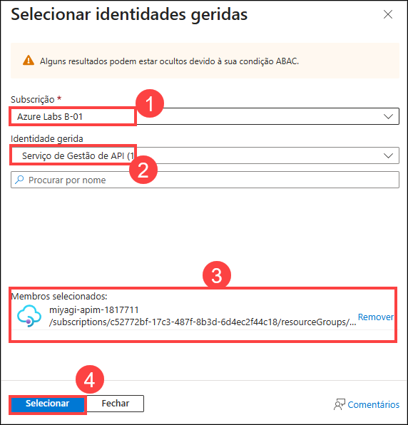

17. Clique em **Seguinte**.

18. No separador **Rever + atribuir** clique em **Rever + atribuir**.

19. Navegue de volta para **serviço de gestão de API** no Portal Azure, selecione o serviço **miyagi-apim-<inject key="DeploymentID" enableCopy="false"/>** API Management.

20. No **serviço de gestão de API**, selecione **APIs** **(1)**, selecione a **api-key** **(2)** API criada no passo anterior, selecione **Todas as operações** **(3)** e clique em **Editor de código de política**</> **(4)** em **Processamento de entrada**.

   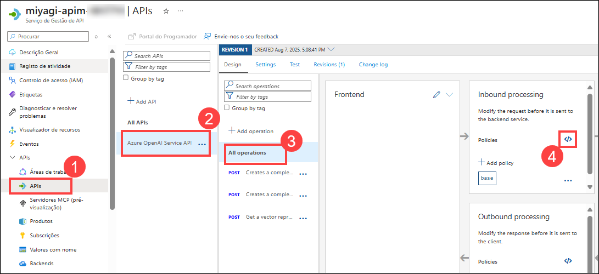

21. No editor de código, copie a política abaixo para substituir apenas as tags **inbound** **(1)**, substitua **&lt;&lt;Azure_OpenAI_Endpoint&gt;&gt;** por **<inject key=" OpenAIEndpoint " enableCopy="true"/>** **(2)** do gestor de API que copiou na Tarefa 1, Passo 4 e clique em **Guardar** **(3)**.

      ```
      <inbound>
         <base />
         <set-header name="api-key" exists-action="delete" />
         <authentication-managed-identity resource="https://cognitiveservices.azure.com" output-token-variable-name="msi-access-token" ignore-error="false" />
         <set-header name="Authorization" exists-action="override">
            <value>@("Bearer " + (string)context.Variables["msi-access-token"])</value>
         </set-header>
         <set-backend-service base-url="https://<<Azure_OpenAI_Endpoint>>/openai" />
      </inbound>
      ```


   

>**Nota**: Certifique-se de que cola os valores **OpenAIEndpoint** e elimina qualquer duplicação de **https://**.

22. Em API Management, clique em **Test** **(1)**, selecione Cria uma **conclusão para a mensagem de chat** **(2)**, introduza o nome de implementação gpt-4 **<inject key="CompletionModel" enableCopy="true"/>** **(3)** no campo de implementação ID, introduza **2023-05-15** **(4)** na API campo versão.

   

23. Desça até à secção **Corpo do pedido** **(1)**, substitua o código existente pelo código abaixo e clique em **Submeter** **(2)**.

    ```
    {"model":"gpt-4","messages":[{"role":"user","content":"Hello! What does an API Management Service in Azure do?"}]}
    ```

   

24. Desça a resposta e verá uma resposta `200` e uma mensagem de retorno do seu serviço OpenAI.

   

### Tarefa 3: atualizar a imagem do Docker para o serviço de recomendação

Neste laboratório, irá atualizar a configuração do serviço de recomendação, reconstruir a imagem do Docker, enviá-la por push para o ACR e garantir que a imagem atualizada está pronta para implementação no ambiente Azure.

1. Navegue até ao Visual Studio Code, expanda o diretório **miyagi/services/recommendation-service/dotnet** e selecione **appsettings.json**.

   

1. No ficheiro `appsettings. json`, deve substituir o valor **endpoint** de **endpoint de recurso OpenAI** por **API Gateway URL** que copiou na Tarefa 1, Passo 4, Valor **apiKey** com a **chave de assinatura** que foi copiada na Tarefa 2, Passo 9 e guarde o ficheiro.

   .png)

1. Navegue de volta para a janela **Visual Studio Code** e navegue até **miyagi/services/recommendation-service/dotnet** - clique com o botão direito do rato em dotnet no menu em cascata, seleccione **Abrir no terminal integrado**.

   

1. Agora, precisa de reconstruir a imagem do docker para o serviço de recomendação, executando o comando docker abaixo. Faça para atualizar o nome da imagem docker que foi criada anteriormente para o serviço de recomendação com o mesmo nome.

    ```
    docker build . -t miyagi-recommendation
    ```

    >**Nota**: Este comando cria uma imagem Docker chamada recomendação Miyagi a partir do Dockerfile e dos ficheiros associados no directório actual.

1. Execute o seguinte comando para iniciar sessão no ACR.

    > **Nota**: Substitua **[ACRname]** por **<inject key="AcrLoginServer" enableCopy="true"/>**, **[uname]** por **<inject key= " AcrUsername" enableCopy="true"/>** e **[password]** com **<inject key="AcrPassword" enableCopy="true"/>**.

    ```
    docker login [ACRname] -u [uname] -p [password]
    ```

    >**Nota**: O comando docker login [ACRname] -u [uname] -p [password] é utilizado para autenticar o seu cliente Docker com o Azure Container Registry (ACR) especificado utilizando o nome de utilizador e a palavra-passe fornecidos. Esta autenticação é necessária para executar operações como o envio e receção de imagens de contentores de e para o ACR.

1. Execute o seguinte comando para adicionar a etiqueta.

    > **Nota**: Substitua **[ACRname]** por **<inject key="AcrLoginServer" enableCopy="true"/>**.

    ```
    docker tag miyagi-recommendation:latest [ACRname]/miyagi-recommendation:latest
    ```

    >**Nota**: O comando docker push [ACRname]/miyagi-recommendation:latest carrega uma imagem do Docker da sua máquina local para o Azure Container Registry (ACR) especificado. Ao executar este comando, disponibiliza a imagem miyagi-recommendation:latest no ACR, permitindo que seja utilizada em diversas implementações e serviços no Azure.

1. Depois de fazer login no ACR. Execute o comando abaixo para enviar a imagem docker atualizada do serviço de recomendação para o registo do contentor.

    >**Nota**: certifique-se de que substitui **[ACRname]** por **<inject key="AcrLoginServer" enableCopy="true"/>**.

    ```
    docker push [ACRname]/miyagi-recommendation:latest
    ```

    >**Nota**: O comando docker push [ACRname]/miyagi-recommendation:latest carrega a imagem do Docker miyagi-recommendation:latest para o Azure Container Registry (ACR) especificado. Isto disponibiliza a imagem no ACR para utilização em implementações e outras operações.

### Tarefa 4: Revisão do serviço de recomendação do AKS

Neste laboratório, irá gerir o ciclo de vida de implementação do serviço de recomendação no Azure Kubernetes Service (AKS), incluindo o início e a paragem do serviço, bem como a verificação da sua funcionalidade após a revisão.

1. Navegue até ao portal do Azure, abra o Grupo de Recursos denominado **miyagi-rg-<inject key="DeploymentID" enableCopy="false"/>** e seleccione **env-miyagi-<inject key=" DeploymentID" enableCopy="false"/>** Serviço Kubernetes da lista de recursos.

   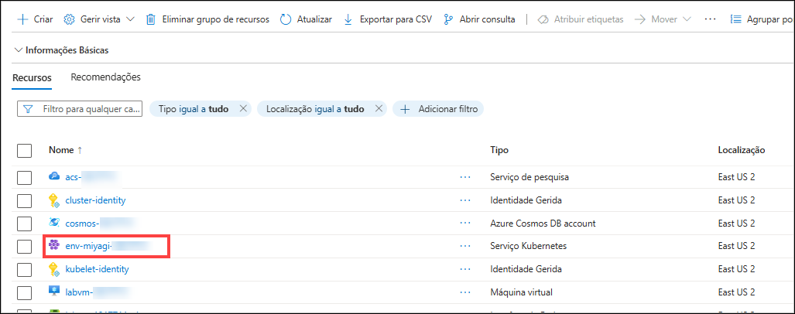

1. No separador Visão geral **env-miyagi-<inject key="DeploymentID" enableCopy="false"/>** painel de serviço Kubernetes, clique no botão **Parar**.

   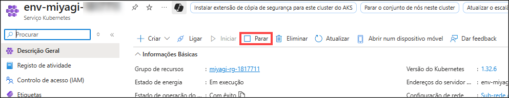

    > **Nota**: aguarde até que o serviço Kubernetes seja completamente interrompido.

1. No separador Visão geral **env-miyagi-<inject key="DeploymentID" enableCopy="false"/>** painel de serviço Kubernetes, clique no botão **Iniciar**.

   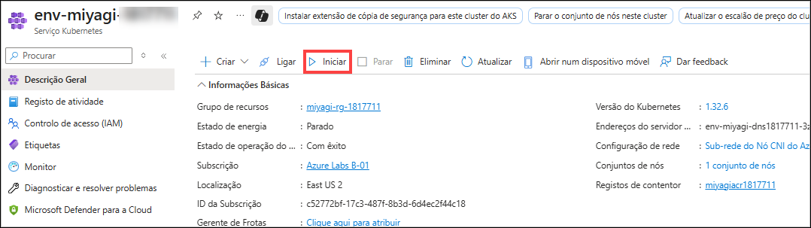

1. Assim que o serviço Kubernetes for iniciado, selecione **Serviços e entradas** em **Recursos Kubernetes** e clique em **IP de extensão** do serviço de recomendação miyagi.

   

1. Isto irá navegar numa nova aba com a página web **miyagi-recommendation-service**.

   

### Tarefa 5: configurar o log do Event Hub e validar a entrada

Neste laboratório, irá configurar o registo do Event Hub para a gestão de API, configurar os componentes necessários no Azure, implementar a configuração de registo utilizando um modelo Bicep e validar a integração através de testes e monitorização.

1. Na pesquisa do portal Azure e selecione **Espaço de Nomes de Hubs de Eventos**, selecione **miyagi-event-<inject key="DeploymentID" enableCopy="false"/>**.

   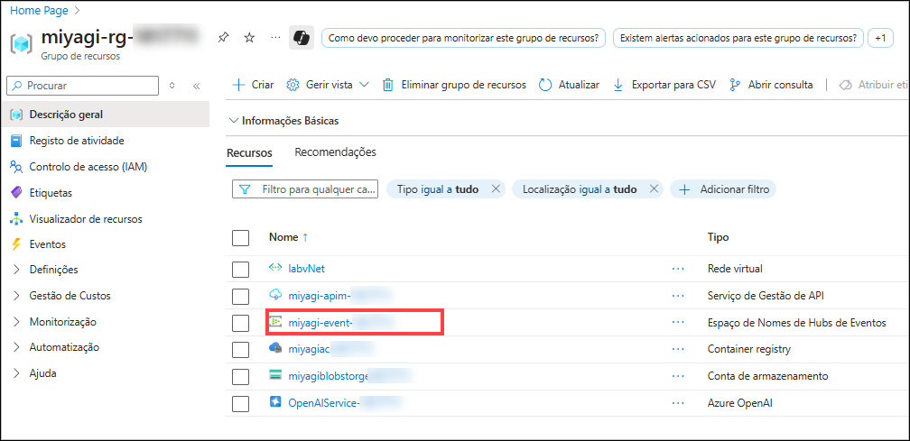

1. No separador **miyagi-event-<inject key="DeploymentID" enableCopy="false"/>** Event hub Namespace, no menu esquerdo selecione **Controlo de acesso (IAM)** **(1)** , clique em **+ Adicionar** **(2)** e selecione **Adicionar atribuição de função** **(3)**.

   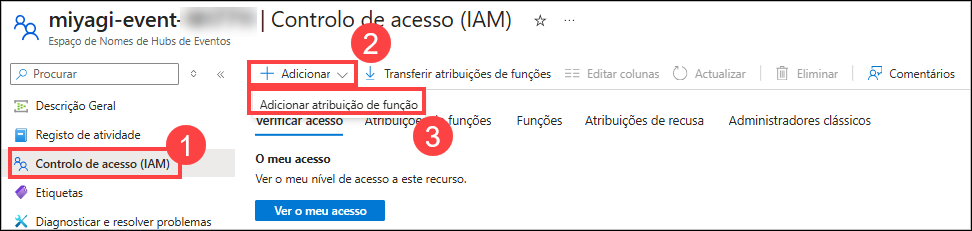

1. No separador **Role** do separador Adicionar atribuição de função na barra de pesquisa, pesquise e selecione **Remetente de dados dos Hubs de Eventos do Azure (1)(2)** e clique em **Next (3)**.

   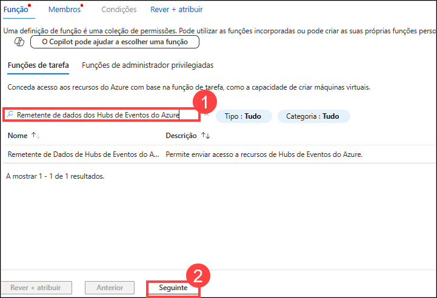

1. No separador **Membros**, selecione **Identidade gerida** **(1)**, clique em **+ Selecionar membros** **(2)**.

   

1. No pop-up de seleção de identidade gerida para **Assinatura Aceite o padrão (1)** no menu pendente Identidade gerida, selecione **Serviço de gestão de API** **(2)**, selecione **miyagi-apim-<inject key="DeploymentID" enableCopy="false"/>** **(3)** e clique em **Select** **(4)**.

   

1. Clique em **Seguinte**.

1. No separador **Revisar + atribuir** clique em **Revisar + atribuir**.

   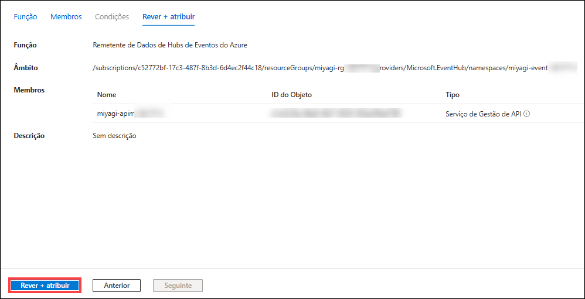

1. No ficheiro **miyagi-event-<inject key="DeploymentID" enableCopy="false"/>**, no menu esquerdo seleccione **Event Hubs** **(1)** em **Entity** e clique em **miyagi-event-<inject key="DeploymentID" enableCopy="false"/> (2)**

   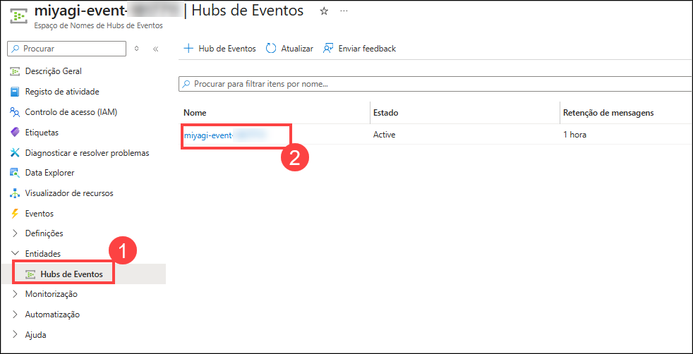

1. Na **Instância de Hubs de Eventos** de **miyagi-event-<inject key="DeploymentID" enableCopy="false"/>**, no menu esquerdo selecione **Políticas de acesso partilhado** **(1)** em **Settings**, clique em **apimLoggerAccessPolicy** **(2)** e copie **Cadeia de ligação primária** **(3)** cole-o num bloco de notas.

   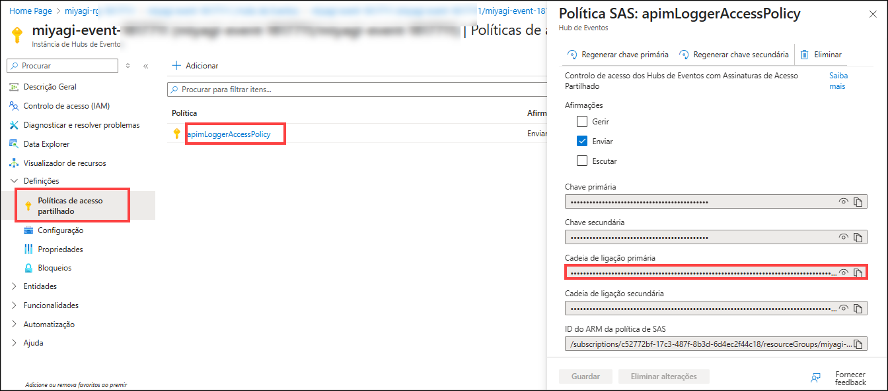

1. Abra o **notepad** do jumpvm e copie e cole o código abaixo, actualize **&lt;&lt;API_MANAGEMENT_NAME&gt;&gt;** com **miyagi-apim-<inject key="DeploymentID" enableCopy= "false "/>** nome e o &lt;&lt;EVENT_HUB_CONNECTION_STRING&gt;&gt; copiado da etapa acima.

   ```
   resource existingApiManagement 'Microsoft.ApiManagement/service@2023-03-01-preview' existing = {
      name: '<<API_MANAGEMENT_NAME>>'
    }
    
    resource ehLoggerWithConnectionString 'Microsoft.ApiManagement/service/loggers@2023-05-01-preview' = {
      name: 'AOAILogger'
      parent: existingApiManagement
      properties: {
        loggerType: 'azureEventHub'
        description: 'Event hub logger with connection string'
        credentials: {
          connectionString: '<<EVENT_HUB_CONNECTION_STRING>>'
          name: 'ApimEventHub'
        }
      }
    }
   ```

   

1. Na barra de menu do bloco de notas selecione **Ficheiros** e clique em **Guardar como**.

1. Em **Guardar como** navegue até ao caminho `C:\LabFiles\miyagi` **(1)**, introduza o nome do ficheiro **aoai-logger.bicep** **(2)** , guarde como tipo em **Todos os ficheiros** **(3)** e clique em **Guardar** **(4)**.

   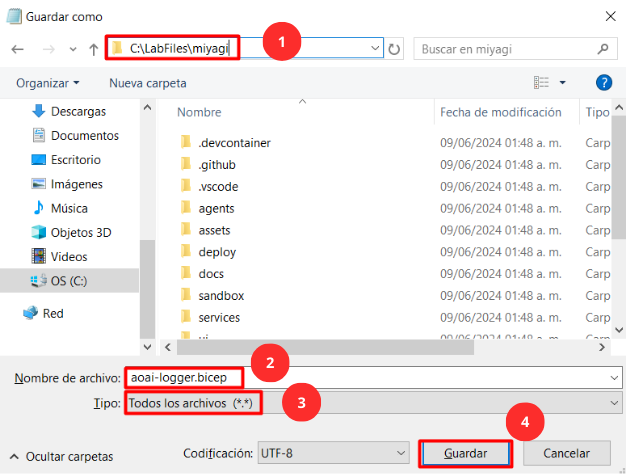

1. No jumpvm, abra o terminal PowerShell e execute o seguinte comando para iniciar sessão no **portal Azure**.

    ```
    az login
    ```

1. Isto irá redirecionar para **página de login da Microsoft**, selecione a sua conta do Azure **<inject key="AzureAdUserEmail"></inject>** e navegue de volta para o **PowerShell**.

   

1. Execute o seguinte comando para alterar o diretório para a pasta raiz `miyagi` no terminal e execute o ficheiro bíceps.

    > **Nota**: Substitua &lt;&lt;RESOURCE_GROUP_NAME&gt;&gt; com **<inject key="rgname" enableCopy="true"/>**.

    ```
    cd C:\LabFiles\miyagi
    az deployment group create --resource-group <<RESOURCE_GROUP_NAME>> --template-file .\aoai-logger.bicep
    ```

    >**Nota**: Esta sequência de comando navega para o diretório C:\LabFiles\miyagi que contém o ficheiro Bicep e, em seguida, implementa os recursos definidos nesse ficheiro no grupo de recursos do Azure especificado.

1. Navegue até ao portal do Azure, abra o Grupo de Recursos denominado **miyagi-rg-<inject key="DeploymentID" enableCopy="false"/>** e seleccione **miyagi-apim-<inject key=" DeploymentID" enableCopy ="false"/>** Serviço de gestão de API da lista de recursos.

   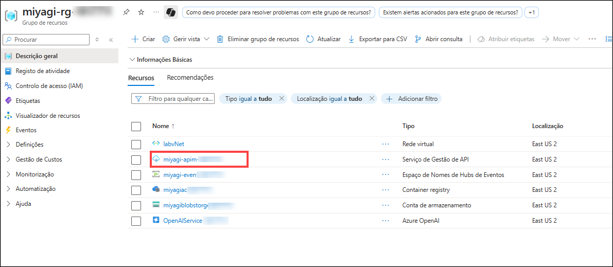

1. No serviço **miyagi-apim-<inject key="DeploymentID" enableCopy="false"/>** API Management do menu esquerdo, clique em **APIs** **(1)** e seleccione a **api-key** **(2)** criada no passo anterior, selecione **Todas as operações** **(3)** e em **processamento de saída** clique em **código de política editor(4)**.

   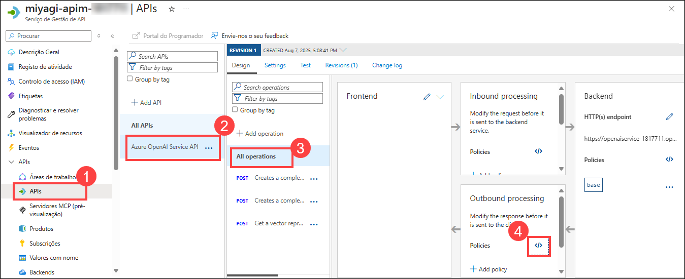

1. No editor de código, copie a política abaixo para substituir apenas as tags **outbound (1)** e clique em **Save(2)**.

      ```
      <outbound>
         <base />
         <choose>
            <when condition="@(!context.Variables.GetValueOrDefault<bool>("isStream"))">
                  <log-to-eventhub logger-id="AOAILogger" partition-id="0">@{
                  var responseBody = context.Response.Body?.As<JObject>(true);
                  return new JObject(
                     new JProperty("prompt_tokens", responseBody["usage"]["prompt_tokens"].ToString()),
                     new JProperty("total_tokens", responseBody["usage"]["total_tokens"].ToString())
                  ).ToString();
            }</log-to-eventhub>
            </when>
         </choose>
      </outbound>
      ```

   

1. De seguida, abra a **IU Miyagi** num separador separado do browser, clique em **Personalizar** e selecione o seu **Consultor Financeiro Favorito (1)** e escolha **GPT-4 (2)** para **Mecanismo de raciocínio** no menu suspenso e clique em **Personalizar (3)**. repita o mesmo passo selecionando diferentes **Consultores financeiros favoritos** 6 a 7 vezes para gerar registos adicionais.

   

1. Navegue de volta para o Event Hub, selecione **miyagi-event-<inject key="DeploymentID" enableCopy="false"/>** Event Hubs.

   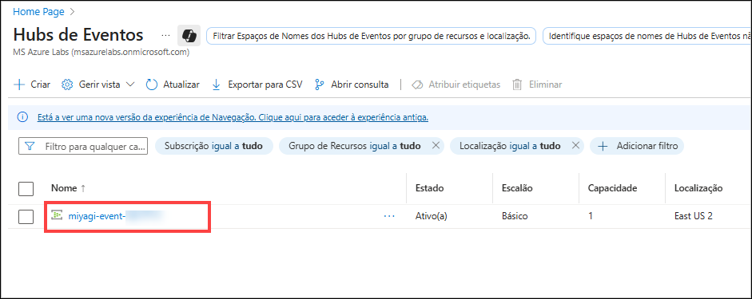

1. No **miyagi-event-<inject key="DeploymentID" enableCopy="false"/>** Event Hub Namespace, no menu esquerdo selecione **Hubs de Eventos** **(1)** em **Entidade** e clique em **miyagi-event-<inject key="DeploymentID" enableCopy="false"/>**

   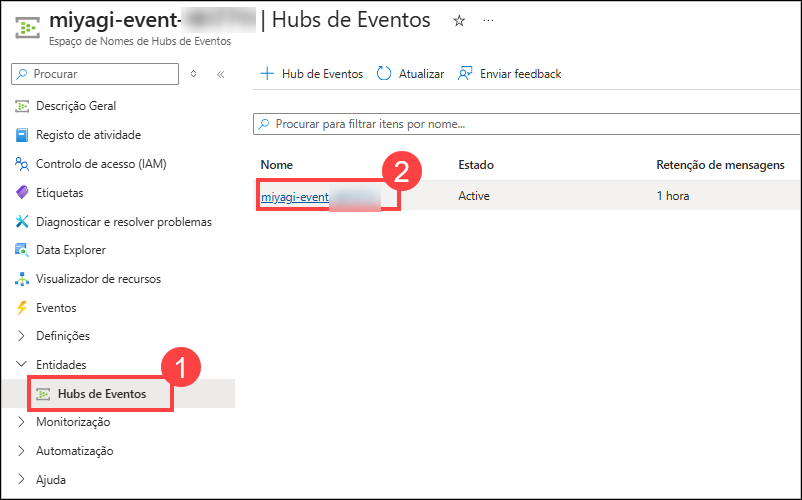

1. No **miyagi-event-<inject key="DeploymentID" enableCopy="false"/>** Instância de hubs de eventos, no menu esquerdo selecione **Processar dados** **(1)**, desça até encontrar **Ativar informações em tempo real de eventos** e clique em **Iniciar** **(2)**.

   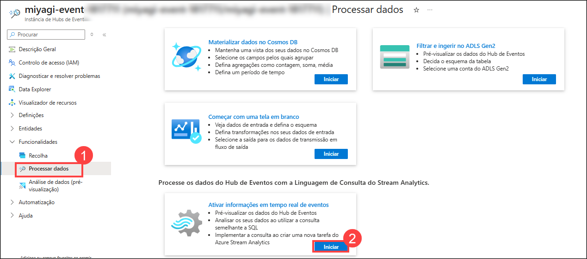

1. Clique em **Consulta de Teste** e na consulta do Event Hub, deverá ver informações de registo para os tokens utilizados.

   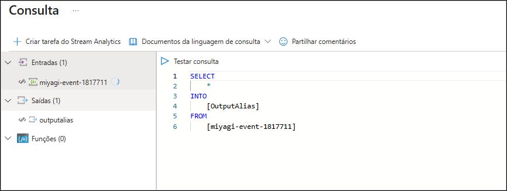

### Resumo

Neste laboratório, configurou um serviço de gestão de APIs para gerir APIs de forma eficiente. Inicialmente, o serviço foi implementado e foi criada uma API dentro do mesmo. Posteriormente, foram estabelecidas regras e funções para controlar o acesso à API. O registo do Event Hub foi configurado para monitorizar a utilização da API de forma eficaz. Por último, foi realizada a validação de entrada para garantir que a API tratava corretamente as várias entradas. No geral, este processo garantiu a gestão, a segurança e a monitorização de desempenho eficazes das APIs, contribuindo para um ecossistema de APIs bem organizado e seguro.

### Concluiu este laboratório com sucesso. Agora clique em Seguinte no canto inferior direito para passar para a página seguinte.
