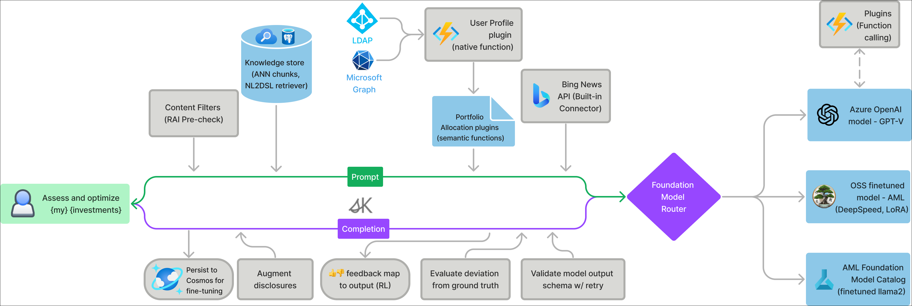

# Introdução ao Miyagi

### Duração estimada: 10 minutos

O Miyagi foi criado para apresentar o Copilot Stack da Microsoft para a criação e implantação de aplicativos inteligentes avançados de nível empresarial. Esta iniciativa oferece uma exploração abrangente de casos de uso de aprendizado de máquina generativo e tradicional, oferecendo uma abordagem prática para o desenvolvimento de experiências de produtos aprimoradas por IA. Este workshop é voltado para engenheiros de software interessados em se aprofundar em padrões e técnicas de design emergentes que podem aprimorar seus aplicativos por meio da hiperpersonalização e do aprimoramento da produtividade.

## Objetivo

Neste workshop prático, você aprenderá como aproveitar o Copilot Stack da Microsoft para projetar e criar aplicativos de nível empresarial com tecnologia de IA que aumentam a produtividade e proporcionam experiências de usuário altamente personalizadas.

- **Interaja com ferramentas e metodologias:** aprenda técnicas de engenharia rápida (por exemplo, cadeia de pensamento, recuperação e aumento), vetorização para memória de longo prazo e ajuste fino de modelos de código aberto.

- **Apresentar Conceitos Avançados:** Explorar orquestração e plugins semelhantes a agentes para aprimorar modelos de linguagem de grande porte (LLMs).

- **Construir uma Base para Integração de IA:** Fornecer uma base sólida para integrar IA em aplicativos modernos.

## Principais habilidades e ferramentas

- **IA Generativa:** Compreendendo os fundamentos e as aplicações.

- **Azure OpenAI:** Implementando soluções de IA usando os serviços OpenAI do Azure.

- **Padrões de Geração Aumentada de Recuperação (RAG):** Aprimorando modelos de IA com RAG.

- **Núcleo Semântico:** Utilizando o Núcleo Semântico para tarefas orientadas por IA.

- **Copilot Stack da Microsoft:** Aproveitando o Copilot Stack da Microsoft para construir sistemas inteligentes.

- **Casos de Uso Prático:** Aplicando conhecimento a cenários do mundo real para visualizar e criar soluções inteligentes.

## Para quem é isso

Este workshop foi concebido para:

- Desenvolvedores e arquitetos com conhecimentos básicos de desenvolvimento de aplicativos que desejam incorporar IA em seus aplicativos.

- Gerentes de produto e designers interessados em utilizar IA para aprimorar a experiência do usuário.

- Qualquer pessoa curiosa sobre o potencial da IA no desenvolvimento de aplicativos.

## Arquitetura

### Arquitetura lógica de alto nível

   

### Fluxo de aprendizagem em contexto

   

### Clique agora em **Seguinte** no canto inferior direito para ir para a página seguinte

