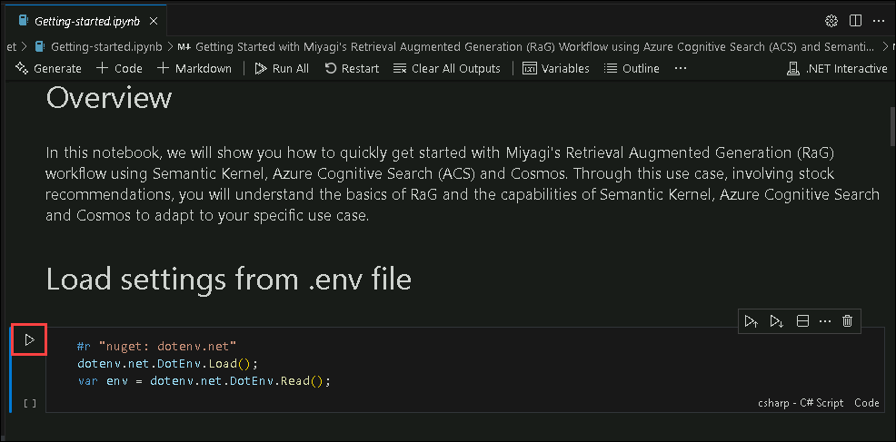

# Laboratório 2 - Execute a aplicação Miyagi localmente

### Duração: 80 minutos

Neste laboratório, o foco está na configuração da aplicação Miyagi para prontidão operacional. Posteriormente, a atenção passa para a compreensão da implementação diferenciada do serviço de recomendação. A fase prática envolve a execução do serviço de recomendação e a implementação local do frontend Miyagi para teste e desenvolvimento. Uma etapa crucial inclui a otimização da eficiência da recuperação de dados através da persistência de incorporações no Azure AI Search. O projeto culmina com uma exploração mais ampla da aplicação Miyagi e do serviço de recomendação, enfatizando uma experiência de utilizador personalizada. Esta abordagem baseada em tarefas garante uma progressão sistemática através das complexidades do projeto, facilitando uma compreensão abrangente e uma implementação eficaz.

### Tarefa 1: Configuração da aplicação miyagi

Nesta tarefa, irá configurar a aplicação Miyagi atualizando definições específicas no Visual Studio Code. Isto envolve a substituição dos valores de espaço reservado nos ficheiros de configuração pelos valores reais de vários recursos do Azure para garantir a conectividade e a funcionalidade adequadas.

1. Abra o **Visual Studio Code** na área de trabalho do Lab VM, clicando duas vezes sobre o mesmo.

   

   >**Nota** Se **Junte-se a nós para melhorar a extensão do fluxo de avisos!** janela solicitada, clique em **Não, obrigado**.

   

1. Em **Visual Studio Code** na barra de menus, seleccione **Ficheiro (1) > abrir pasta (2)**.

   

1. No **File Explorer**, navegue até **C:\LabFiles\miyagi** seleccione **miyagi** **(1)** clique em **Select folder (2)**

   .png)

1. No **Visual Studio Code**, clique em **Sim, confio nos autores** quando a janela **Confia nos autores dos ficheiros desta pasta?** for apresentada.

   

1. Expanda o diretório **miyagi>ui** e verifique se o ficheiro **. env.** está presente.

1. Expanda o diretório **miyagi/services/recommendation-service/dotnet** e verifique se o ficheiro **appsettings. json** está presente.

   

1. Abra o ficheiro **appsettings. json** e substitua os seguintes valores pelas variáveis ​​abaixo.

   | **Variables**                | **Values**                                                    |
   | ---------------------------- |---------------------------------------------------------------|
   | deploymentOrModelId          | **<inject key="CompletionModel" enableCopy="true"/>**         |
   | embeddingDeploymentOrModelId | **<inject key="EmbeddingModel" enableCopy="true"/>**          |
   | endpoint                     | **<inject key="OpenAIEndpoint" enableCopy="true"/>**          |
   | apiKey                       | **<inject key="OpenAIKey" enableCopy="true"/>**               |
   | azureCognitiveSearchEndpoint | **<inject key="SearchServiceuri" enableCopy="true"/>**        |
   | azureCognitiveSearchApiKey   | **<inject key="SearchAPIkey" enableCopy="true"/>**            |
   | cosmosDbUri                  | **<inject key="CosmosDBuri" enableCopy="true"/>**             |
   | blobServiceUri               | **<inject key="StorageAccounturi" enableCopy="true"/>**       |
   | bingApiKey                   | **<inject key="Bing_API_KEY" enableCopy="true"/>**           |
   | cosmosDbConnectionString     | **<inject key="CosmosDBconnectinString" enableCopy="true"/>** |
   

    > **Nota**: Para sua informação, os valores/Chaves/Endpoints/ConnectionString acima dos Recursos do Azure são injetados diretamente no labguide. Deixe as definições padrão para "cosmosDbContainerName": "recommendations" e "logLevel": "Trace".

   1.png)

1. Após atualizar os valores, guarde o ficheiro premindo **CTRL + S**.

1. Navegue até **miyagi/sandbox/usecases/rag/dotnet** e verifique se o ficheiro **. env** está presente.

1. No ficheiro **. env** substitua os seguintes valores pelas variáveis ​​abaixo.

   | **Variables**                          | **Values**                                            |
   | ---------------------------------------| ------------------------------------------------------|
   | AZURE_OPENAI_ENDPOINT                  | **<inject key="OpenAIEndpoint" enableCopy="true"/>**  |
   | AZURE_OPENAI_CHAT_MODEL                | **<inject key="CompletionModel" enableCopy="true"/>** |
   | AZURE_OPENAI_EMBEDDING_MODEL           | **<inject key="EmbeddingModel" enableCopy="true"/>**  |
   | AZURE_OPENAI_API_KEY                   | **<inject key="OpenAIKey" enableCopy="true"/>**       |
   | AZURE_COGNITIVE_SEARCH_ENDPOINT        | **<inject key="SearchServiceuri" enableCopy="true"/>**|
   |AZURE_COGNITIVE_SEARCH_API_KEY          | **<inject key="SearchAPIkey" enableCopy="true"/>**    |
   

   .png)

1. Após atualizar os valores, guarde o ficheiro premindo **CTRL + S**.

    >**Parabéns** pela conclusão da tarefa! Agora é altura de validá-lo. Aqui estão os passos:
    > - Clique no botão Validar para a tarefa correspondente. Se receber um mensagem de sucesso, validou o laboratório com sucesso.
    > - Caso contrário, leia atentamente a mensagem de erro e tente novamente o passo, seguindo as instruções do guia do laboratório.
    > - Se precisar de ajuda, contacte-nos através do e-mail labs-support@spektrasystems.com.

 <validation step="d37dd2bb-631a-4ffe-a41e-fc3ef07aa2b5" />

### Tarefa 2: Compreender a implementação do serviço de recomendação

O serviço de recomendação implementa o padrão RAG utilizando o SDK do Kernel Semântico. Os detalhes da implementação são capturados no Jupyter notebook na pasta miyagi/sandbox/usecases/rag/dotnet. Pode abrir o notebook no VSCode e executar as células para compreender os detalhes passo a passo de como o serviço de recomendação é implementado. Preste especial atenção à forma como o padrão RAG é implementado utilizando o Kernel Semântico. Selecione kernel como .NET Interactive no canto superior direito do portátil.

1. No Visual Studio Code, navegue até à pasta **miyagi/sandbox/usecases/rag/dotnet** e selecione **Getting-started.ipynb**

   

1. **Execute o caderno célula a célula** (utilizando Ctrl + Enter para permanecer na mesma célula ou Shift + Enter para avançar para a célula seguinte) e observe os resultados da execução de cada célula.

    > **Nota**: Certifique-se de que o **. Net Interactive** está no estado pronto. Além disso, não clique na opção **Executar tudo** para executar todas as células de uma só vez, o que pode levar a exceder o limite de tokens, resultando no Erro: 503 – Serviço inacessível.

   

    > **Nota**: Caso ocorram problemas ou erros relacionados com o excesso do limite da taxa de chamada do seu nível de preços OpenAI S0 atual. , Aguarde 15 a 20 segundos e execute novamente a célula

    >**Parabéns** pela conclusão da tarefa! Agora é altura de validá-lo. Aqui estão os passos:
    > - Clique no botão Validar para a tarefa correspondente. Se receber uma mensagem de sucesso, validou o laboratório com sucesso.
    > - Caso contrário, leia atentamente a mensagem de erro e tente novamente o passo, seguindo as instruções do guia do laboratório.
    > - Se precisar de ajuda, contacte-nos através do e-mail labs-support@spektrasystems.com.

<validation step="f277b99e-c179-4bb8-b9c1-6479a526ee4b" />

### Tarefa 3: executar o serviço de recomendação localmente
Nesta tarefa, irá executar o serviço de recomendação localmente utilizando o Visual Studio Code para criar e executar o serviço no terminal e, em seguida, verificar a sua funcionalidade acedendo à página do Swagger no browser.

1. Abra um novo terminal: navegando **miyagi/services/recommendation-service/dotnet** e clique com o botão direito do rato em **dotnet** no menu em cascata e selecione **Abrir no terminal de intergate**.

   

1. Execute o seguinte comando para executar o serviço de recomendação localmente

    ```
    dotnet build
    dotnet run
    ```

    > **Nota**: Deixe o comando ser executado, entretanto pode prosseguir com o passo seguinte.
    > **Nota** Os comandos dotnet build e dotnet run são fundamentais em ambientes .NET Core e .NET 5+ para criar e executar aplicações .NET localmente na sua máquina.

1. Abra outro separador no Edge, na janela do browser cole o seguinte link

    ```
    http://localhost:5224/swagger/index.html
    ```

    > **Nota**: Atualize a página continuamente até obter a página swagger do serviço de recomendação, como mostra a imagem abaixo.

   


### Tarefa 4: Executar o frontend miyagi localmente
Nesta tarefa, irá executar o frontend miyagi localmente instalando dependências utilizando npm e yarn e, em seguida, iniciando o servidor de desenvolvimento. Irá verificar a sua funcionalidade acedendo ao servidor de desenvolvimento local no navegador.

1. Abra um novo terminal: navegando **miyagi/ui** e clique com o botão direito do rato em **ui/typescript** , no menu em cascata selecione **Open in intergate Terminal**.

   

1. Execute o seguinte comando para instalar as dependências

    ```
    npm install --global yarn
    yarn install
    yarn dev
    ```

    > **Nota**: Aguarde até que o comando seja executado com sucesso. Isto levará até 5 minutos. Assim que o comando **yarn dev** começar a ser executado, aguarde 2 minutos e avance para o passo seguinte.

    > **Nota**: Estes comandos (npm install --global Yarn, Yarn Install e Yarn Dev) são realmente essenciais em projetos JavaScript e TypeScript para gerir dependências e executar scripts necessários para configurar e executar aplicações. Garantem que todos os pacotes necessários são instalados (yarn install) e executam scripts de desenvolvimento (yarn dev) definidos na configuração do projeto (package.json).

1. Abra um novo separador no Edge e navegue nos seguintes

    ```
    http://localhost:4001
    ```

### Tarefa 5: persistir incorporações no Azure AI Search

Nesta tarefa, irá persistir os embeddings no Azure AI Search executando um pedido POST na interface do utilizador do Swagger, verificando a execução e, em seguida, confirmando a criação do índice no portal do Azure.

1. Navegue de volta para a página **Swagger UI**, vá até à sessão **Memory**, clique em **POST /dataset (1)** para expansão e clique em **Experimente (2)**.

   

1. Substitua o **código (1)** abaixo pelo código abaixo e clique em **Executar (2)**.

     ```
     {
        "metadata": {
              "userId": "50",
              "riskLevel": "aggressive",
              "favoriteSubReddit": "finance",
              "favoriteAdvisor": "Jim Cramer"
            },
          "dataSetName": "intelligent-investor"
      }
      ```

   .png)

1. Na página **swagger UI**, desça até à revisão da sessão **Responses** que foi executada com sucesso, verificando se o estado do código é **200**.

   

1. Navegue de volta para o separador **Portal do Azure**, na caixa Pesquisar recursos, serviços e documentos (G+/) na parte superior do portal, introduza **AI Search** e selecione **AI Search** sob serviços.

   

1. Em **serviços Azure IA | No separador AI Search**, selecione **acs-<inject key="DeploymentID" enableCopy="false"/>**.

   

1. No separador **acs-<inject key="DeploymentID" enableCopy="false"/>** Serviço de pesquisa, clique em **Indexes** **(1)** em Gestão de pesquisa e reveja **miyagi-embeddings** **(2)** foi criado.

   

    > **Nota**: Clique no botão Atualizar para visualizar a **Contagem de documentos**.

    >**Parabéns** pela conclusão da tarefa! Agora é altura de validá-lo. Aqui estão os passos:
    > - Clique no botão Validar para a tarefa correspondente. Se receber uma mensagem de sucesso, validou o laboratório com sucesso.
    > - Caso contrário, leia atentamente a mensagem de erro e tente novamente o passo, seguindo as instruções do guia do laboratório.
    > - Se precisar de ajuda, contacte-nos através do e-mail labs-support@spektrasystems.com.

 <validation step="940ebf1a-9add-4bf0-a7fd-c6d929961497" />

### Tarefa 6: Explore a aplicação Miyagi e o serviço de recomendação personalizando
Nesta tarefa, irá personalizar o serviço de recomendação da aplicação Miyagi, selecionando um consultor financeiro e analisando as recomendações. Em seguida, irá verificar os registos no Visual Studio Code e interromper os serviços.

1. Navegue de volta para a página da interface do utilizador do **serviço de recomendação** e clique no botão **personalizar**.

   

1. Na página **Personalizar**, selecione o seu **Consultor financeiro favorito (1)** e escolha **GPT-4 (2)** para o **Mecanismo de raciocínio** no menu suspenso e clique em em **Personalizar (3)**.

   

1. Deverá ver as recomendações do serviço de recomendação no widget Principais ações.

   

1. Navegue até **Visual Studio Code** e clique em **dotnet** no terminal, pode passar pelos logs.

   

1. Depois de visualizar os registos, prima **Ctrl + C** para interromper a página **Swagger UI**.

1. No terminal **Terminal**, selecione **Nó** e prima **Ctrl + C** para interromper a página da interface do utilizador do **serviço de recomendação**.
   

1. Agora, clique em **Seguinte** no canto inferior direito para passar para a página seguinte.

## Resumo

Neste laboratório, começou por configurar a aplicação Miyagi para prontidão operacional, seguida de uma exploração detalhada da implementação do serviço de recomendação. A execução prática envolve a execução do serviço de recomendação e a implementação local do frontend Miyagi para teste. Melhorar a eficiência da recuperação de dados é um passo fundamental, alcançado através de incorporações persistentes no Azure AI Search. O projeto termina com uma ampla exploração da App Miyagi e do serviço de recomendação, dando prioridade a uma experiência de utilizador personalizada. Esta abordagem sistemática garante uma compreensão completa e uma implementação eficaz ao longo de todo o projeto.

### Concluiu este laboratório com sucesso. Agora clique em Seguinte no canto inferior direito para passar para a página seguinte.
