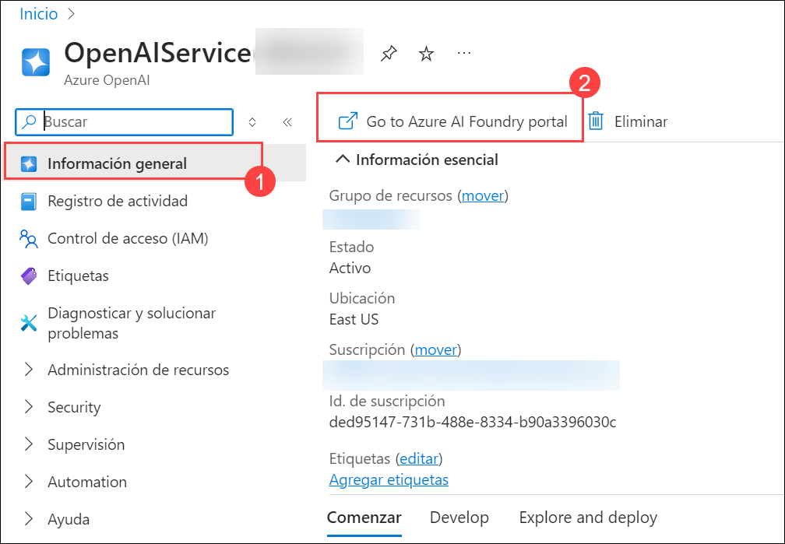
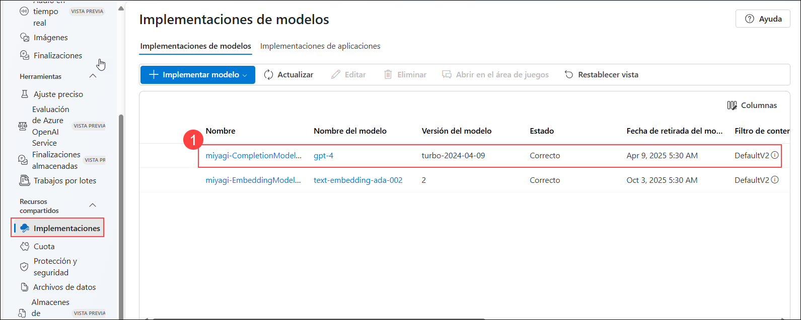
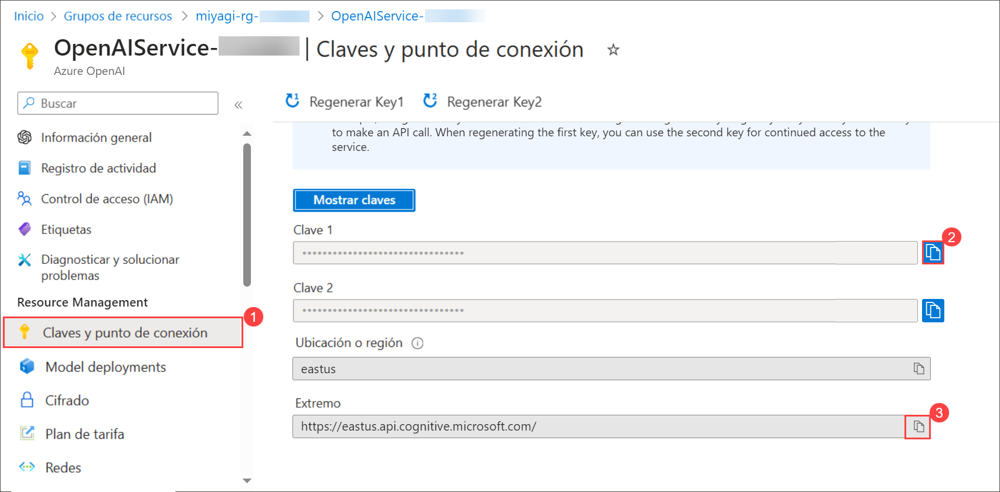
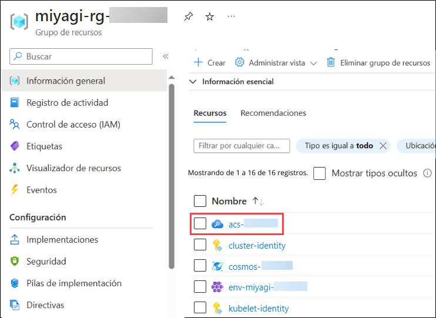
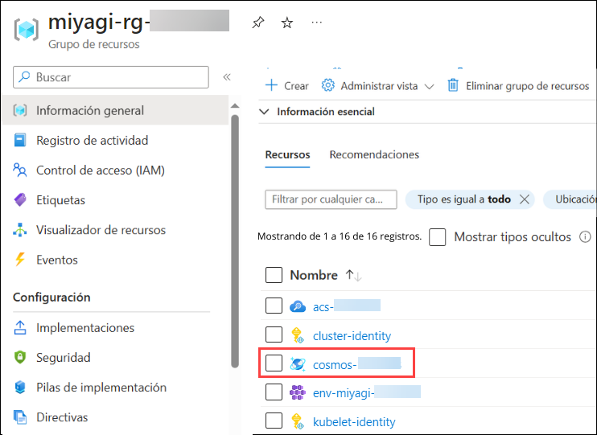
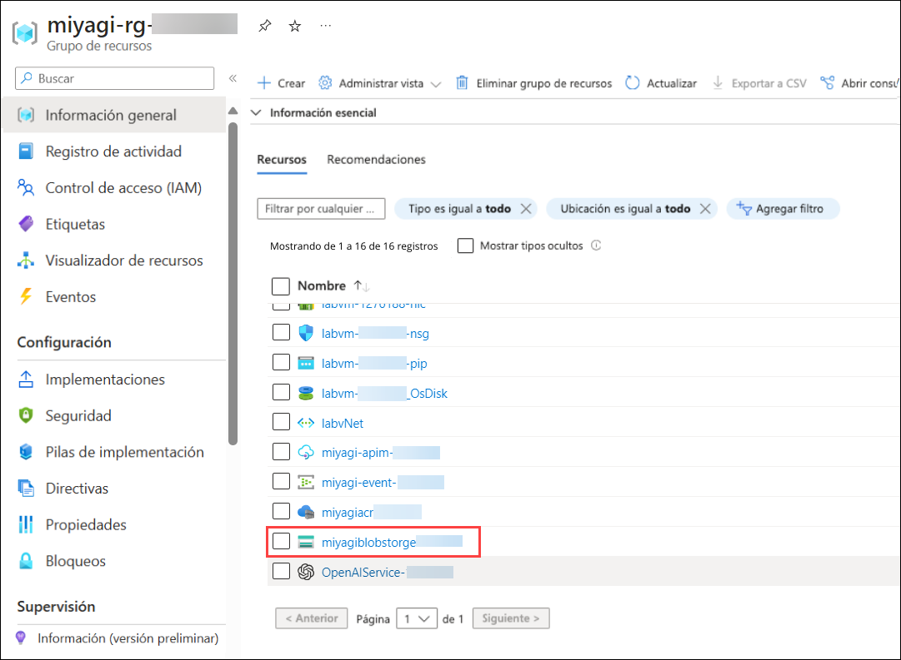

# Laboratorio 1 - Verificar y Recuperar los valores de los Recursos de Azure (opcional)

En esta tarea, se verifican y recuperan valores específicos, incluidos el punto de conexión, la cadena de conexión y la clave para los recursos designados.

   - Azure OpenAI : **OpenAIService-<inject key="DeploymentID" enableCopy="false"/>** 
   - Cuenta de Azure Cosmos DB : **cosmos-<inject key="DeploymentID" enableCopy="false"/>**
   - Servicio Search : **acs-<inject key="DeploymentID" enableCopy="false"/>**

1. Para verificar los nombres de los modelos implementados para "**deploymentOrModelId**" y para "**embeddingDeploymentOrModelId**" siga los pasos a continuación:
   
      - En el Portal de Azure, haga clic en **Grupos de Recursos** en el panel Navegar.

      - Desde la página Grupos de Recursos, haga clic en **miyagi-rg-<inject key="DeploymentID" enableCopy="false"/>**.

         

      - En **miyagi-rg-<inject key="DeploymentID" enableCopy="false"/>**, en la pestaña **Información general (1)** seleccione **OpenAIService-<inject key="DeploymentID" enableCopy="false"/> (2)**.

        .png)

      - En la página **Información general de OpenAI** **(1)**, haga clic en el botón **Go to Azure AI Foundry portal (2)**.

            
   
      - En **Azure AI Foundry portal**, seleccione **Implementaciones**, en la sección Administración.

      - En la hoja **Implementaciones** de Azure AI Studio, haga clic en el nombre de modelo **gpt-4** **(1)** y verifique el **nombre de la implementación** del modelo gpt-4 **(2)**.

          
        
          .png)
      
      -  Vuelva a la página **Implementaciones**.

      - En la hoja Implementaciones de Azure AI Studio, haga clic en **miyagi-EmbeddingModel-<inject key="DeploymentID" enableCopy="false"/>** nombre de implementación y verifique el **nombre de implementación** de **incrustación de texto -ada-002 modelo(2)**.
        
          

         .png)

1. Para verificar los valores para **Extremo** y **Clave 1**, siga los pasos a continuación:

   -  Vuelva a la pestaña que muestra **Portal de Azure**. 

   -  En la hoja **OpenAIService-<inject key="DeploymentID" enableCopy="false"/>** en la sección **Administración de Recursos**, seleccione **Claves y punto de conexión (1)**, verifique **Clave 1 (2)** y **Extremo (3)**.
     
      

1. Para verificar los valores para  "azureCognitiveSearchEndpoint" y  "azureCognitiveSearchApiKey", siga los pasos a continuación:
   
   - Vuelva al grupo de recursos **miyagi-rg-<inject key="DeploymentID" enableCopy="false"/>**.

   - En la página **miyagi-rg-<inject key="DeploymentID" enableCopy="false"/>**, seleccione **acs-<inject key="DeploymentID" enableCopy="false"/>** de la lista de recursos.

      
 
   - En la hoja **acs-<inject key="DeploymentID" enableCopy="false"/>**, verifique la **URL**.
   
      

   - En la hoja **acs-<inject key="DeploymentID" enableCopy="false"/>**, en la sección **Configuración**, verifique el valor **Clave de administrador principal**.
   
      

1. Para verificar los valores de "**cosmosDbUri**" y "**cosmosDbName**," por favor siga los pasos a continuación:

   - Vuelva a la página del grupo de recursos **miyagi-rg-<inject key="DeploymentID" enableCopy="false"/>**, seleccione **cosmos-<inject key="DeploymentID" enableCopy="false"/>** de la lista de recursos.

     

   - En **cosmos-<inject key="DeploymentID" enableCopy="false"/>** verifique la **URL**.
     
     

   - En **cosmos-<inject key="DeploymentID" enableCopy="false"/>** en **Configuración**, seleccione **Claves (1)** y verifique el valor de la **CADENA DE CONEXIÓN PRINCIPAL de Cosmos DB (2)**.

     

1. Para obtener los valores de  "**blobServiceUri**", por favor siga los pasos a continuación:

   - Vuelva a la página del grupo de recursos **miyagi-rg-<inject key="DeploymentID" enableCopy="false"/>**, seleccione **miyagiblobstorge<inject key="DeploymentID" enableCopy="false"/>** de la lista de recursos.

     

   - En la cuenta de almacenamiento **miyagiblobstorge<inject key="DeploymentID" enableCopy="false"/>**, del menú de la izquierda seleccione **Puntos de conexión** **(1)** en Configuración y verifique **Blob service** **(1)** en Blob service.

     

1. Ahora, haga clic en **Siguiente** en la esquina inferior derecha para pasar a la página siguiente.
