# Lab: Build Custom Copilot Application using Azure AI Foundry

### Estimated Duration: 60 minutes

## Lab objectives 

In this lab, you'll run Chat Copilot locally after retrieving Azure OpenAI Service values from the Azure portal. By cloning the Chat-Copilot GitHub repo and setting up dependencies, you'll configure and execute the application. Uploading documents enables interaction with Copilot, which generates responses based on their content, complete with citations for validation. This exercise provides hands-on experience in utilizing Chat Copilot with your own data, managing documents and sessions within the application.

# Exercise 1: Run the Chat Copilot App Locally

- Task 1: Retrieving the Azure OpenAI Service values
- Task 2: Cloning the Chat-Copilot GitHub Repo
- Task 3: Setting up the Environment
- Task 4: Configure and run the Chat Copilot App Locally

# Exercise 2: Chat with your own documents

- Task 1: Chat with your own documents in the Chat Copilot Application
- Task 2: Cloning the Chat-Copilot GitHub Repo
 
# Exercise 1: Run the Chat Copilot App Locally

In this lab, you will run the Chat Copilot app locally by setting up the environment, installing dependencies, and launching the application for testing and interaction.

### Task 1: Retrieving the Azure OpenAI Service values

In this task, you will retrieve the Azure OpenAI Service values by accessing the service configuration, querying the API, and ensuring the correct integration of parameters for your application.

1. In the Azure Portal, search for **OpenAI (1)** and select **Azure OpenAI (2)**
   
    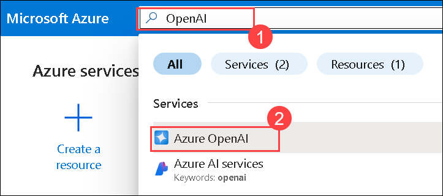

1. Select the **Azure OpenAI** resource created.

    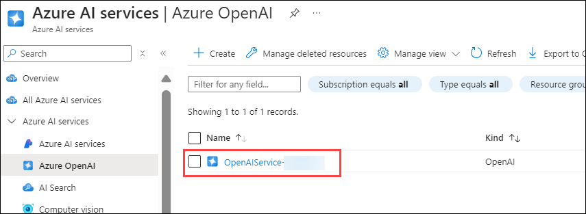  

1. Select **Keys and Endpoints (1)** from the left pane. Copy **Key 1 (2)** and **Endpoint (3)**, then store them in Notepad.
   
    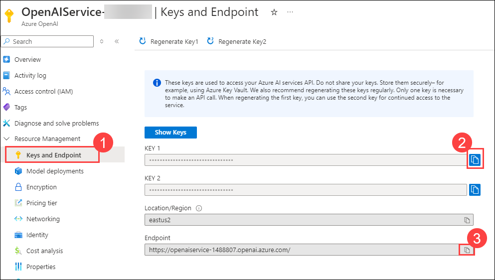

   > **Note**: If you dont see the Left side Navigation pane, click on the **three horizontal line** in the top left corner.

   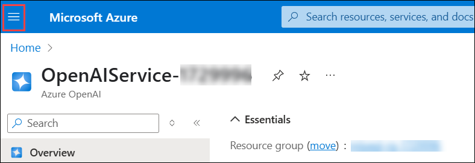 

1. From the **Overview (1)** page, click on **Go to Azure AI Foundry portal (2)**.
   
    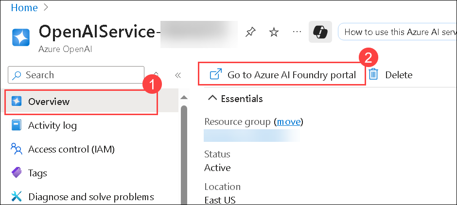

1. Go to **Deployments (1)** in the left navigation pane, click on the names of your AI model to copy them, and paste them into Notepad **(2)**.
    
    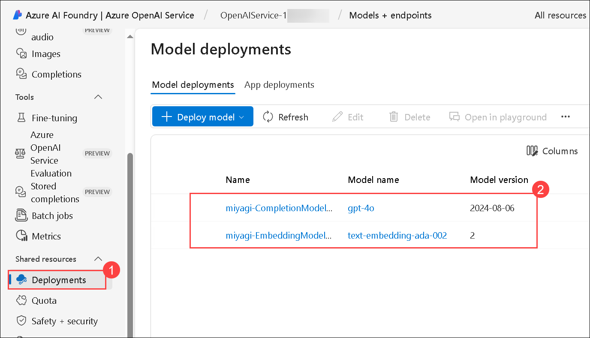

    > **Note**: Click on the **Expand** button, if you dont see the left side navigation pane.         

### Task 2: Cloning the Chat-Copilot GitHub Repo

In this task, you will clone the Chat-Copilot GitHub repository by using Git commands to download the code to your local machine for further exploration and development.

1. In the LabVM, click on **Start**, from the start menu search for **Powershell (1)** and select **Windows PowerShell (2)** and then pen PowerShell as an administrator.

    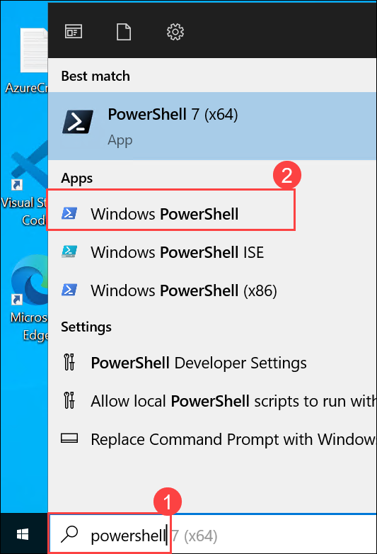  
   
1. Navigate to the directory `C:/Users/azureuser` by running the below command.
 
   ``` 
   cd C:/Users/azureuser
   ```
1. Run the command to clone the GitHub repository.
   
   ``` 
   git clone https://github.com/CloudLabsAI-Azure/chat-copilot CHAT-COPILOT
   ```

    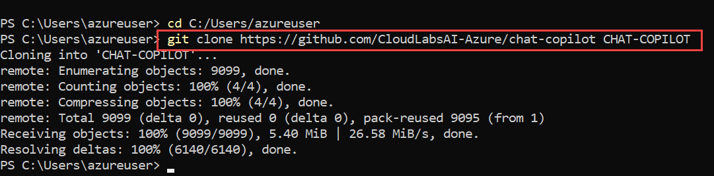

1. Open Visual Studio Code from the LabVM Desktop and click on `File (1) > Open folder (2)`.

   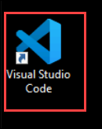

   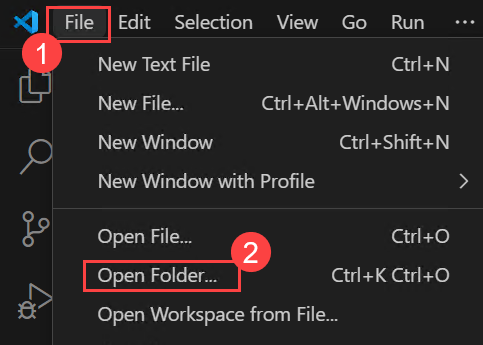

1. Select **CHAT-COPILOT (1)** and click **Select Folder (2)**.

   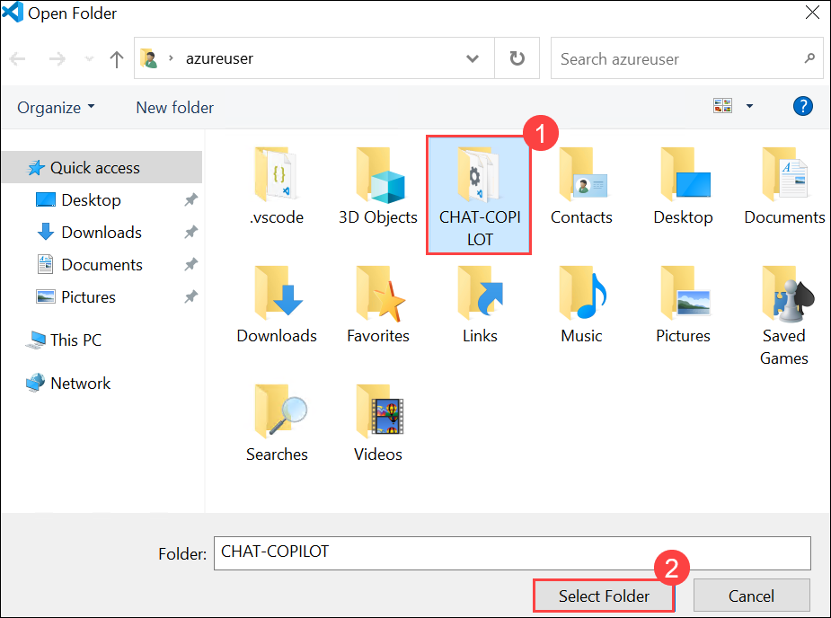

1. If the pop up appears for **Do you trust the authors of the file in this folder**, click on **Yes, I trust the authors.** 

    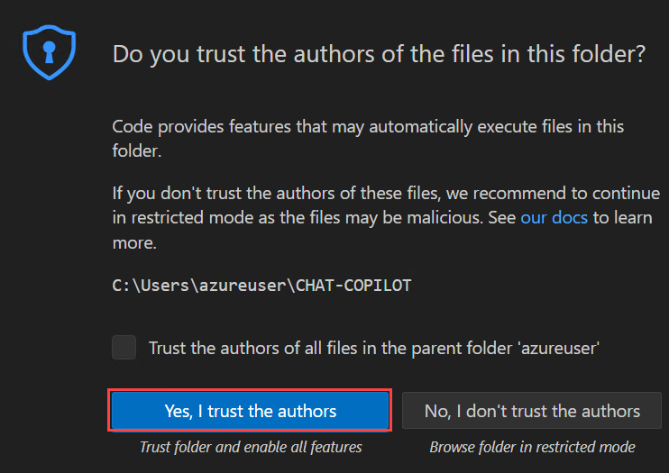

1. Review the files.

     

### Task 3: Setting up the Environment

In this task, you will set up the environment for the Chat-Copilot project by installing necessary dependencies, configuring environment variables, and preparing the development environment for local execution.

1. In the LabVM, click on **Start**, from the start menu search for **Powershell (1)**, right click on **Windows PowerShell (2)** and run **PowerShell as an administrator (3)**.

   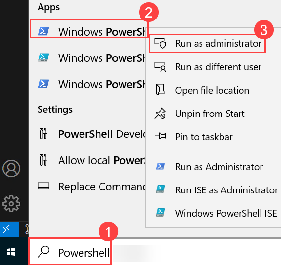

1. Setup your environment by navigating to the scripts directory of chat-copilot using the command:

   ``` 
   cd C:\Users\azureuser\chat-copilot\scripts\
   ```

1. Run the below command to install Chocolatey, dotnet-7.0-sdk, nodejs, and yarn:

   ```
   .\Install.ps1
   ```

    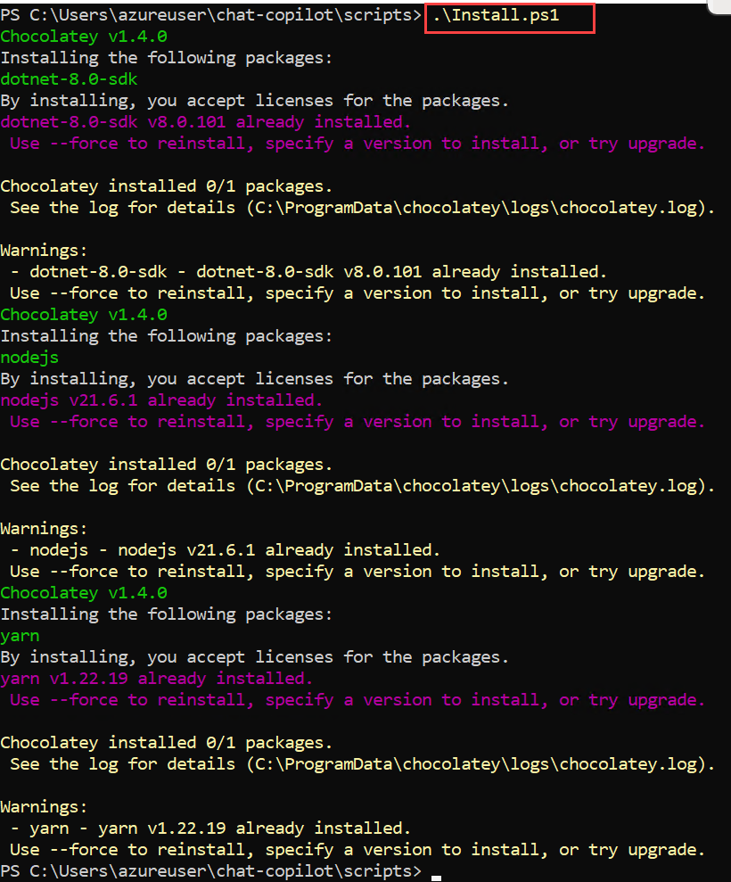   

   >**Note:** If you receive an error that the script is not digitally signed or cannot execute on the system, you may need to change the execution policy or unblock the script.

### Task 4: Configure and run the Chat Copilot App locally

In this task, you will configure and run the Chat Copilot app locally by setting up the environment, adjusting configuration files, and launching the application for testing and development.

1. Configure Chat Copilot by running the following command. You can use the Azure OpenAI Service Name, Key, Endpoint, and the already deployed model names that you noted down in the previous steps or use the values from the below mentioned table.
   
   ```
   .\Configure.ps1 -AIService {AI_SERVICE} -APIKey {API_KEY} -Endpoint {AZURE_OPENAI_ENDPOINT} -CompletionModel {DEPLOYMENT_NAME} -EmbeddingModel {DEPLOYMENT_NAME}
   ```
   | **Variables**                          | **Values**                                            |
   | ---------------------------------------| ------------------------------------------------------|
   | API_KEY                                | **<inject key="OpenAIKey" enableCopy="true"/>**       |
   | AI_SERVICE                             | **AzureOpenAI**| 
   | AZURE_OPENAI_ENDPOINT                  | **<inject key="OpenAIEndpoint" enableCopy="true"/>**  |
   | CompletionModel:{DEPLOYMENT_NAME}      | **<inject key="CompletionModel" enableCopy="true"/>** |
   | EmbeddingModel:{DEPLOYMENT_NAME}       | **<inject key="EmbeddingModel" enableCopy="true"/>**  |

   >**Note:** If a Security warning pop-up window appears, choose **Yes**
   >
   >**Note:** The code should look similar to the image below:

     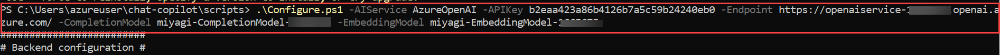

1. Run Chat Copilot locally. This step starts the **backend API** application. frontend
 
   ```powershell
   .\Start-Backend.ps1
   ```
   > **Note:** It may take a around 5 minutes for Yarn packages to install on the first run, wait untill the command run successfully.
 
1. Open another tab in **Edge**, in the browser window paste the following link, and you should see a confirmation message: `Healthy`.
 
   ```powershell
   http://localhost:40443/healthz
   ```
   > **Note:** Don't close the PowerShell window keep it running up.
  
     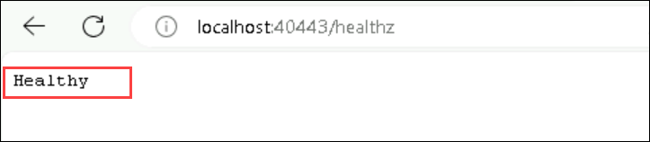
    
1. In the LabVM, click on **Start**, from the start menu search for **PowerShell 7 (1)** and select for **PowerShell 7 (2)**.

   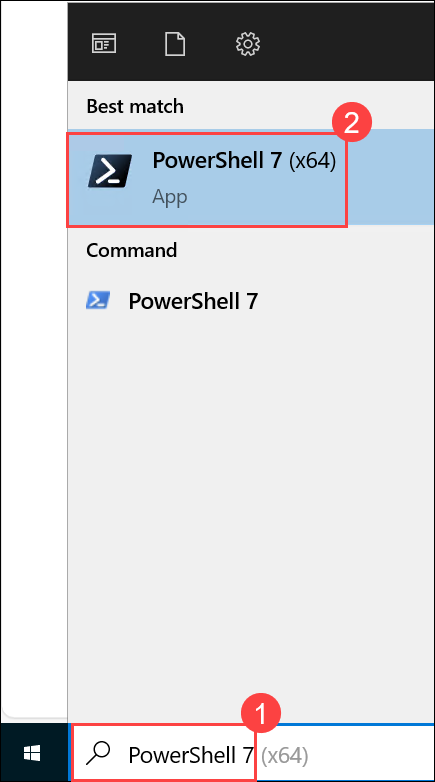
 
1. Run the following command to change the path.
 
   ```
   cd C:\Users\azureuser\chat-copilot\scripts\
   ```
 
1. Run the following to set the execution policy.
 
   ```
   Set-ExecutionPolicy -ExecutionPolicy Unrestricted -Scope Process
   ```
 
1. The execution policy helps protect you from scripts that you do not trust. Changing the execution policy might expose you to the security risks described in the about_Execution_Policies help topic. If promted **Do you want to change the execution policy?,** enter **A** and hit **Enter**.
 
1. Configure **Chat Copilot** by running the following command.
 
   ```powershell
   .\Start-Frontend.ps1
   ```

    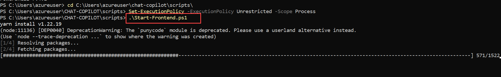   

     >**Note:** Please wait for 5-7 mins for the command to run completely. If it throws any warnings please ignore.     

1. Once the deployment of the script is executed successfully it will redirect to `http://localhost:3000/` Chat CoPilot in **Edge** browser.
 
   >**Note:** Please wait for 3-4 mins for the browser to load
  
1. You will get an output similar to this for the frontend:

   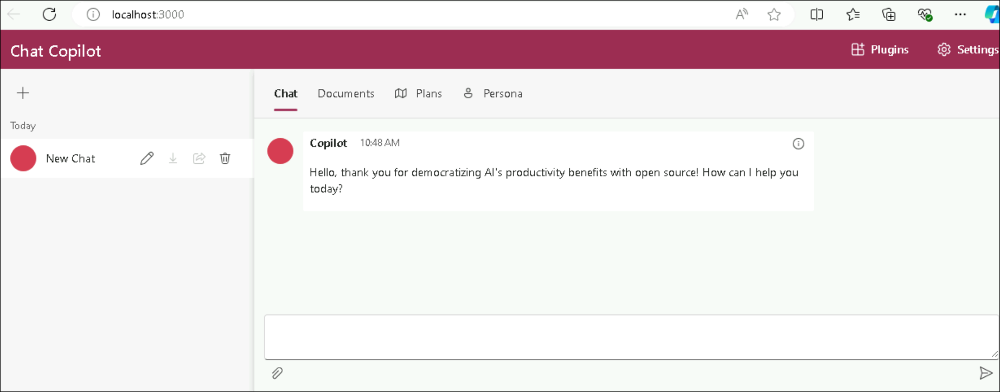

1. You will get an output similar to this for the backend:

   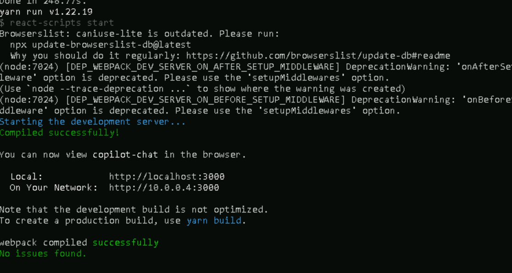

>**Congratulations** on completing the Task! Now, it's time to validate it. Here are the steps:
> - Hit the Validate button for the corresponding task. If you receive a success message, you have successfully validated the lab. 
> - If not, carefully read the error message and retry the step, following the instructions in the lab guide.
> - If you need any assistance, please contact us at cloudlabs-support@spektrasystems.com.

<validation step="df43cbbf-d05e-4a3b-b34a-a5f2dd969bad" />

# Exercise 2: Chat with your own documents

In this lab, you will chat with your own documents by uploading files to the Chat Copilot app and interacting with the integrated chat interface for personalized responses.

## Task 1: Chat with your own documents in the Chat Copilot Application

In this task, you will learn how to chat with your own documents in the Chat Copilot application by uploading files, configuring the document processing, and interacting with the integrated chat interface for personalized responses.

1. Navigate back to the WebApp. Click on the **Documents (1)** tab at the top and click on **Upload (2)** and select **+ New local chat document (3).**

    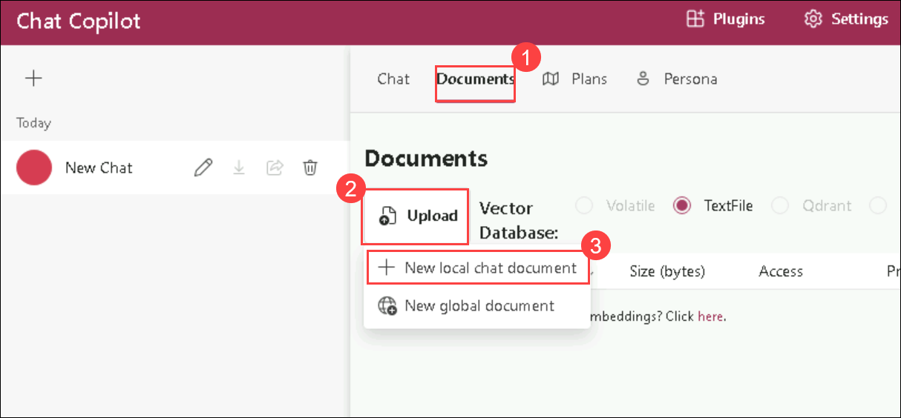  

1. Navigate to `C:\Labfiles\Documents` **(1)** to upload the three pdfs. Select the three files **(2)** and click **Open. (3)**

    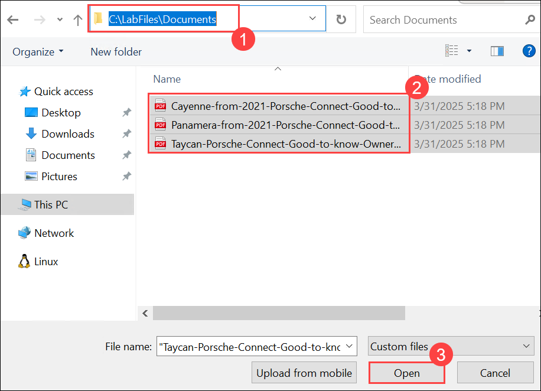

1. Ensure the files are uploaded successfully before proceeding.

    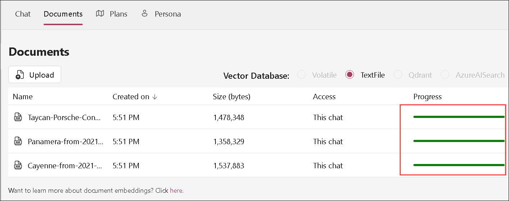

1. Once it is uploaded, Naviagte to the **Chat (1)** tab then provide the below prompt **(2)** then click **send (3)** button and then check how the response is generated by Copilot.

    ```
    How to operate Android Auto in Porche Taycan? Give step-by-step instructions.
    ```
    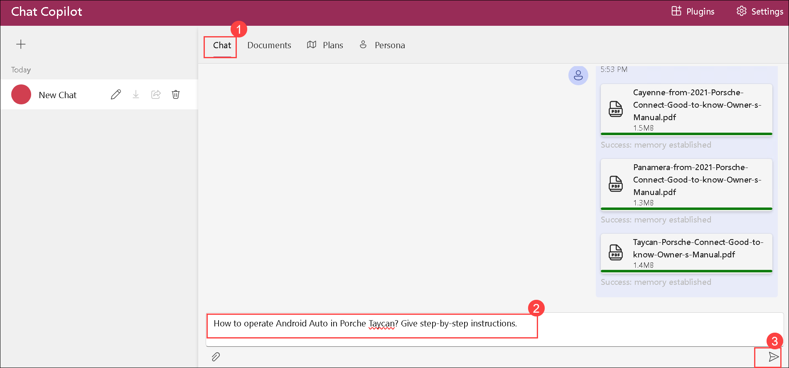
   
1. Provide another prompt and check how the response is generated by Copilot.

    ```
    Give detailed information on Apple CarPlay.
    ```
    

     >**Note**: If you get any error while sending the second prompt, related to exceeded Token rate limit. Please wait for 5-10 seconds and then send the prompt.

      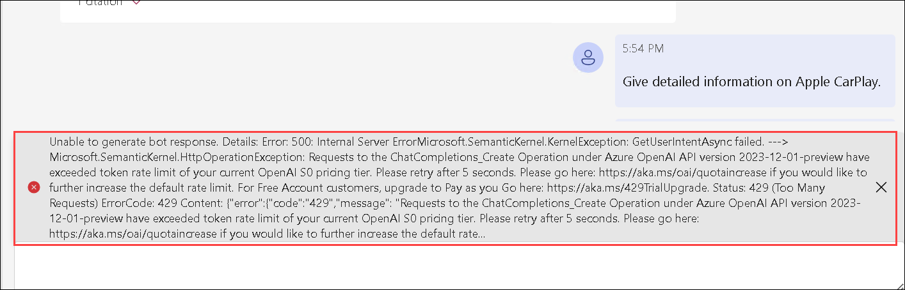     
   
1. The response not only answered the question based on the content found in these documents, but it also included citations (1) to that content to validate the accuracy of the information. When you click on an annotation, the app jumps right to the page of the document (2) that goes into the comparison of the plans, so that we can read more or do additional validation on the accuracy of the answer under the citation section.

1. Click on the **Edit** button on the left to rename.

    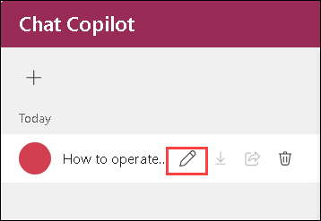

1. Give any name you prefer **(1)** and then click on right mark **(2)**.    

    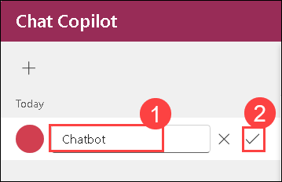

## Summary

In this lab, you have accomplished the following:

- Retrieved Azure OpenAI Service values for proper integration.  
- Cloned the Chat-Copilot GitHub repository to access the code.  
- Set up the environment with required dependencies and configurations.  
- Ran the Chat Copilot app locally for testing purposes.  
- Interacted with your documents within the Chat Copilot app.  

### You have succesfully completed the lab
