# Laboratorio 2 - Ejecutar la Aplicación Miyagi Localmente

### Duración estimada: 60 minutos

En esta práctica de laboratorio, la atención se centra en configurar la aplicación Miyagi para que esté lista para funcionar. Posteriormente, la atención se centra en comprender la implementación matizada del servicio de Recomendación. La fase práctica implica ejecutar el servicio de Recomendación e implementar el frontend Miyagi localmente para pruebas y desarrollo. Un paso crucial incluye optimizar la eficiencia de la recuperación de datos mediante la persistencia de los embeddings en Azure AI Search. El proyecto culmina con una exploración más amplia de la aplicación Miyagi y el servicio de Recomendación, enfatizando una experiencia de usuario personalizada. Este enfoque basado en tareas garantiza una progresión sistemática a través de las complejidades del proyecto, facilitando una comprensión integral y una implementación efectiva.

## Objetivos del laboratorio
Podrás completar las siguientes tareas:

- Tarea 1: Configurar la aplicación miyagi
- Tarea 2: Comprender la implementación del servicio de Recomendación
- Tarea 3: Ejecutar el servicio de recomendación localmente
- Tarea 4: Ejecutar el frontend de Miyagi localmente
- Tarea 5: Persistir embeddings en Azure AI Search
- Tarea 6: Explorar la Aplicación Miyagi y el servicio de Recomendación mediante Personalización

### Tarea 1: Configurar la aplicación miyagi

En esta tarea, configurará la aplicación Miyagi actualizando configuraciones específicas en Visual Studio Code. Esto implica reemplazar los valores de marcador de posición (placeholder) en los archivos de configuración con los valores reales de varios recursos de Azure para garantizar la conectividad y el funcionamiento correctos.

1. Abra **Visual Studio Code** desde el escritorio de Lab VM haciendo doble clic en el acceso directo.

   

   >**Nota** Si aparece la ventana **¡Únase a nosotros para mejorar la extensión promt-flow!**, haga clic en **No,thanks**.

   
   
1. En **Visual Studio Code**, de la barra de menú seleccione **Archivo (1) > Abrir carpeta (2)**.

   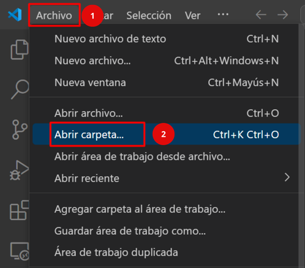

1. Dentro del **Explorador de Archivos**, navegue hasta **C:\LabFiles\miyagi** seleccione **miyagi** **(1)** y haga clic en **Seleccionar carpeta (2)**

   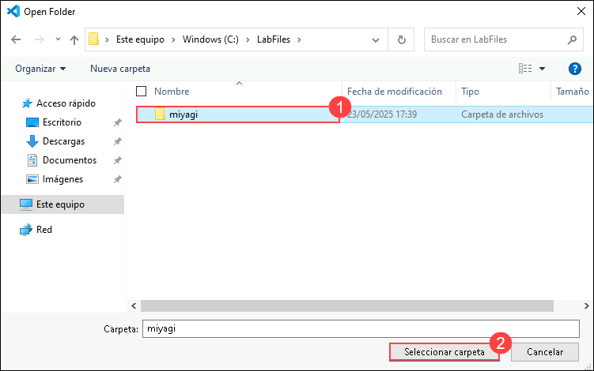

1. En **Visual Studio Code**, haga clic en **Sí, confío en los autores** cuando se le solicite en la ventana **¿Confía en los autores de los archivos de esta carpeta?**.

   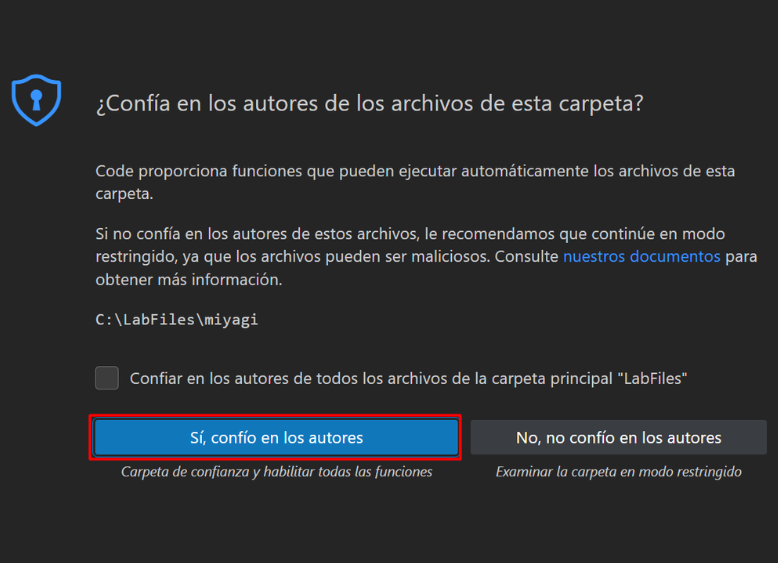 
   
1. Expanda el directorio **miyagi > ui > typescript** y verifique que el archivo **.env** está presente. 

    

1. Expanda el directorio **miyagi/services/recommendation-service/dotnet** y verifique que el archivo **appsettings.json** está presente.

   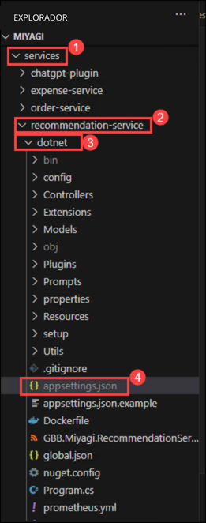
  
1. En el archivo **appsettings.json** reemplace los siguientes valores para las variables siguientes.

   | **Variables**                | **Valores**                                                    |
   | ---------------------------- |---------------------------------------------------------------|
   | deploymentOrModelId          | **<inject key="CompletionModel" enableCopy="true"/>**         |
   | embeddingDeploymentOrModelId | **<inject key="EmbeddingModel" enableCopy="true"/>**          |
   | endpoint                     | **<inject key="OpenAIEndpoint" enableCopy="true"/>**          |
   | apiKey                       | **<inject key="OpenAIKey" enableCopy="true"/>**               |
   | azureCognitiveSearchEndpoint | **<inject key="SearchServiceuri" enableCopy="true"/>**        |
   | azureCognitiveSearchApiKey   | **<inject key="SearchAPIkey" enableCopy="true"/>**            |
   | cosmosDbUri                  | **<inject key="CosmosDBuri" enableCopy="true"/>**             |
   | blobServiceUri               | **<inject key="StorageAccounturi" enableCopy="true"/>**       |
   | bingApiKey                   | **<inject key="Bing_API_KEY" enableCopy="true"/>**           |
   | cosmosDbConnectionString     | **<inject key="CosmosDBconnectinString" enableCopy="true"/>** |
   
   > **Nota**: Para su información, los valores/Claves/Puntos de conexión/Cadena de conexión de los Recursos de Azure están directamente inyectados en esta guía de laboratorio. Deje la configuración predeterminada para "cosmosDbContainerName": "recommendations" y "logLevel": "Trace".

      
   
1. Una vez que haya actualizado los valores, guarde el archivo presionando **CTRL + S**.

1. En la carpeta **miyagi**, expanda **sandbox (1)/usecases (2)/rag (3)/dotnet (4)** y verifique que el archivo **.env (5)** esté presente.

   .png)
  
1. En el archivo **.env** reemplace los siguientes valores para las variables siguientes.

   | **Variables**                          | **Valores**                                            |
   | ---------------------------------------| ------------------------------------------------------|
   | AZURE_OPENAI_ENDPOINT                  | **<inject key="OpenAIEndpoint" enableCopy="true"/>**  |
   | AZURE_OPENAI_CHAT_MODEL                | **<inject key="CompletionModel" enableCopy="true"/>** |
   | AZURE_OPENAI_EMBEDDING_MODEL           | **<inject key="EmbeddingModel" enableCopy="true"/>**  |
   | AZURE_OPENAI_API_KEY                   | **<inject key="OpenAIKey" enableCopy="true"/>**       |
   | AZURE_COGNITIVE_SEARCH_ENDPOINT        | **<inject key="SearchServiceuri" enableCopy="true"/>**|
   |AZURE_COGNITIVE_SEARCH_API_KEY          | **<inject key="SearchAPIkey" enableCopy="true"/>**    |
   
   

1. Una vez que haya actualizado los valores, guarde el archivo presionando **CTRL + S**.

>**¡Felicitaciones** por completar la Tarea! Ahora es el momento de validarla. Aquí están los pasos:
> - Pulse el botón Validar para la tarea correspondiente. Si recibe un mensaje de éxito, ha validado correctamente el laboratorio.
> - De lo contrario, lea atentamente el mensaje de error y vuelva a intentar el paso, siguiendo las instrucciones de la guía de laboratorio. 
> - Si necesita ayuda, contáctenos en cloudlabs-support@spektrasystems.com.

<validation step="209e971c-dc3f-486b-b7c7-1096724301f7" />

### Tarea 2: Comprender la implementación del servicio de Recomendación

El servicio de recomendación implementa el patrón RAG utilizando el SDK de Semantic Kernel. Los detalles de la implementación se capturan en el notebook (cuaderno) de Jupyter en la carpeta miyagi/sandbox/usecases/rag/dotnet. Puede abrir el cuaderno en VS Code y ejecutar las celdas para comprender los detalles paso a paso de cómo se implementa el servicio de Recomendación. Preste especial atención a cómo se implementa el patrón RAG utilizando Semantic Kernel. Seleccione el kernel como .NET Interactive en la esquina superior derecha del cuaderno.

1. En Visual Studio Code, navegue a la carpeta **miyagi (1)** y expanda la carpeta **sandbox (2)/usecases (3)/rag (4)/dotnet (5)** y seleccione **Getting-started.ipynb (6)**.

   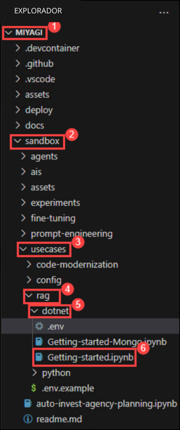

1. **Ejecute el cuaderno celda por celda** (ya sea usando Ctrl + Enter para permanecer en la misma celda o con Shift + Enter par avanzar a la siguiente celda) y observe los resultados de la ejecución de cada celda.
  
   > **Nota**: Asegúrese de que **.Net Interactive** se encuentre en el estado Listo. De lo contrario, espere de 15 a 20 segundos. Además, por favor no haga clic en la opción **Ejecutar Todo** para ejecutar todas las celdas a la vez, dado que puede provocar que se exceda el límite de tokens y se produzca el Error: 503 – Servicio inalcanzable. 

      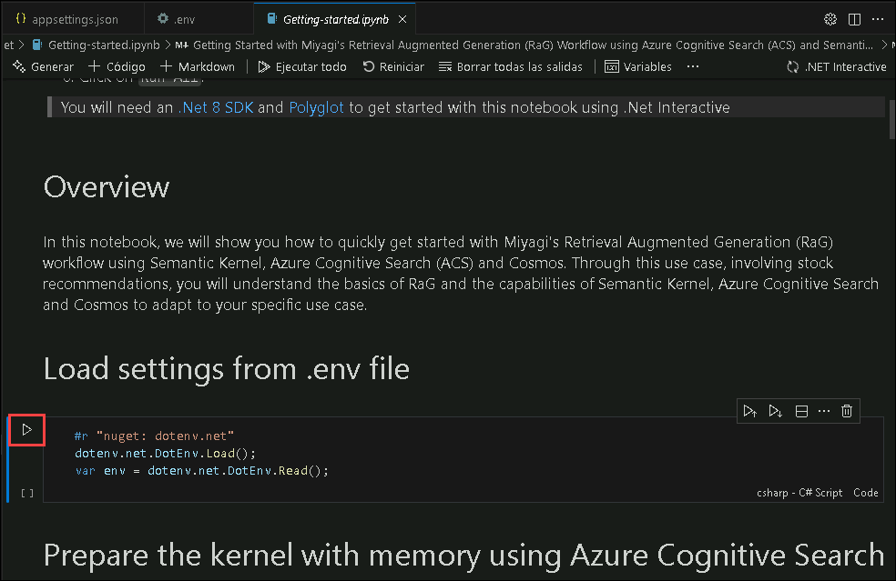

   > **Nota**: En caso de que se produzca algún problema o error relacionado con exceder el límite de tasa de llamadas de su nivel de precios actual de OpenAI S0, espere de 15 a 20 segundos y vuelva a ejecutar la celda.

>**¡Felicitaciones** por completar la Tarea! Ahora es el momento de validarla. Aquí están los pasos:
> - Pulse el botón Validar para la tarea correspondiente. Si recibe un mensaje de éxito, ha validado correctamente el laboratorio.
> - De lo contrario, lea atentamente el mensaje de error y vuelva a intentar el paso, siguiendo las instrucciones de la guía de laboratorio. 
> - Si necesita ayuda, contáctenos en cloudlabs-support@spektrasystems.com.

<validation step="560130f4-fca1-49e1-98a6-97ec61155364" />

### Tarea 3: Ejecutar el servicio de recomendaciones localmente

En esta tarea, ejecutará el servicio de recomendación localmente utilizando Visual Studio Code para compilar y ejecutar el servicio en la terminal y luego verificará su funcionalidad accediendo a la página Swagger en el navegador.

1. Para abrir una nueva terminal, navegue a **miyagi (1)/services (2)/recommendation-service (3)/dotnet (4)** y haga clic derecho en **dotnet**. En el menú en cascada, seleccione **Abrir en terminal integrado (5)**.

    

1. Ejecute el siguiente comando para ejecutar el servicio de recomendación localmente.
    
   ```
   dotnet build
   dotnet run
   ```

   **Nota**: Deje que se ejecute el comando, mientras tanto puede continuar con el siguiente paso. **Nota**: Los comandos dotnet build y dotnet run son fundamentales en entornos .NET Core y .NET 5+ para crear y ejecutar aplicaciones .NET localmente en su máquina.

1. Abra otra pestaña en Edge, en la ventana del navegador pegue el siguiente enlace

   ```
   http://localhost:5224/swagger/index.html 
   ```

   **Nota**: Actualice la página continuamente hasta que obtenga la página swagger para el servicio de recomendación como se muestra en la imagen a continuación.

   


### Tarea 4: Ejecutar el frontend de Miyagi localmente

En esta tarea, ejecutará la interfaz de Miyagi localmente instalando las dependencias con npm y yarn, y luego iniciará el servidor de desarrollo. Verificará su funcionalidad accediendo al servidor de desarrollo local desde el navegador.

1. Para abrir una nueva terminal, navegue a la carpeta **miyagi (1)**, luego expanda **ui** y haga clic derecho en la carpeta **ui/typescript (2)**, en el menú en cascada seleccione **Abrir en la terminal integrada (3)**.

   

1. Ejecute el siguiente comando para instalar las dependencias
   
    ```
    npm install --global yarn
    yarn install
    yarn dev
    ```

   > **Nota**: Por favor espere hasta que el comando se ejecute correctamente. Tardará hasta 5 minutos. Una vez que el comando **yarn dev** comience a ejecutarse, espere 2 minutos y continúe con el siguiente paso.

   > **Nota**: Estos comandos (npm install --global yarn, yarn install y yarn dev) son esenciales en proyectos de JavaScript y TypeScript para gestionar dependencias y ejecutar los scripts necesarios para configurar y ejecutar aplicaciones. Garantizan la instalación de todos los paquetes necesarios (yarn install) y ejecutan los scripts de desarrollo (yarn dev) definidos en la configuración del proyecto (package.json).

1. Abra una nueva pestaña en Edge, navegue a la siguiente dirección

   ```
   http://localhost:4001
   ```

   >**Nota:** Puede obtener el puerto de los registros en la terminal.

      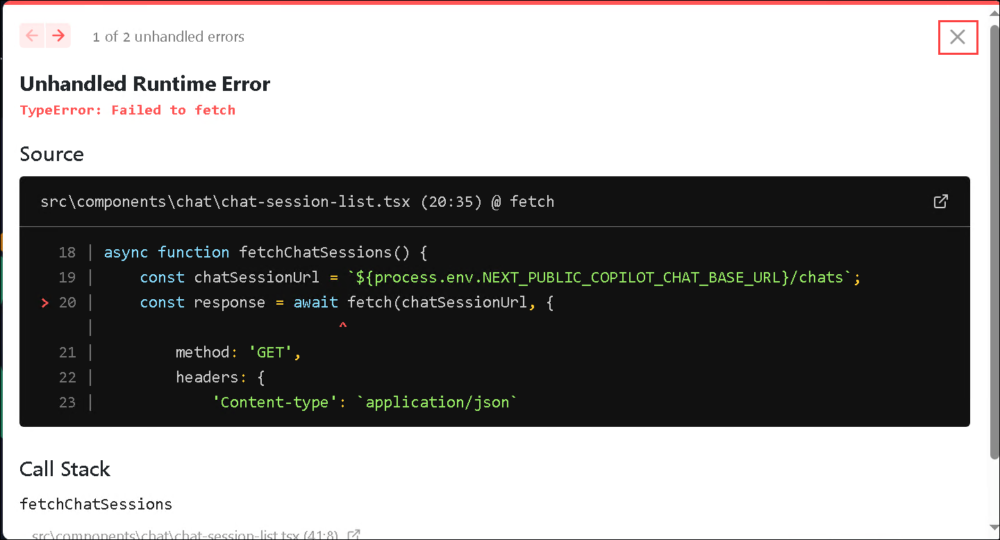

   >**Nota:** Si encuentra una ventana emergente **Error de tiempo de ejecución no controlado**, ciérrela y descarte también el mensaje de error en la esquina inferior izquierda.

     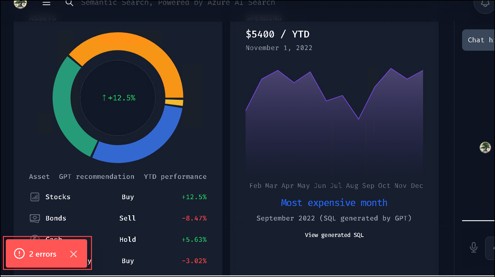

   > **[!IMPORTANTE]**
   > No cierre VS Code ya que necesitará que el host local se ejecute para tareas futuras.

### Tarea 5: Persistir embeddings en Azure AI Search

En esta tarea, conservará las incorporaciones en Azure AI Search ejecutando una solicitud POST en Swagger UI, verificando la ejecución y luego confirmando la creación del índice en Azure Portal.

1. Vuelva a la página **swagger UI**, desplácese hasta la sección **Memory**, haga clic en **POST /dataset** para ampliar y haga clic en **Try it out**.

   

1. Reemplace el siguiente **código** con el siguiente código y haga clic en **Execute**.

     ```
     {
        "metadata": {
              "userId": "50",
              "riskLevel": "aggressive",
              "favoriteSubReddit": "finance",
              "favoriteAdvisor": "Jim Cramer"
            },
          "dataSetName": "intelligent-investor"
      }
      ```

      
      
1. En la página **swagger UI**, desplácese hasta la sección **Responses** revise que se ha ejecutado exitosamente verificando que el código de estado es **200**.

    

1. Regrese a la pestaña **Portal de Azure**, en el cuadro Buscar recursos, servicios y documentos (G+/) en la parte superior del portal, ingrese **AI Search (1)** y luego seleccione **Búsqueda de IA (2)** en Servicios.

        

1. En la pestaña **Fundición de IA | Búsqueda de IA**, seleccione **acs-<inject key="DeploymentID" enableCopy="false"/>**.

   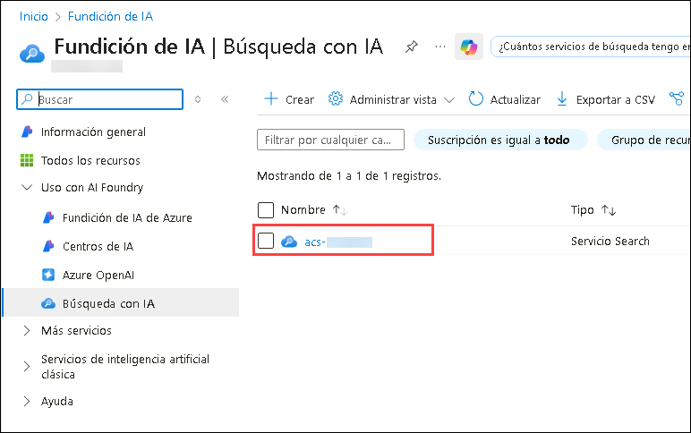

1. En la pestaña **acs-<inject key="DeploymentID" enableCopy="false"/>** del servicio Search, haga clic en **Índices** **(1)** en Administración de búsquedas y revise que **miyagi-embeddings** **(2)** ha sido creado.   

   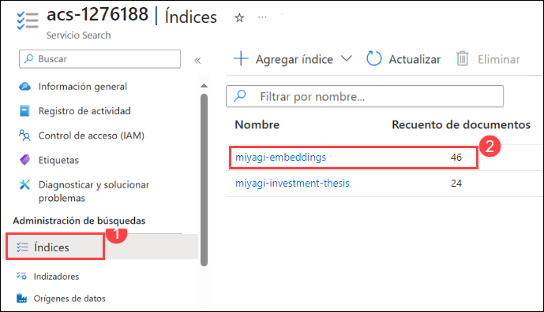

   > **Nota**: Por favor haga clic en el botón Actualizar mientras ve el **Recuento de Documentos**.

>**¡Felicitaciones** por completar la Tarea! Ahora es el momento de validarla. Aquí están los pasos:
> - Pulse el botón Validar para la tarea correspondiente. Si recibe un mensaje de éxito, ha validado correctamente el laboratorio.
> - De lo contrario, lea atentamente el mensaje de error y vuelva a intentar el paso, siguiendo las instrucciones de la guía de laboratorio. 
> - Si necesita ayuda, contáctenos en cloudlabs-support@spektrasystems.com.

<validation step="32fe7dd9-0728-4b16-b975-374eb199044d" />
   
### Tarea 6: Explorar la Aplicación Miyagi y el servicio de Recomendación mediante Personalización

En esta tarea, personalizará el servicio de recomendaciones de la aplicación Miyagi seleccionando un asesor financiero y revisando las recomendaciones. Después, revisará los registros en Visual Studio Code y detendrá los servicios.

1. Vuelva a la página de la interfaz de usuario del **servicio de recomendación** y haga clic en el botón **personalize**.

    

2. En la página **Personalize**, seleccione su **asesor financiero favorito (1)** y elija **GPT-4 (2)** para el **Reasoning Engine** en el menú desplegable, luego haga clic en **Personalize (3)**.

    

3. Debería ver las recomendaciones del servicio de recomendación en el widget Top Stocks.

     

4. Navegue a **Visual Studio Code** y haga clic en **dotnet** desde la terminal, puede revisar los registros.

    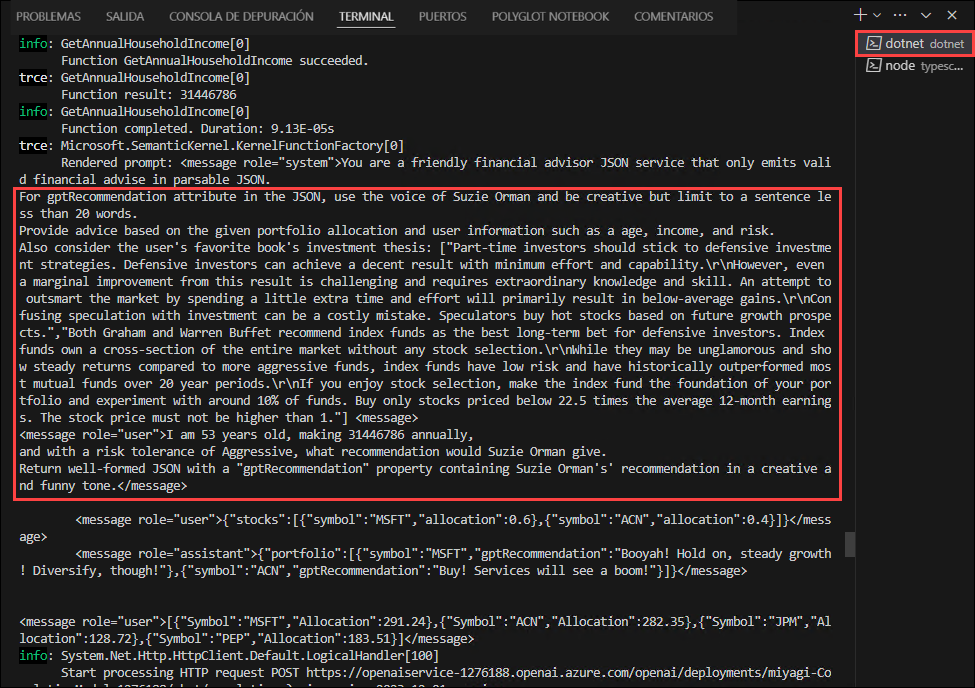    

5. Una vez que revise los registros, presione **Ctrl + C** para detener la página **swagger UI**.

6. Desde la **Terminal** seleccione la terminal **Node**, presione **Ctrl + C** para detener la página de la interfaz de usuario del **servicio de recomendación**.

    

7. Ahora, haga clic en **Siguiente** en la esquina inferior derecha para pasar a la página siguiente.

## Resumen

En esta práctica de laboratorio, comenzó con la configuración de la Aplicación Miyagi para su preparación operativa, seguido de una exploración detallada de la implementación del servicio de Recomendación. La ejecución práctica implica ejecutar el servicio de Recomendación e implementar el frontend Miyagi localmente para realizar pruebas. Mejorar la eficiencia de la recuperación de datos es un paso fundamental que se logra mediante la persistencia de embeddings en Azure AI Search. El proyecto concluye con una amplia exploración de la Aplicación Miyagi y el servicio de Recomendación, priorizando una experiencia de usuario personalizada. Este enfoque sistemático garantiza una comprensión profunda y una implementación efectiva durante todo el proyecto.

### Ha completado con éxito el laboratorio. Ahora haga clic en **Siguiente** en la esquina inferior derecha para pasar a la página siguiente.

   
