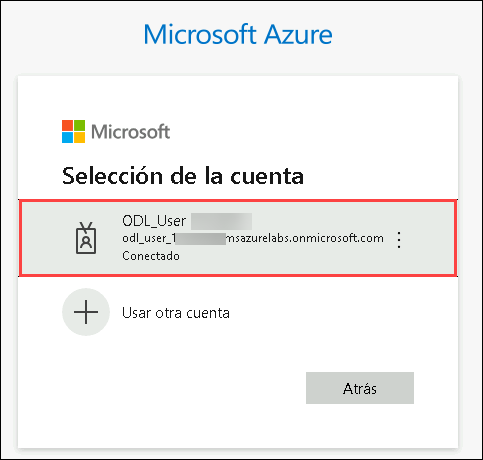
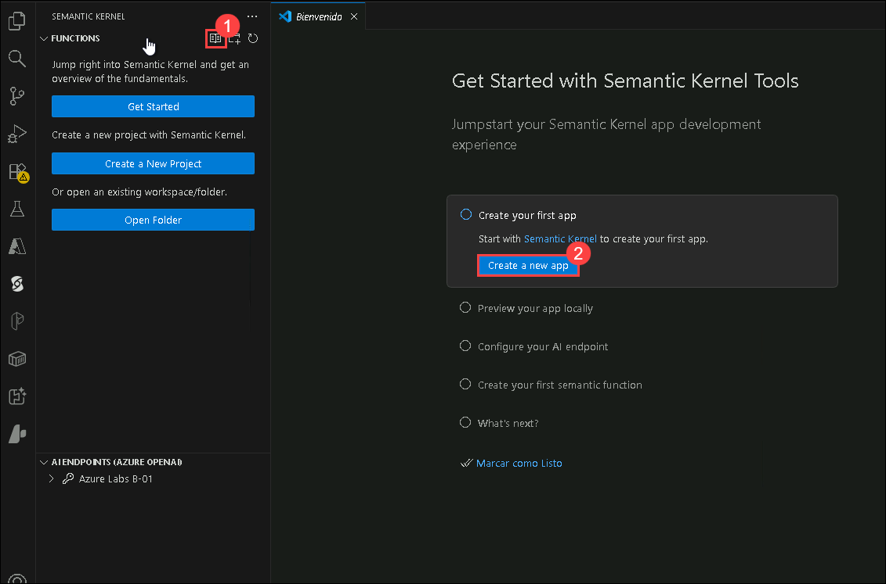

# Laboratorio 5- Cómo empezar con su propio copiloto

### Duración estimada: 30 minutos

Semantic Kernel es un SDK que integra Modelos de Lenguajes Grandes (LLMs) como OpenAI, Azure OpenAI y Hugging Face con lenguajes de programación convencionales como C#, Python y Java. Semantic Kernel logra esto permitiéndole definir plugins que se pueden encadenar en solo unas pocas líneas de código.

Sin embargo, lo que hace a Semantic Kernel _especial_ es su capacidad para orquestar _automáticamente_ plugins con IA. Con los [planners](https://learn.microsoft.com/en-us/semantic-kernel/ai-orchestration/planner) de Semantic Kernel, puede solicitarle a un LLM que genere un plan que logre el objetivo único del usuario. Posteriormente, Semantic Kernel ejecutará el plan por el usuario.

## Objetivos del laboratorio
Podrás completar las siguientes tareas:
- Tarea 1: Configurar y Ejecutar el Ejemplo de Semantic Kernel.
- Tarea 2: Configurar Azure AI Search.

### Tarea 1: Configurar y Ejecutar el Ejemplo de Semantic Kernel

En esta tarea, configurará el plugin de Semantic Kernel en Visual Studio Code, creará una aplicación de automatización del hogar en C# con Azure OpenAI y compilará y ejecutará la aplicación para interactuar con ella.

1. Abra **Visual Studio Code** desde el escritorio de Lab VM haciendo doble clic en el acceso directo.

   

2. En **Visual Studio Code** en el panel izquierdo seleccione la extensión **Semantic Kernel** **(1)**, expanda haciendo clic en **AI ENDPONTS (OPENAI)** **(2)**, haga clic en **Cambiar Proveedor de Punto de Conexión** **(3)**, y elija **AzureOpenAI** **(4)**.

   

3. En **AI ENDPONTS(AZURE OPENAI)**, haga clic en **Sign in to Azure** **(1)**, en la ventana emergente **La extensión 'Semantic Kernel Tools' quiere iniciar sesión con Microsoft** haga clic en **Permitir** **(2)**.

   

4. Esto lo redireccionará a **la página de inicio de sesión de Microsoft**, seleccione su cuenta de Azure **<inject key="AzureAdUserEmail"></inject>**, y regrese de vuelta a **Visual Studio Code**.

   

5. De vuelta en **Visual Studio Code** en el **Panel Functions**, haga clic en el **ícono Comenzar** **(1)** y siga el asistente para **Create a new app** **(2)** con la función semántica y guárdela.

   

6. Elija **Semantic Kernel: C# Home Automation**

    

7. Navegue a la ubicación **C:\LabFiles (1)** y **Select location for new app (2).**

   .png)

8. Haga clic en **Sí, confío en los autores**.

   

9. Navegue al archivo **appsettings.json** **(1)** y reemplace el **script** **(2)** existente con lo siguiente. La sección `AzureOpenAIOptions` en appsettings.json almacena los ajustes de configuración para los servicios de Azure OpenAI, como la clave API, la dirección URL del punto final y el nombre del modelo, que se usan para la autenticación y el acceso al servicio.

   ```
   {
   "AzureOpenAIOptions": {
     "ChatDeploymentName": "",
     "Endpoint": "",
     "ApiKey": ""
      }
   }
   ```

   

10. En ASP.NET Core, `appsettings.json` es un archivo de configuración que se utiliza para almacenar varias configuraciones de aplicación, como puntos de conexión de servicio y otras configuraciones específicas de la aplicación. Guarde el archivo presionando **Ctrl + S**. 

    | **Variables**       | **Valores**                                             |
    | --------------------|--------------------------------------------------------|
    | ChatDeploymentName  | **<inject key="CompletionModel" enableCopy="true"/>**  |
    | Endpoint            | **<inject key="OpenAIEndpoint" enableCopy="true"/>**   |
    | ApiKey              | **<inject key="OpenAIKey" enableCopy="true"/>**        |

11. Asegúrese de que su archivo `appsettings.json` se vea como se muestra en la siguiente captura de pantalla.

    .png)

12. Navegue hasta el archivo **Program.cs** **(1)** y reemplace el código existente con lo siguiente. El archivo `Program.cs` configura una aplicación .NET mediante inyección de dependencia y Semantic Kernel. Configura servicios, incluido Azure OpenAI para completar el chat, y agrega varios complementos `(MyTimePlugin, MyAlarmPlugin, MyLightPlugin)`. Las `AzureOpenAIOptions` se cargan desde archivos de configuración y variables de entorno. Un servicio alojado `(Worker)` maneja la lógica de ejecución principal. Se crea un kernel de automatización del hogar con una colección de estos complementos y se agrega al contenedor de inyección de dependencias.

      ```
      using HomeAutomation.Options;
      using HomeAutomation.Plugins;
      using Microsoft.Extensions.DependencyInjection;
      using Microsoft.Extensions.Hosting;
      using Microsoft.Extensions.Options;
      using Microsoft.SemanticKernel;
      using Microsoft.SemanticKernel.ChatCompletion;
      using Microsoft.SemanticKernel.Connectors.OpenAI;
      
      namespace HomeAutomation;
      
      internal static class Program
      {
          internal static async Task Main(string[] args)
          {
              HostApplicationBuilder builder = Host.CreateApplicationBuilder(args);
      
              // Actual code to execute is found in Worker class
              builder.Services.AddHostedService<Worker>();
      
              // Get configuration
              builder.Services.AddOptions<AzureOpenAIOptions>()
                              .Bind(builder.Configuration.GetSection(nameof(AzureOpenAIOptions)))
                              .ValidateDataAnnotations()
                              .ValidateOnStart();
      
              // Chat completion service that kernels will use
              builder.Services.AddSingleton<IChatCompletionService>(sp =>
              {
                  /*OpenAIOptions options = sp.GetRequiredService<IOptions<OpenAIOptions>>().Value;
      
                  // A custom HttpClient can be provided to this constructor
                  return new OpenAIChatCompletionService(options.ChatModelId, options.ApiKey);
      
                   Alternatively, you can use plain, Azure OpenAI after loading AzureOpenAIOptions instead
                     of OpenAI options with builder.Services.AddOptions:*/
      
                  AzureOpenAIOptions options = sp.GetRequiredService<IOptions<AzureOpenAIOptions>>().Value;
      
                  return new AzureOpenAIChatCompletionService(options.ChatDeploymentName, options.Endpoint, options.ApiKey); 
              });
      
              // Add plugins that can be used by kernels
              // The plugins are added as singletons so that they can be used by multiple kernels
              builder.Services.AddSingleton<MyTimePlugin>();
              builder.Services.AddSingleton<MyAlarmPlugin>();
              builder.Services.AddKeyedSingleton<MyLightPlugin>("OfficeLight");
              builder.Services.AddKeyedSingleton<MyLightPlugin>("PorchLight", (sp, key) =>
              {
                  return new MyLightPlugin(turnedOn: true);
              });
      
              /* To add an OpenAI or OpenAPI plugin, you need to be using Microsoft.SemanticKernel.Plugins.OpenApi.
                 Then create a temporary kernel, use it to load the plugin and add it as keyed singleton.
              Kernel kernel = new();
              KernelPlugin openAIPlugin = await kernel.ImportPluginFromOpenAIAsync("<plugin name>", new Uri("<OpenAI-plugin>"));
              builder.Services.AddKeyedSingleton<KernelPlugin>("MyImportedOpenAIPlugin", openAIPlugin);
      
              KernelPlugin openApiPlugin = await kernel.ImportPluginFromOpenApiAsync("<plugin name>", new Uri("<OpenAPI-plugin>"));
              builder.Services.AddKeyedSingleton<KernelPlugin>("MyImportedOpenApiPlugin", openApiPlugin);*/
      
              // Add a home automation kernel to the dependency injection container
              builder.Services.AddKeyedTransient<Kernel>("HomeAutomationKernel", (sp, key) =>
              {
                  // Create a collection of plugins that the kernel will use
                  KernelPluginCollection pluginCollection = [];
                  pluginCollection.AddFromObject(sp.GetRequiredService<MyTimePlugin>());
                  pluginCollection.AddFromObject(sp.GetRequiredService<MyAlarmPlugin>());
                  pluginCollection.AddFromObject(sp.GetRequiredKeyedService<MyLightPlugin>("OfficeLight"), "OfficeLight");
                  pluginCollection.AddFromObject(sp.GetRequiredKeyedService<MyLightPlugin>("PorchLight"), "PorchLight");
      
                  // When created by the dependency injection container, Semantic Kernel logging is included by default
                  return new Kernel(sp, pluginCollection);
              });
      
              using IHost host = builder.Build();
      
              await host.RunAsync();
          }
      }
      ```

13. Navegue hasta el archivo **Worker.cs** y actualice la línea número **29** y **CTRL+S**.

    ```
    ToolCallBehavior = ToolCallBehavior.AutoInvokeKernelFunctions
    ```

14. Configure un punto de conexión de Azure OpenAI abriendo una nueva **Terminal**. Haga clic en **(...) (1)** al lado del menú **Ver** y seleccione **Terminal (2)** > **Nueva Terminal (3)**.

    

15. Ejecute los siguientes comandos para instalar los paquetes necesarios.
    
    ```
    dotnet add package Microsoft.Extensions.Hosting --version 9.0.0-preview.3.24172.9
    dotnet add package Microsoft.Extensions.Options.DataAnnotations --version 9.0.0-preview.3.24172.9
    dotnet add package Microsoft.SemanticKernel --version 1.11.0
    ```

    >**Nota:** Estos comandos se usan en un proyecto .NET Core o .NET 5+ para agregar paquetes NuGet al proyecto. Esto es lo que hace cada comando:

    >**dotnet add package Microsoft.Extensions.Hosting --version 9.0.0-preview.3.24172.9:** Agrega el paquete Microsoft.Extensions.Hosting al proyecto con una versión específica (9.0.0-preview.3.24172.9). Este paquete proporciona abstracciones de inicio y alojamiento para aplicaciones .NET.

    >**dotnet add package Microsoft.Extensions.Options.DataAnnotations --version 9.0.0-preview.3.24172.9:** agrega el paquete Microsoft.Extensions.Options.DataAnnotations al proyecto con una versión específica (9.0.0-preview.3.24172.9 ). Este paquete amplía el marco de opciones en .NET para admitir anotaciones de datos para objetos de configuración.

    >**dotnet add package Microsoft.SemanticKernel --versión 1.11.0:** agrega el paquete Microsoft.SemanticKernel al proyecto con una versión específica (1.11.0). Es probable que este paquete proporcione funciones relacionadas con el análisis y el procesamiento semántico dentro de la aplicación.

16. Para compilar y ejecutar la aplicación Home Automation desde la terminal, utilice los siguientes comandos: 

    ```powershell
    dotnet build
    dotnet run
    ```
    
    

    > **Nota**: Por favor ignore la advertencia.

    >**Nota:** Los comandos dotnet build y dotnet run son fundamentales en los entornos .NET Core y .NET 5+ para crear y ejecutar aplicaciones .NET localmente en su máquina.
    
17. Después de ejecutar `dotnet run`, puede hacer algunas preguntas y revisar la respuesta. Por ejemplo:: `What time is it?`

    

18. Ejemplo 2: `Set an alarm for 6:00 am.`

    

19. Si desea incluir preguntas adicionales, navegue hasta el archivo **worker.cs** e inserte sus nuevas preguntas en la **línea número 32**.

    

20. Alternativamente, puede plantear cualquier pregunta en la terminal.

### Tarea 2: Configurar Azure CognAIitive Search

En esta tarea, configurará Azure AI Search importando datos de CosmosDB a un índice de búsqueda llamado "realestate-us-sample-index". Personalizará el índice y creará un indexador llamado "realestate-us-sample-indexer" para sincronizar los datos. Finalmente, verificará la funcionalidad de búsqueda consultando los datos de "Seattle".

1. Vuelva a la pestaña **Portal de Azure**,  en el cuadro "Buscar recursos, servicios y documentos (G+/)" en la parte superior del portal, escriba **Búsqueda de IA (1)** y, a continuación, seleccione **Búsqueda de IA (2)** en la sección "Servicios".

        

1. En la pestaña **AI Foundry | AI Search**, seleccione **acs-<inject key="DeploymentID" enableCopy="false"/>**.

    

1. En la pestaña Información general del servicio Search, haga clic en **Importar datos**.

        
   
1. En el menú desplegable, establezca el **Origen de Datos** en **Muestra**, seleccione **CosmosDB hotels-sample**, y haga clic en **Siguiente : Agregar aptitudes cognitivas (opcional)**.

   
   
1. En **aptitudes cognitivas** deje todo con los valores predeterminados y haga clic en **Omitir hasta: Personalizar índice de destino**.

    

1. En **Personalizar índice de destino**, establezca el nombre del índice como **realestate-us-sample-index** y haga clic en **Siguiente: Crear indizador**.

   

1. En **Crear un indizador**, cambie el nombre del indizador a **realestate-us-sample-indexer** y haga clic en **Enviar**.

   

1. Regrese a la pestaña **AI Foundry | AI Search**, seleccione **acs-<inject key="DeploymentID" enableCopy="false"/>**.

   
   
1. En el panel de navegación izquierdo, en **Administración de búsqueda** select **Índices (1)** y haga clic en **realestate-us-sample-index (2)**.

    

1. Haga clic en **realestate-us-sample-index**, en la barra de búsqueda ingrese **Seattle (1)** y haga clic en **Buscar (2)** para ver el **Resultado**.

   

### Resumen

En esta práctica de laboratorio, aprendió a configurar y ejecutar el ejemplo de Semantic Kernel integrando el SDK en su proyecto, configurando proveedores de LLM, definiendo plugins y ejecutando el código. Además, adquirió conocimientos sobre la configuración de Azure AI Search, incluyendo la creación o selección de un índice, la configuración de campos, la configuración de Semantic Kernel para interactuar con Azure, la definición de plugins y la prueba de la integración para capacidades de búsqueda mejoradas.

### You have completed this lab.
